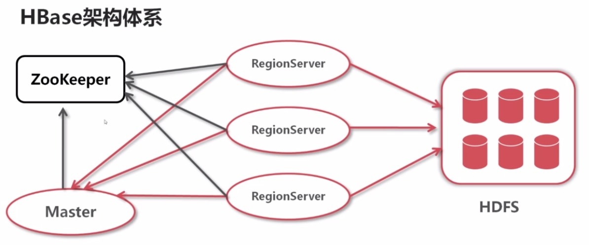
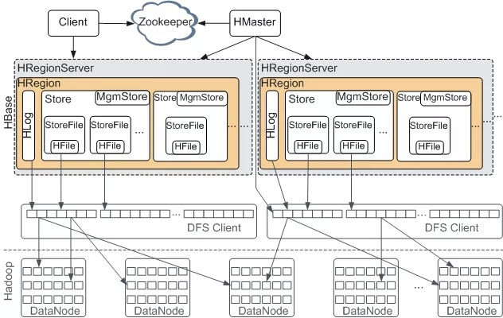

# Hbase，分布式存储的数据库

Hbase（Hadoop Database）是一个高可靠性、高性能、面向列、可线性伸缩的分布式存储的NoSQL数据库系统。它的目标是在普通的硬件配置上存储并处理海量的数据，但并非数据库，缺少很多RDBMS系统的特性。

Hbase是根据Google公开的关于Bigtable论文的开源实现，建立在HDFS文件存储系统之上，用MapReduce处理海量数据，并利用Zookeeper作为协同服务。

## 集群服务结构

HBase采用Master/Slave架构搭建集群，依赖的技术有HDFS与Zookeeper，有两个类型的节点：HMaster节点、HRegionServer节点，以及ZooKeeper集群和HDFS集群。

- HMaster节点是管理和分配HRegion，处理Schema更新请求，管理namespace和table元数据等信息，这些信息的数据文件也放在HDFS。一般和NameNode同一节点。
- HRegionServer节点则管理自己的HRegion，和管理table在HDFS中数据。一般和DataNode同一节点。
- ZooKeeper集群存放了集群状态与元数据，并处理HMaster的容错。
- HDFS集群做数据存放。
- 外部的Client访问Hbase的接口（RPC），从HMaster中获取元数据，从HRegionServer读写数据。

## 数据模型

HBase数据存储结构中主要包括：命名空间、表、行、列和列族、列限定符、单元格和时间戳。

- namespace，命名空间，对表的逻辑分组，用来做资源与数据隔离。有配额、安全、指定Region组等相关操作。
- table，表，数据的组织，在 schema 定义时被预先声明的，必须有表名和列族名。
- row，行，在表内一条记录的数据存储格式。 并通过行键（类型为byte []）唯一标识。
- column family，列族，基本存储单位，一个或者多个列形成列族，是对行中的数据按列族分组，存储在同一个Store。
- column qualifier，列限定符，是列族中数据的索引，类型为byte []，等同于列名，但是不用提前指定。
- cell，行键/单元格，由列族和列限定符的组合唯一标识一个单元格。存储在单元格中的数据称为该单元格的值，实际存储的也为byte []类型。
- timestamp，时间戳记，默认情况下作为单元格值的版本号。

## 数据存储方式

1. Table在行的方向上超过大小阀值后会分割为多个Region，又分散在不同的RegionServer上。
2. Region是由一个或者多个Store组成（超过容量阀值后会分割），每个Store保存一个columns family（列族，同一列族中的多个列保存在一起）。
3. 每个Store又由一个MemStore和0或多个StoreFile组成（MemStore大小超过阀值写一个StoreFile）。
4. MemStore存储在内存中，StoreFile以HFile格式存储在HDFS上。
4. HLog文件中，记录数据的所有变更。每个region server维护一个HLog，每隔1小时，产生新的log文件。同时旧的log文件（已经记录到HFile的）也会被定期删除。
6. Meta目录表，记录了集群中regions的位置信息，本身也记录在一个HRegion中，由ZooKeeper存储着Meta表的位置，供Client快速定位读取，并缓存在Client中。

## Hbase中的组件结构

Hbase具体的组件包括HRegion、Store、MemStore、StoreFile、HFile、HLog等。

- **HRegion**，是HBase中分布式存储和负载均衡的最小单元。Table在行的方向上分割为多个HRegion，每个HRegion对应Table中一个Region，当HRegion的某个列簇达到一个阀值（默认10G）时就会分成两个新的HRegion。
- **Store**，处理HBase的数据存储，两部分组成，一部分是MemStore，一部分是StoreFiles。每一个HRegion由一个或多个Store组成。
- **MemStore**，是放在内存中的，保存着修改的数据，当大小达到一个阀值（默认128MB）时，MemStore会被Flush到StoreFile中。
- **StoreFile**，保存数据的抽象文件，StoreFile底层是以HFile的格式保存。增长到一定阀值（小于256M并到4个）后，系统会进行合并，全形成一个更大的文件。
- **HFile**，HBase中KeyValue数据的存储格式，是HDFS的二进制格式文件。
- **HLog**，就是WAL（write ahead log）记录数据的所有变更，用来做灾难恢复使用。一旦region server 宕机，就可以从log中进行恢复。 

