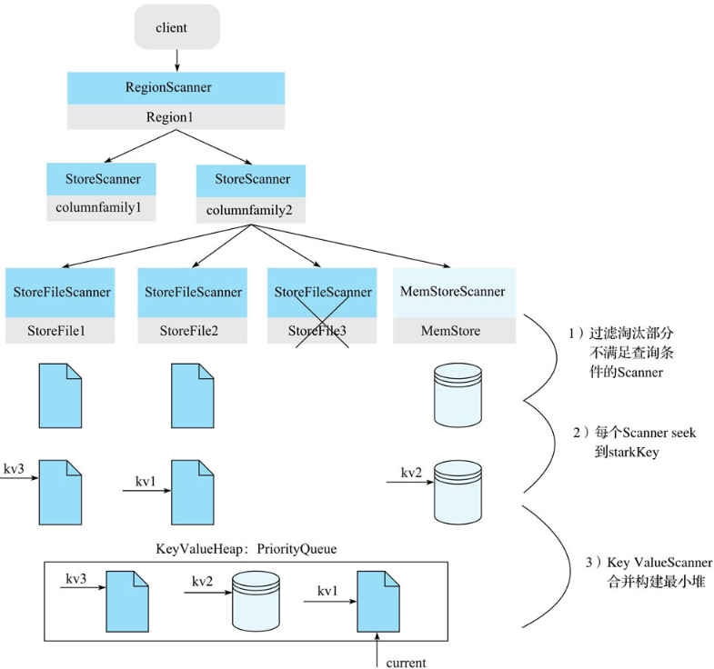

# Hbase作为实时系统的读过程

HBase不是一个关系型数据库，不具备“强一致性”的事务处理能力，也不能处理固定模式与复杂数据关系。它是运行在Hadoop上的NoSQL数据库，是一个分布式的和可扩展的大数据仓库，因此适合的场景是松散数据，并支持高并发访问，如果数据量不大，读取数据性能。

HBase支持Hadoop map-reduce程序设计模型。HBase有两种访问方式：通过行键进行随机访问；通过map-reduce脱机或批访问；前者主要提供了get、scan以及filter等方法读取数据库中的数据。

## Hbase数据结构与架构

HBase 的数据模型的核心是表，包含着行、键列族和列。get与scan都以行键rowkey 为参数查找数据位置并读取。为了减少读取的IO次数，加了多层缓存，首先表的元数据将缓存在客户端，HRegion上也先访问内存中的memstore以及blockcache。另外Hfile为行键设置了多种索引。

- Hbase Table数据结构组成：Table = rowkey + family + column + timestamp + value。
- Hbase的结构元素组成：ZooKeeper，HMaster，HRegionSever，HRegion，HStore，MemStore与StoreFile，HFile。
- HBase存储的设计：LSM树（Log-Structured Merge Tree）存储引擎。它首先在内存中构建一颗有序的小树，随着小树的逐渐增大，达到一定阈值时会flush到磁盘，磁盘中的树定期可以做merge操作，合并成一棵大树，以优化读性能。

## 读数据过程

Hbase的读操作参与角色有：ZooKeeper -> meta -> HRegionServer -> HRegion -> memstore -> Storefile。

HBase一次范围查询可能会涉及多个Region、多块缓存甚至多个Hfile。HBase中更新操作使用时间戳属性实现了多版本，删除操作也只是插入了一条标记为"deleted"标签的数据，读取过程需要过滤版本、标记删除的数据。

总体的读流程如下：

1. Client访问zookeeper，获取元数据hbase:meta存储所在的HRegionServer地址。
2. 根据地址访问对应的HRegionServer，拿到hbase:meta加载到内存中，用RowKey找到表存储的一个或多个HRegionServer地址。
3. 去表所在的HRegionServer，发起数据的读取请求。
4. server查找对应的HRegion，在HRegion中寻找列族，先找到memstore，找不到去blockcache中寻找，再找不到就会访问磁盘中HFile读取数据。
5. 找到数据之后会先缓存到blockcache中，再将结果返回给Client。（blockcache逐渐满了之后，会采用LRU的淘汰策略。）

当Client的数据读取请求到HRegionServer后，Scanner在server上的流程分解如下：

1. HRegionServer构建RegionScanner，用于对该Region的数据检索。
2. 一个RegionScanner管理一堆ColumnFamily，构造StoreScanner，用于对该列族的数据检索。多个StoreScanner合并构建最小堆（已排序的完全二叉树）StoreHeap:PriorityQueue<StoreScanner>。
3. StoreScanner管理一堆HFile，构造一个MemStoreScanner和一个或多个StoreFileScanner（数量取决于StoreFile数量），这个是实际读取数据的地方（除了compaction状态的HFile）。需要过滤掉RowKey一定不在StoreFile内的对应的Scanner，主要过滤策略有：Time Range过滤、Rowkey Range过滤以及布隆过滤器。
4. 每个Scanner seek到startKey，这个步骤就是在Blockcache中读取该HFile的索引树结构，seek扫描起始点startKey，然后Load Block（先BlockCache再HFile），最后在Data Block内部通过二分查找的方式定位具体的RowKey。
5. 将所有的StoreFileScanner和MemStoreScanner合并，并按keyvalue由小到大排序，构建最小堆KeyValueHeap:PriorityQueue<KeyValueScanner>。
6. 通过触发KeyValueHeap的peek()和next() 调用，来遍历与过滤所有 Scanner 中的数据，最终返回的List<Cell>results要封装成Result[]格式返回。这步的过滤分两方面，一方面是过期、删除、版本等，另一方面是用户的过滤条件。

## 附：数据部分的KeyValue数据结构

KeyValue由Key length、value length、key、value组成。

其中key又由RowKey length、RowKey、ColumnFamily length、ColumnFamily、ColumnQualifier、TimeStamp、KeyType组成。

- RowKey length：RowKey长度
- RowKey：RowKey内容
- ColumnFamily length：列族长度
- ColumnFamily：列族
- ColumnQualifier：列名
- Timestamp：时间戳
- KeyType：表示类型，取值有Put/Delete/Delete Column/Delete Family

## 附：rowkey设计

HBase查询只能通过其Rowkey来查询，Rowkey设计的优劣直接影响读写性能。HBase中的数据是按照Rowkey的ASCII字典顺序进行全局排序。

Rowkey设计应遵循以下原则：

长度原则：建议是越短越好，不要超过16个字节。而且列族名、列名等也尽量使用短名字。

散列原则：我们设计的Rowkey应均匀的分布在各个HBase节点上。建议将Rowkey的高位作为散列字段，减少RegionServer上堆积的热点现象。

唯一原则：必须在设计上保证其唯一性，相同Rowkey数据会被覆盖。

排序原则：Rowkey是按照ASCII有序设计的，业务上可以利用这一点减少性能的消耗。

