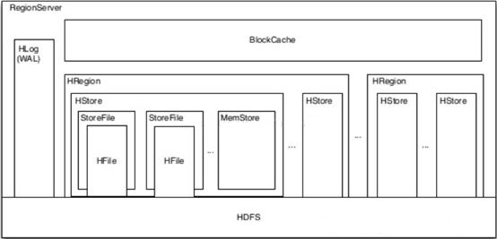
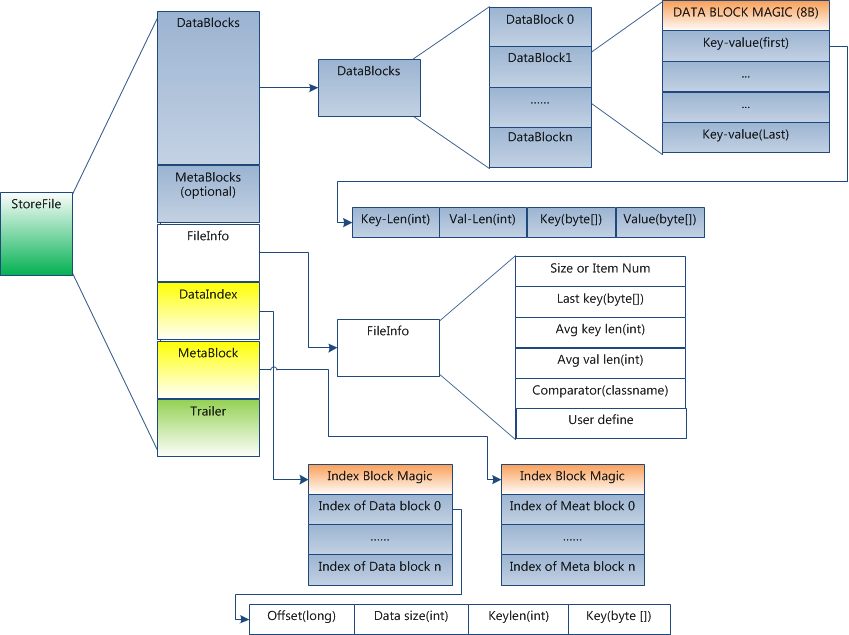
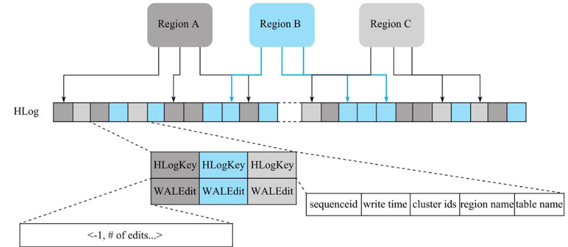

# Hbase的数据存储设计

Hbase从数据结构来看，Hbase将数据按照表、行和列进行存储。HBase数据结构由以下构成：META，NameSpace，Table，Row，RowKey，Column Family，Cell，Timestamp。

从数据的物理存储来看，Hbase是构建在分布式的HDFS上的列式存储系统，HBase主要概念有：HRegion，HStore，MemStore与StoreFile，HLog，HFile。



## 索引

数据读取是通过RowKey定位到对应的region以及regionserver，在找到对应的store后，查找的顺序是先memstore，然后blockcache，最后到HFile。HFile会被切分为多个块HFileBlock。

Hbase使用了Bloom（布隆过滤器）处理key检索来为提高随机读性能，经过布隆过滤器处理就可以知道该Hfile中是否存在待检索key，不存在则不需要遍历查找该文件，降低了实际IO次数。布隆过滤器通常会存储在内存中。

另外一个重要提升性能的设计就是Data Index，用Data Index部分存储了每一个Data Block的索引信息{Offset，Size，FirstKey}。HFile中索引结构就有单层索引和多级索引（一般为两级或三级），Data Index最先是单层索引并放内存中，随时容量过大时逐步分离为多层索引，第一级仍放内存中。Bloom与Meta也有索引，为单层索引。

而Data Index的索引信息{Data Index Offset, Data Block Count}被存储在HFile的Trailer部分。

## Hfile

HFile:HBase中KeyValue数据的存储格式，是 Hadoop 的二进制文件格式，是 StoreFile 的轻量级包装。表数据在hdfs中存储目录：

```shell
/hbase
  /data
    /<Namespace>  # 命名空间
      /<Table>  # 表
        /<Region>  # 表的region
          /<ColumnFamily>  # 列族
            /<StoreFile>  # 数据文件
```

Hfile的格式为：



HFile文件在抽象上可分为四个部分：


- Scanned block section，存储数据、第三层数据索引，以及数据的Booleam过滤块。类型有Data Block、Leaf Index Block 、 Bloom Block。
- Non-scanned block section，存储元数据信息与第二层数据索引。类型有Meta Block、Intermediate Index Block 。
- Load-on-open section，主要存放了启动时需要加载到内存中的数据，第一层数据索引和元信息索引，还有Booleam过滤元信息。类型有Root Data Index、Meta Index、File Info、有BooleamFilter 的Bloom Meta。
- Trailer，文件尾，主要记录了HFile的基本信息、各个部分的偏移量、version版本等。读取Hfile时首先读取这部分来确定下一步需要读取的内容的位置。

物理存储设计：

- HFile会被切分为多个有相同的数据结构且大小相等的HFileBlock，每一个block大小可以在创建表列簇的时候通过blockSize参数指定，默认是64K，较大的blockSize有利于scan，较小的有利于随即查询(get)。

HFileBlock主要分为3个部分： 

- Block Header，用来存储元数据，包括block 类型，压缩block大小，上一个block的偏移量等。
- Block Dada，主要存储具体的数据，Data、Meta、Bloom、Index等等。
- Checksum，用于data校验。

HFile对外声明block 类型，分别用于数据存储和数据索引，数据块包括：

- **DATA**(表格数据块)、用于存储实际数据，通常情况下每个Data Block可以存放多条KeyValue数据对。
- **META**(元数据块)、存储HFile的元数据，可选，V2版Bloom元信息移到了BLOOM_META。
- **BLOOM_CHUNK**(Bloom Block布隆数据块)、key的Bloom位数组，也包括了删除的key的Bloom过滤，每个HFile都有多个Bloom Block。
- **FILE_INFO**(文件信息块)、存储本Hfile文件信息。

HFile的索引块的block 类型包括：

- Index Block，索引块，存储了数据的索引，它是分层设计，多层的Index还带有格外的数据mid-key的信息。细分的三层的块类型有：
  **ROOT_INDEX**(根索引块)，第一层索引。
  **INTERMEDIATE_INDEX**(中间索引块)，第二层索引。
  **LEAF_INDEX**(叶子索引块)，第二层索引。
- **BLOOM_META**(布隆索引元信息块)、Bloom filter metadata block，记录布隆位数据块的元数据信息。

- **TRAILER**、文件尾部。

HFile经历了三个版本，其中V2在0.92引入，V3在0.98引入。V1占用内存多启动慢，V2版本进行了优化，V3只是在cell层面添加了Tag数组的支持。V2的优化主要在分层索引、交叉存放、按需读取。

- 分层索引，Data Block的索引按数据量分裂最多至三层，打开Region时只有最上层的Root Data index会加载到内存。Bloom Filter也被拆成了多个Bloom Block，其元信息数据也首先加载到内存。
- 交叉存放，Data Block、Leaf Index Block、Bloom Block交叉存储在"Scanned Block Section"区域。
- 按需读取，Data Block与Bloom Filter都被拆成了多个Block，Region Open阶段按块读取。

## Hlog（WALs）

HLog File:(Write Ahead Log) 预写日志(HLog)文件，HBase中系统故障恢复以及主从复制都基于HLog实现。一个RegionServer有一个HLog（默认一个可指定多个），存放在HDFS上，是一种定制化格式的数据存储文件。

预写日志文件在hdfs中存储目录：

```shell
/hbase
  /WALs
    /<RegionServer>  # 一个regionserver共用WALs
      /<WAL>  # 数据文件
```

Hlog文件的基本结构如下：



HLog中，日志单元WALEntry（图中小方框）表示一次行级更新的最小追加单元，它由HLogKey和WALEdit两部分组成，其中HLogKey由table name、region name以及sequenceid等字段构成。WALEdit用来表示一个事务中的更新集合。

HLog文件生成之后并不会永久存储在系统中，它的使命完成后，文件就会失效最终被删除。HLog生命周期包含4个阶段：

- 构建，HBase的任何写入（更新、删除）操作都会先将记录追加写入到HLog文件中。
- 滚动，HBase后台启动一个线程，每隔一段时间日志滚动会新建一个新的日志文件，接收新的日志数据。
- 失效，写入数据一旦从MemStore中落盘，对应的日志数据就会失效。先从WALs文件夹移动到oldWALs文件夹。失效是以文件为单位。
- 删除，Master后台会启动一个线程，每隔一段时间检查一次文件夹oldWALs下的所有失效日志文件，不参与主从复制并超10分钟则删除。


