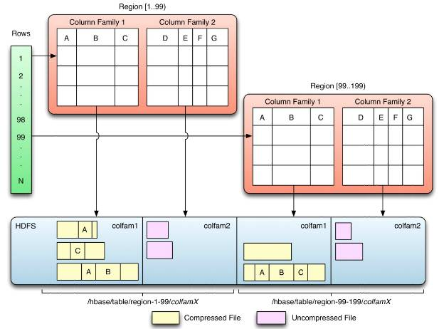
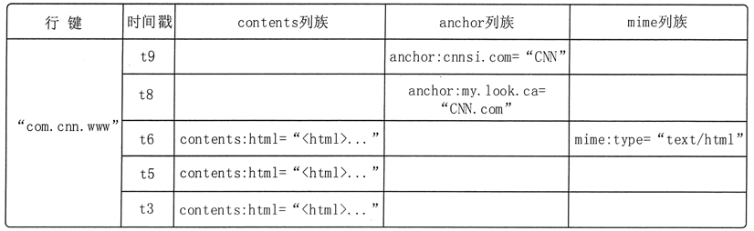
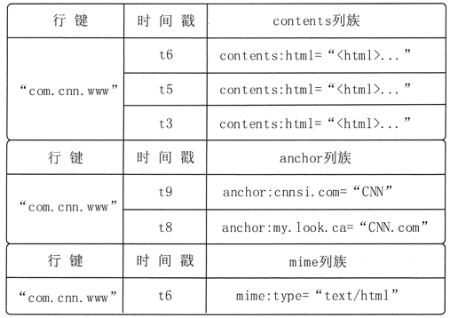

# Hbase数据的结构设计

Hbase是面向列的NoSQL数据库，仅能通过主键(row key)和主键的range来检索数据，仅支持单行事务。主要用来存储非结构化和半结构化的松散数据。

所有数据都保存在HDFS上，用户通过访问region服务获取数据，一个物理节点一般只能运行一个region服务器，主要组成部分为：HLog（WALs）和多个region；一个HStore包含：一个MemStore和多个HFile。

Hbase使用Zookeeper来监控HRegionServer的健康状况，并交给HMaster管理。同时Zookeeper也进行HMaster选举，解决它单点问题。

## 数据结构

从数据结构来看，Hbase将数据按照表、行和列进行存储。HBase数据结构由以下构成：META，NameSpace，Table与Schema，Row与RowKey，Column Family与Column Qualifier，Cell与Timestamp。

命名空间是表的集合，表是行的集合，行是列族的集合，列族是列的集合，列是键值对的集合，每个列的值都具有时间戳。



访问数据只有三种方式：通过单个row key访问；通过row key的range（正则）；全表扫描。

## 表模型

HBase物理数据模型是三维有序存储概念，它的三维是指：rowkey（行主键），column key(columnFamily+< label>)，timestamp(时间戳或者版本号)三部分组成。

以概念来看，结构如下：



以物理存储来看，是根据Column Family（列族）存储的：



数据读取是通过RowKey定位到对应的region以及regionserver，在找到对应的store后，查找的顺序是先memstore，然后blockcache，最后到HFile（File会被切分为多个有相同的数据结构且大小相等的HFileBlock）。

Hbase系统相关的元数据也以表的方式存储。常见有的：meta、namespace等。meta是Hbase访问表中数据的入口，它的Region地址还会登记在Zookeeper中。

## namespace表

namespace（命名空间）是表的逻辑分组，是多租户特性基础，可进行资源配额管理、安全、Region服务器分配等。命名空间记录都保存在hbase:namespace表。

预定义的命名空间有：

- hbase：系统命名空间，用于包含hbase的内部表。其中几个常见系统表有hbase:meta表（用户表的元信息）、hbase:namespace表（命名空间的元数据）、hbase:quota表（资源限制）、hbase:acl表（权限）。
- default：所有未指定命名空间的表都自动进入该命名空间，也就是默认下的用户表。

## meta表

hbase:meta表存储了所有用户HRegion的位置信息，同时此表也是Hbase的Table，同样的存储模式与读写方式。此表的RegionSever信息保存在zookeeper中，客户端访问zookeeper得到meta表所在地址后（会缓存起来），再访问region server, 得到需要的meta表，就知道其他用户表的RegionServer信息了。

它的RowKey是：tableName，regionStartKey，regionId，replicaId等。

它只有info列族，这个列族包含三个列，他们分别是：

- info:regioninfo列是RegionInfo的proto格式：regionId，tableName，startKey，endKey，offline，split，replicaId。
- info:server格式：HRegionServer对应的server:port。
- info:serverstartcode格式：HRegionServer的启动时间戳。

2.x版增加了info:sn与info:state，分别记录Region的标识和状态。还新增了table 列族，字段table:state记录表的状态。

region server 做split region时，需要通过修改meta中的region信息进行，将老的region下线再split为两个新region，最后将老的删除。

表信息存放在zookeeper中的/hbase/table/hbase:meta。

## 附：Hfile

HFile:HBase中KeyValue数据的存储格式，是 Hadoop 的二进制文件格式，是 StoreFile 的轻量级包装。表数据在hdfs中存储目录：

```shell
/hbase
  /data
    /<Namespace>  # 命名空间
      /<Table>  # 表
        /<Region>  # 表的region
          /<ColumnFamily>  # 列族
            /<StoreFile>  # 数据文件
```

## 附：Hlog（WALs）

HLog File:(Write Ahead Log) 预写日志(HLog)文件，在物理上是 Hadoop 的 Sequence File。

预写日志文件在hdfs中存储目录：

```shell
/hbase
  /WALs
    /<RegionServer>  # 一个regionserver共用WALs
      /<WAL>  # 数据文件
```


