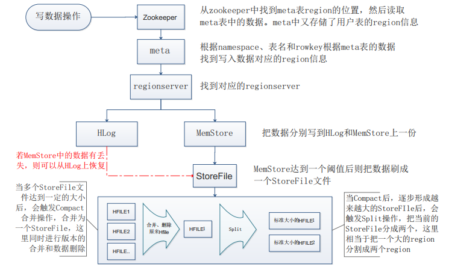
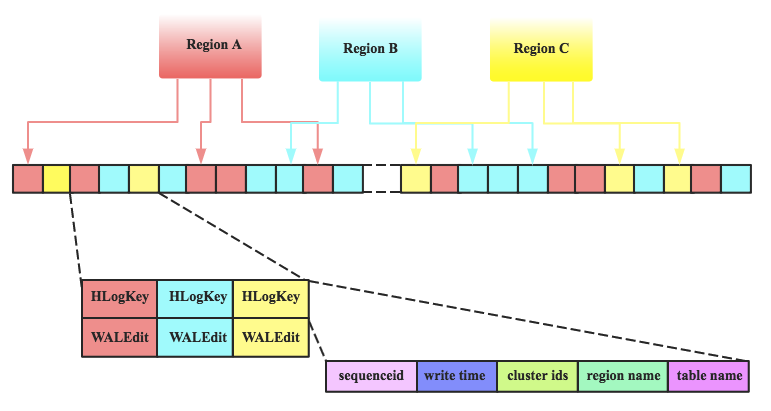

# Hbase作为实时系统的写过程

Hbase作为NoSQL数据库，不具备“强一致性”的事务处理能力，满足CAP理论中的CP（一致性与分区容错性），另外用了错误监控、主备模式以及Zookeeper的协调等技术来保障可用性。其最主要的功能是解决海量数据下的实时随机读写的问题。

## 数据存储方面的核心设计

- HFile

HBase中的每张表都通过行键按照一定的范围被分割成多个子表（HRegion），HRegion超过一定大小就要被分割成两个，由HRegionServer管理。HRegionServer存取一个子表时，会创建一个HRegion对象，然后对表的每个列族(Column Family)创建一个Store实例，每个Store都会1个MemStore和0个或多个StoreFile与之对应，每个StoreFile都会对应一个HFile， HFile就是实际的存储文件。MemStore存储在内存中，StoreFile存储在HDFS上。

- LSM

HBase使用了LSM树（Log-Structured Merge Tree）存储引擎。它首先在内存中构建一颗有序的小树，随着小树的逐渐增大，达到一定阈值时会flush到磁盘，磁盘中的树定期可以做merge操作，合并成一棵大树，以优化读性能。

- HLog

数据在写入内存MemStore直到flush到磁盘StoreFile有一定的时间差，突然断电会造成数据丢失，于是HBase采用WAL策略：每次更新之前，将数据写到一个HLog日志文件中，只有当写入成功后才通过客户端该操作成功。

## 写数据操作流程

HBase 写数据最终来看只有 put 和 delete 操作，在 HBase 里面添加数据和更新数据其实就是一个 put 操作；而 delete 数据并不是把原有的数据立即删除，而仅仅是做一个标记操作，真实的数据会在后面的 Major Compaction 过程中删除的。

我们往 HBase 里面写数据，首先是经过 HBase Client 的，然后到 RegionServer，最后数据被写到对应的 HFile 里面。写数据的过程，ZooKeeper -- meta -- regionserver-- Hlog -- MemStore -- storefile 。

写操作详细如下：

1. Client也是先访问zookeeper，找到.META.表的RegionServer位置，进而读出.META.表，并获取.META.表信息，并缓存在Client端。
2. 在元数据表.meta.中根据rowkey找到它们归属的RegionServer服务器。
3. Client向该RegionServer服务器发起写入数据的远程RPC请求，然后RegionServer收到请求并响应。客户端的提交操作到此结束。Client是支持批量的。
4. RegionServer接到请求后，先进行数据反序列化与各种检查，然后开始一次写事务操作过程。
5. 当事务正常结束后，则表示这条数据写入成功。
6. 在此过程中，如果Memstore达到阈值，会把Memstore中的数据flush到StoreFile中。
7. 当Storefile越来越多，会触发Compact合并操作，把过多的Storefile合并成一个大的Storefile。当Storefile越来越大，Region也会越来越大，达到阈值后，会触发Split操作，将Region一分为二。

写事务的过程如下：

1. 获取行锁、Region更新共享锁，获得锁后，开始写事务。
2. 先把数据写入到HLog，以防止数据丢失。
3. 然后将数据写入到Memstore。
4. 如果Hlog和Memstore均写入成功，释放行锁以及共享锁，Sync HLog到HDFS，如果失败将整个回滚。
5. 结束写事务，让数据被其他读请求可见。

## HLog的操作流程

HLog的数据结构是<HLogKey,WALEdit>，HLogKey主要存储了log sequence number，更新时间 write time，region name，表名table name以及cluster ids。WALEdit用来表示一个事务中的更新集合。

当数据写入时，按照顺序追加到HLog中，以获取最好的写入性能。

- 首先将数据写入本地缓存。
- 然后再将本地缓存写入文件系统。
- 最后执行sync操作同步到磁盘。

当故障恢复时，因为每个Region Server拥有一个HLog日志，而且HLog是直接存储在 HDFS 上的，在HMaster控制下，需要先将HLog切分再分发到对应的HRegion再回放。

恢复方案有三种，新版本默认是分布式日志切分方案：

- Log Splitting，普通日志切分方案。
- Distributed Log Splitting，分布式日志切分方案。
- Distributed Log Replay，分布式日志直接回放方案。