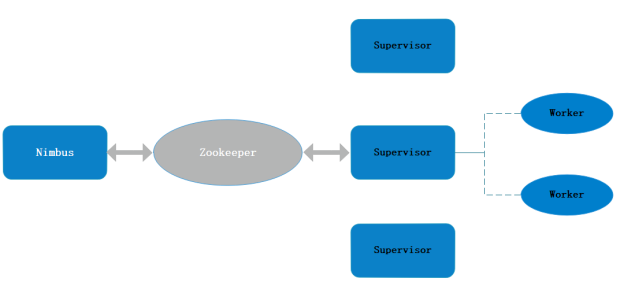

# Storm，分布式实时大数据处理系统

Storm是Apache社区分布式实时大数据处理框架，在2010年由Nathan Marz和BackType的团队创建，被Twitter收购后开源，2013年发布0.9版本以后成为Apache的开源项目，并在随后成为顶级项目。于2016年发布1.0版本，2019年发布2.0版本，核心代码全部使用了Java进行重构。

与Hadoop类似都是处理大批量数据，但是Storm主要用来持续不断的处理流数据，弥补了Hadoop批处理模式的不足。Storm的设计核心在容错和水平可扩展，并行的对实时数据进行处理，并且它保证每个消息将通过拓扑至少处理一次。框架主要特点如下：

- **简化编程**，开发人员只需要关注应用逻辑，资源的调度，数据的流转等工作都是框架完成。
- **容错**，单个节点挂了不影响应用，Storm集群会感知工作节点状态，失联节点上的任务会被重新分配。
- **可扩展**，系统可水平扩展，可以动态的增加减少节点，集群会自动重新分配任务。
- **可靠**，所有消息都可保证至少处理一次，也可能会被处理多次。

## 核心概念

Storm从一端读取实时数据的原始流，并将其传递到集群的处理单元，并在另一端输出最终结果。类似于Hadoop的Mapreduce的任务（Job），只是整个不会停止，一直读取数据处理数据。

- **Topologies**拓扑，打包了一个实时处理程序的逻辑，等同于一个任务，由Spouts和Bolts组成，由SteamGroupings连接到一起的拓扑结构。
- **Streams**数据流，是元组（Tuple）序列，从Spout传递给Bolt，从上一个Bolt传递给下一个Bolt，形成的这些数据通道即叫做Stream。可以有StreamId。
- **Spouts**数据源，拓扑中数据流的来源，一般是外部的，发送到拓扑中。Storm线程主动不断的从数据源拉取数据，再将数据组装成元组（Tuple）发送给之后的Bolt。
- **Bolts**数据流处理单元，可以执行过滤，聚合，加入，与数据源和数据库交互的操作。Bolts接收数据并发射到一个或多个Bolts。一个或多个Bolt按顺序组合起来可完成复杂的数据处理。它处理完一个数据后需要进行反馈（ACK机制）。
- **Stream groupings**流分组，数据分发策略，Storm中有八个内置流分组：随机分组、字段分组、所有分组、全局分组、无分组、直接分组、本地或随机分组。
- **Tasks**任务，每个任务对应一个执行线程，流分组定义如何将元组从一组任务发送到另一组任务。每个Spout和Bolt都可以执行多个任务。
- **Workers**工作节点，执行任务的节点，每个节点都是一个JVM，执行所有任务。

- **Tuple**元组，Stream中最小数据组成单元。

## 服务架构

Storm采用Master/Slave体系结构，分布式计算由Nimbus和Supervisor两类服务节点实现，依赖于ZooKeeper来监视工作节点的状态。

- **Nimbus**，进程运行在集群的主节点，负责任务的指派和分发。
- **Supervisor**，运行在集群的从节点，负责执行任务的具体部分，一般是集群化部署。
- **ZooKeeper**，存储节点与任务的状态数据，帮助supervisor与nimbus交互，维持nimbus，supervisor的状态。

## 编程模型

Storm 为了方便编程，将 Storm 的程序封装成 Topology，其实质是将Spout和Bolt组成一个 DAG 有向无环图，所有的数据都是以 Tuple 的形式在其中进行传输。Java类分解如下：

