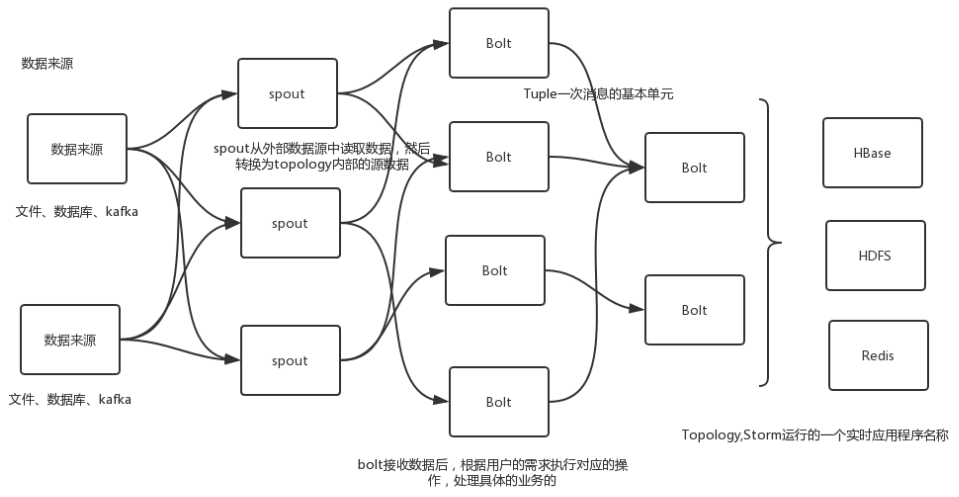

# Storm的编程模型-以Java语言为例

Storm可以很容易做到可靠地处理实时的数据流，处理数据流的应用程序不会终止，处理的数据也保存在内存中。我们需要采用内置或自定义实现 Spout(数据源) 和 Bolt(处理单元)，并通过 TopologyBuilder 将它们之间进行关联，形成 Topology。

Nimbus 和 Supervisor 进程都就快速失败和无状态，通过Zookeeper对整个过程进行跟踪，出现故障时，会重新获取记录在Zookeeper上的状态。

Storm接收Client提交应用程序是Thrift 接口，所以并不限定于特定语言。

## 数据处理模型

Strom在运行中有Spout与Bolt两类组件，其中，数据源从Spout开始，数据以Tuple的方式发送到Bolt，多个Bolt可以串连起来，一个Bolt也可以接入多个Spot/Bolt，最终由Bolt完成结果交付，如连接与访问数据库等。




## 应用程序

详细执行流程如下：

1. 客户端提交任务给Nimbus。
2. Nimbus做任务分配，找到空闲的Supervisor，进行任务分配（结合ZK）。
3. 将通过Zookeeper将任务分发下去，Supervisor开始跑程序。
4. Spout读数据，封装发送出来，Bolt处理数据并回复结果。Spout与Bolt的处理流程由Topology提前编排好的。
5. Nimbus对分配的任务进行监控，一旦发现超时不响应的Worker进程将重新分配。Worker进程自己也会周期性的获得任务的变化，对自己进行变更处理。

以官方的WordCount为例来详细体验一下具体过程。程序的Maven依赖storm-core，但是不需要把Storm依赖打到Jar中，Storm运行时环境中有自带storm-core的Jar包。

构建Topology，任务的编排，Worker进程数，提交：

```java
public class WordCountTopology extends ConfigurableTopology {
    public static void main(String[] args) throws Exception {
        ConfigurableTopology.start(new WordCountTopology(), args);
    }
    @Override
    protected int run(String[] args) throws Exception {
        TopologyBuilder builder = new TopologyBuilder();
        builder.setSpout("spout", new RandomSentenceSpout(), 4);
        builder.setBolt("split", new SplitSentence(), 4)
            .shuffleGrouping("spout");
        builder.setBolt("count", new WordCountBolt(), 4)
            .fieldsGrouping("split", new Fields("word"));
        Config conf = new Config();
        conf.setMaxTaskParallelism(3);
        conf.setNumWorkers(3);
        String topologyName = "word-count";
        return submit(topologyName, conf, builder);
    }
}
```

实现任务的各组件细节，Spout与Bolt，指定一个数据源，这个数据源可以是数据库、消息等等，主要是nextTuple取数据，再将数据封装为Tuple然后emit，官方例子是随机的字符串生成器：

```java
public static class RandomSentenceSpout extends BaseRichSpout {
    SpoutOutputCollector collector;
    Random random;
    @Override
    public void open(Map conf, TopologyContext context, 
                     SpoutOutputCollector collector) {
        this.collector = collector;
        this.random = new Random();
    }
    @Override
    public void nextTuple() {
        Utils.sleep(10);
        String[] sentences = new String[]{
            "the cow jumped over the moon", 
            "an apple a day keeps the doctor away"
        };
        final String sentence = 
            sentences[random.nextInt(sentences.length)];
        this.collector.emit(new Values(sentence), UUID.randomUUID());
    }
    @Override
    public void ack(Object id) {}
    @Override
    public void fail(Object id) {}
    @Override
    public void declareOutputFields(OutputFieldsDeclarer declarer) {
        declarer.declare(new Fields("word"));
    }
}
```

处理过程之一，分词处理，接收到数据处理后，再emit出来，一般来说处理完成需要主动ack，在BasicBolt中execute正常结束时会自动ack：

```java
public static class SplitSentence extends BaseBasicBolt {
    @Override
    public void execute(Tuple tuple, BasicOutputCollector collector) {
        String sentence = tuple.getString(0);
        for (String word : sentence.split("\\s+")) {
            collector.emit(new Values(word, 1));
        }
    }
    @Override
    public void declareOutputFields(OutputFieldsDeclarer declarer) {
        declarer.declare(new Fields("word", "count"));
    }
}
```

处理过程之二，汇总计数处理，数据最终被处理后可以选择存储或再转发：

```java
public static class WordCount extends BaseBasicBolt {
    Map<String, Integer> counts = new HashMap<>();
    @Override
    public void execute(Tuple tuple, BasicOutputCollector collector) {
        String word = tuple.getString(0);
        Integer count = counts.get(word);
        if (count == null) {
            count = 0;
        }
        count++;
        counts.put(word, count);
        collector.emit(new Values(word, count));
    }
    @Override
    public void declareOutputFields(OutputFieldsDeclarer declarer) {
        declarer.declare(new Fields("word", "count"));
    }
}
```

登陆Storm UI可以看到整个应用的详细情况，并可以操作应用，如终止。

## 处理过程分组编排

最重要的编排是Storm Streaming Grouping，支持如下几种类型：

- **Shuffle Grouping ：**随机分组，或者叫混排，下游Bolt各个task的tuple分配的比较均匀。
- **Fields Grouping ：**按字段分组，相同field值的Tuple被发送到相同的Task。
- **Global grouping ：**全局分组，Stream中的所有的tuple都会发送给同一个bolt任务处理，这样就可以实现事务性处理了。
- **None grouping ：**不分组，相当于随机，不过此Bolt会和上游任务同在一个线程。
- **Direct grouping： **直接分组，由消息的发送者指定由消息接收者的哪个task处理这个消息，必须使用emitDirect方法来。

另外还可以自定义Streaming Grouping接口，实现CustomStreamGrouping接口，其中最主要是chooseTasks方法的实现。

## 可靠性ack

Storm有ack机制保证了拓扑中Spout产生的每个元组都会被处理。同时也需要注意处理可能出现的同一个数据重复处理的问题。

Spout会记录它所发射出去的Tuple，当下游Bolt处理失败时（任意一个），会重新发送此Tuple。在nextTuple方法中，需要指定数据的唯一ID，没有此ID则不跟踪数据的执行情况。一个Tuple发送出去会分解成更多的Tuple，那么所有的Tuple中有一个失败，整个树就失败了。

Bolt在处理消息时，需要应答或报错，ack/fail。当然像BaseBasicBolt会在execute处理完成后隐式的ack。这是可选的，需要锚定到整个树的时候，需要在emit时指定Tuple anchor参数。

