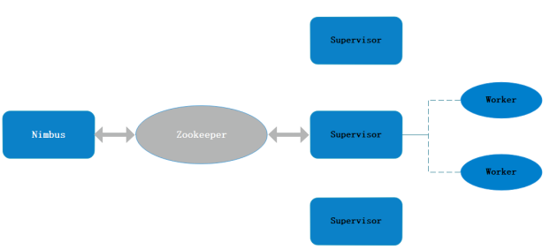

# Storm的部署与配置

Storm是开源的分布式实时计算系统，采用Master/Slave体系结构，分布式计算由Nimbus和Supervisor两类服务节点实现，由ZooKeeper来监视工作节点的状态。



Nimbus为Storm的主节点，是一个 Thrift 服务，设计为无状态模式。接收客户端任务，在集群中分发代码，将任务发布到Zookeeper上，Supervisor自己去领取任务。会监控任务的状态，随时进行已经挂掉的从节点的任务重新发布。

Supervisor为Storm的从节点，负责启动和停止本机上worker进程来执行任务并汇报状态，worker进程负责启动executor线程，executor负责执行客户提交到Storm集群上任务中Task(spout/bolt)。Supervisor与Zookeeper保持心跳，从Zookeeper上获取nimbus分配的任务，一旦挂掉，Nimbus重新分配任务到其他Supervisor。

ZooKeeper存储任务调度信息、各节点状态信息、心跳。

## 环境准备

需要Zookeeper，生产环境一般使用集群模式，开放的端口默认是2181。

Storm 2.0版本开始的核心代码由Clojure转为Java来实现，需要JVM环境，而且所有的 Storm 接口都设计为 Java 接口。至少安装java 8+，并配置环境变量。

0.9版本之后用Netty替换了ZeroMQ，成为storm底层通信框架，不需要再安装ZeroMQ。

Storm核心命令是python实现的，需要Python 2.7.x 或 Python 3.x。

在官网下载最新安装包，storm.apache.org/downloads.html。

生产环境部署集群，需要一个Nibus节点和一个或多个Supervisor节点。

准备Storm需要的目录，安装包目录，如：/usr/local。临时数据目录，如：/data/storm。

## 安装配置

安装Zookeeper过程略，JDK可以使用yum安装。将storm包下载后，解压到指定目录，然后修改配置文件。

解压安装包：

```shell
## 安装包在/usr/local下
tar zxvf apache-storm-2.2.0.tar.gz
```

针对Storm配置JVM环境与JVM配置选项，如指定内存等等：

```shell
## 如果在没有配置全局的JAVA_HOME情况下
vi conf/storm_env.ini
## 加入JAVA_HOME
JAVA_HOME:/usr/lib/jvm/java-11-openjdk-11.0.9.11-0.el7_9.x86_64
```

配置Storm的主要参数，vi conf/storm.yaml，参数很多，主要是Zookeeper与集群：

```yaml
## ZK集群
storm.zookeeper.servers:
    - "192.168.16.201"
## 数据目录
storm.local.dir: "/data/storm"
## UI的端口，默认是8080
ui.port: 8080
## nimbus的地址，各机器相同配置
nimbus.host: "192.168.16.203"
```

## 运维管理

Storm集群启动：

```sh
## 启动nimbus
nohup bin/storm nimbus > /dev/null 2>&1 &
## 启动supervisor
nohup bin/storm supervisor > /dev/null 2>&1 &
## 启动ui
nohup bin/storm ui > /dev/null 2>&1 &
## 启动logviewer
nohup bin/storm logviewer > /dev/null 2>&1 &
```

没有重启节点的方法，也没有停止的方法，只能kill -9 pid。

在集群上运行任务：

```shell
## 运行任务（Topology）
bin/storm jar topology.jar topologyClass arg1 arg2
## 可以独立停止正在运行的任务（Topology），要用提交的submitTopology名
bin/storm kill topologyName
```

UI启动后访问，192.168.16.203:8081/就能看到集群的整体信息，可以看到任务信息。

## 附

storm.yaml中重要的配置项：

**topology.max.task.parallelism**	每个Topology运行时最大的Executor数目
**topology.workers**	每个Topology运行时的worker的默认数目，若在代码中设置，则此选项值被覆盖
**storm.zookeeper.servers**	zookeeper所在服务器地址
**storm.zookeeper.port**	zookeeper的端口
**storm.local.dir**	Storm用于存储jar包和临时文件的本地存储目录
**storm.zookeeper.root**	zookeeper的根节点
**ui.port**	UI进程端口号
**nimbus.host**	nimbus主机地址
**supervisor.slots.ports**	supervisor进程端口号
**supervisor.worker.timeout.secs**	supervisor进程超时时间
**drpc.servers**	在使用drpc服务时，drpc server的服务器列表
**drpc.port**	在使用drpc服务时，drpc server的服务端口