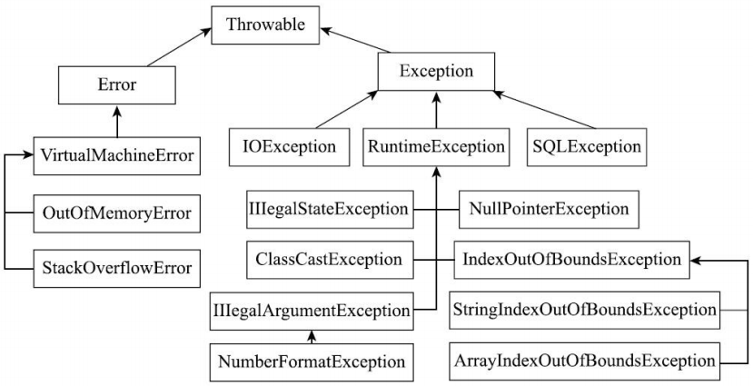

# Java异常体系

## 什么是异常

程序运行过程中会遇到各种非正常情况，例如内存不足、I/O 失败、网络中断、代码逻辑错误等，Java 把这些情况统一抽象为异常，并提供一整套异常机制来处理。

异常是相对于 return 的另一种退出机制。它可以由系统触发，也可以由程序通过 throw 语句主动触发；可以通过 try/catch 语句捕获并处理。如果没有被捕获，异常会沿着调用栈逐层上抛，到达线程顶层时打印异常栈并终止该线程（main 线程被终止，程序也就退出了）。

异常栈是从异常发生点到最上层调用者的完整调用轨迹，包含类名、方法名和行号，是分析异常时最重要的信息。

## 异常的类型体系

Java 定义了大量的异常类，它们以 Throwable 为根，分为两个分支：Error 表示系统错误，Exception 表示应用程序错误。

按编译器是否强制处理，异常又分为受检异常（checked exception）和非受检异常（unchecked exception）。受检异常必须在代码中捕获，或者在方法上用 throws 声明，否则编译报错；非受检异常没有这个要求，它包括 Error 和 RuntimeException 两大类及其子类。



- Throwable 是所有异常的基类，它有两个子类：Error 和 Exception。它保存了异常栈信息，这是我们能看到异常栈的关键。

```java
public class Throwable {   // 简化示意
    // 将异常栈信息保存下来。这也是创建异常开销大的原因：需要同步收集栈信息。
    Throwable fillInStackTrace();
    // 构造异常链：上层的异常由底层异常触发，cause 即底层异常。一个异常最多只能设置一次。
    Throwable initCause(Throwable cause);
    // 打印栈信息，有几个重载方法。
    void printStackTrace();
    // 获取异常信息。
    String getMessage();
    Throwable getCause();
    StackTraceElement[] getStackTrace();
}
```

- Error 表示系统错误或资源耗尽，由 JVM 自身使用，应用程序不应抛出，也不应捕获。常见的子类有内存溢出错误（OutOfMemoryError）和栈溢出错误（StackOverflowError）。
- Exception 表示应用程序错误，应用程序可以继承它或其子类定义自己的异常。
- RuntimeException 是 Exception 的一个子类。所有 RuntimeException 及其子类都属于非受检异常，例如空指针异常（NullPointerException）、数组越界异常（IndexOutOfBoundsException）、非法参数异常（IllegalArgumentException）等。

## 异常的捕获与处理：try / catch / finally / throws

```java
void method() throws zzzException {
    try {
        ... // 异常发生点
    } catch (xxxException e) {
        ... // 捕获异常后的处理逻辑
        throw new yyyException();  // 重新抛出处理后的异常
    } catch (xxxxException e) {
        ...
    } finally {
        ... // 无论有无异常都会执行的逻辑
    }
}
```

- try 块：放置需要捕获异常的代码。
- catch 块：可以有多条，每条对应一种异常类型。异常处理机制按书写顺序匹配 catch 块，匹配到某一条并执行其中代码后，其余 catch 块不再执行。
- 重新抛出：catch 块内处理完后，可以重新抛出异常——可以是原来的异常，也可以是新异常。
- finally 块：跟在 catch 之后，无论有无异常发生都会执行，一般用于释放资源。
- throws：在方法声明中列出该方法可能抛出的异常，多个异常用逗号分隔。受检异常必须显式捕获或用 throws 声明，才能沿调用栈向上传递。
- try-with-resources：JDK 7 引入的 try 语句扩展形式，在 try 关键字后的括号中声明一个或多个资源。资源是用完后必须关闭的对象，须实现 java.lang.AutoCloseable 接口（Closeable 继承自它）。语句块结束时，每个声明的资源都会被自动关闭，不需要再写 finally 手动关闭。

## 自定义异常

业务代码通常不直接使用 Java 类库里的通用异常，而是继承 Exception 或其子类定义受检的业务异常，或继承 RuntimeException 定义非受检的业务异常。两种做法没有绝对的对错，但一个项目中应按约定统一选择，并自始至终保持一致。

定义自定义异常时，一般需要提供携带 message 和 cause 的构造方法，以便在抛出时携带足够的上下文信息。

## 异常的使用规范

使用异常最重要的一致性：一个项目应对如何使用异常达成一致——哪些情况抛受检异常、哪些抛非受检异常、在哪里捕获、在哪里记录日志，都按约定执行即可。

异常按来源可分为三类：

- 用户：用户输入不合法。这类异常应在界面层提示用户，并允许重试。
- 程序员：编程错误，例如空指针、数组越界。这类错误应在开发测试阶段尽早暴露，靠日志定位并修复，不应靠 catch 掩盖后继续运行。
- 第三方：I/O 错误、网络、数据库、第三方服务等外部环境问题。这类异常通常不可控，处理目标是容错——重试、降级或快速失败，并把现场记录下来。

处理的目标也可分为两类：报告和恢复。报告分为报告给用户（提示信息要准确、可操作）和报告给系统（写入日志，要信息充分，便于排查）；恢复则是为程序提供容错能力，使其在部分功能失效时仍能继续服务。

阿里巴巴《Java 开发手册》异常处理章节对此有具体规定（以下条目个别字句有调整）：

> 1.【强制】Java 类库中定义的可以通过预检查方式规避的 RuntimeException 异常不应该通过 catch 的方式来处理。
>
> 2.【强制】异常不要用来做流程控制、条件控制。
>
> 3.【强制】catch 时请分清稳定代码和非稳定代码。稳定代码指无论如何不会出错的代码。对非稳定代码的 catch，尽可能区分异常类型，再做对应的异常处理。
>
> 4.【强制】捕获异常是为了处理它，不要捕获了却什么都不处理而抛弃之。如果不想处理它，请将该异常抛给它的调用者。最外层的业务使用者必须处理异常，将其转化为用户可以理解的内容。
>
> 5.【强制】有 try 块置于事务代码中时，catch 异常后如果需要回滚事务，务必注意手动回滚。
>
> 6.【强制】finally 块必须对资源对象、流对象进行关闭，有异常也要做 try-catch。
>
> 7.【强制】不要在 finally 块中使用 return，因为它会覆盖 try 块中的 return 结果。
>
> 8.【强制】捕获的异常类型与抛出的异常类型必须完全匹配，或者捕获类型是抛出类型的父类。

这八条可以归纳为几个原则：能用预检查规避的不要用异常兜底（第 1、2 条）；捕获了就要处理，不处理就继续上抛（第 4 条）；资源必须在 finally 块或 try-with-resources 中关闭，且 finally 中不 return（第 6、7 条）；捕获类型要匹配，处理要区分类型、分清稳定与非稳定代码（第 3、8 条）；涉及事务时注意手动回滚（第 5 条）。
