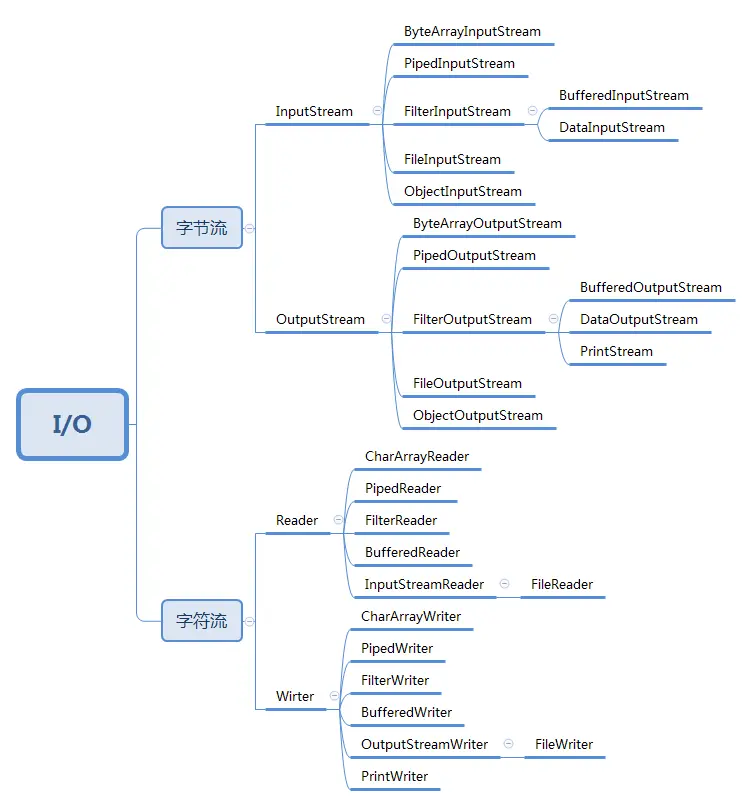
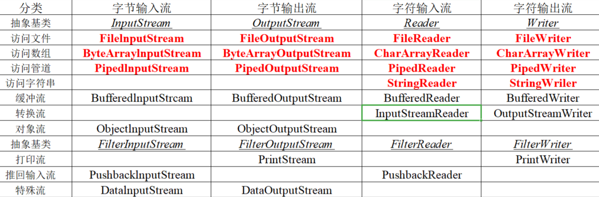

# Java的IO流处理

I/O（Input/Output）即输入/输出，指数据在内存、外部存储等设备之间的读写过程。

Java 把各种输入/输出源统一抽象为“流”（stream），并封装成一系列类，放在 `java.io` 包中。程序可以用相同的方式访问不同的数据源，而不必关心底层的设备差异。

## 流的抽象

流表示从源（source）流向接收端（sink）的有序数据。Java 中的流可以从三个维度分类：

按方向分类：

- 输入流：从数据源读取数据，基类是 `InputStream` 和 `Reader`。
- 输出流：向目的地写入数据，基类是 `OutputStream` 和 `Writer`。

按操作对象分类：

- 字节流：以字节（8 位）为操作单位，基类是 `InputStream` 和 `OutputStream`。
- 字符流：以字符（16 位）为操作单位，基类是 `Reader` 和 `Writer`。

按操作方式分类：

- 节点流：直接面向特定 IO 设备的原始流，如文件流、数组流。
- 处理流：在已有流对象之上再包装一层，提供更高层的功能。这是装饰者模式（Decorator）在 IO 中的典型应用：处理流本身也实现流的接口，使用时把已有的流传入构造器即可叠加能力。

## 常见的处理流

- 缓冲流（`BufferedInputStream` 等）：读写时先缓存数据，减少实际的 IO 次数。
- 过滤流（`FilterInputStream` 等）：读写过程中对数据进行加工，是所有包装流的基类。
- 转换流（`InputStreamReader`、`OutputStreamWriter`）：按指定的字符编码在字节流和字符流之间转换。
- 对象流（`ObjectInputStream`、`ObjectOutputStream`）：读写 Java 对象，即序列化与反序列化。
- 数据流（`DataInputStream`、`DataOutputStream`）：按 Java 基本数据类型读写数据。
- 文件流、数组流、字符串流：面向具体数据源的节点流。

## IO的使用

- 组装流时遵循“先功能、后性能”的顺序：先用节点流接上数据源，再按需叠加处理流。
- 字节流转字符流时必须指定字符编码，否则可能产生乱码。
- 自定义处理流时应遵循装饰者模式：继承过滤流基类，构造器接收一个已有的流。
- 优先使用包装好的公共组件（如 Commons IO），而不是自己造轮子。

## IO 模型

按线程与 IO 操作的配合方式，Java 的 IO 分为三种模型：

`java.io` 包实现传统的 BIO，JDK 1.4 引入的 `java.nio` 包提供 NIO，JDK 7 又在 `java.nio` 包中补充了 AIO（又称 NIO.2）的异步通道 API。

### BIO：同步阻塞 IO

服务器为每个连接分配一个线程：客户端发起连接后，服务器启动（或从线程池借出）一个线程专门服务该连接；线程发起读写调用后一直阻塞，直到数据就绪或写入完成才返回。

这种模型实现简单，业务流程符合直觉；但阻塞期间线程空等，无法服务其他连接。连接数稍大（如数千）时，大量线程带来的上下文切换和内存开销会拖垮服务器，因此 BIO 只适合连接少、并发低的场景。

典型代码形态：`ServerSocket.accept()` 返回一个 `Socket`，在其 `InputStream` 和 `OutputStream` 上同步读写。

### NIO：同步非阻塞 IO

核心思想是把“哪些连接就绪了”的探测工作集中到一个多路复用器（Selector）上：多个 Channel 注册到同一个 Selector，由一个线程通过 select 调用轮询出就绪的 Channel，再交给业务线程处理。一个线程即可管理成千上万连接，即“一个请求一个线程”。

NIO 由三大组件构成：

- Channel（通道）：数据的读写通道，支持双向传输，如 `SocketChannel`、`ServerSocketChannel`。
- Buffer（缓冲区）：数据读写的载体，Channel 只能与 Buffer 交互，数据必须先读入 Buffer 或从 Buffer 写出。
- Selector（多路复用器）：轮询注册在其上的 Channel，将就绪事件分发给处理线程。

其线程模型接近 Reactor 模式——就绪事件由分发线程探测，数据的实际读写仍由业务线程同步完成。NIO 适合连接数多、单次传输量小的场景，如聊天、推送类服务。

### AIO：异步非阻塞 IO

应用发起读写调用后立即返回，数据的实际搬运由操作系统在后台完成，完成后通过回调或 Future 通知应用线程取结果，即“一个有效请求一个线程”。

API 形态：`AsynchronousSocketChannel` 的 `read`/`write` 方法接收一个 `CompletionHandler` 回调或返回 `Future`，操作系统完成 IO 后触发回调。其线程模型接近 Proactor 模式——与 NIO 不同，连数据的读写本身也交给了操作系统异步执行。

AIO 的业务代码最简洁，线程空等最少；但依赖操作系统对异步 IO 的支持（Windows 的 IOCP 实现较完善，Linux 上 JDK 早期版本借助 epoll 线程池模拟），实际性能与 NIO 差距有限，因此主流网络框架（如 Netty）仍以 NIO 为基础。

