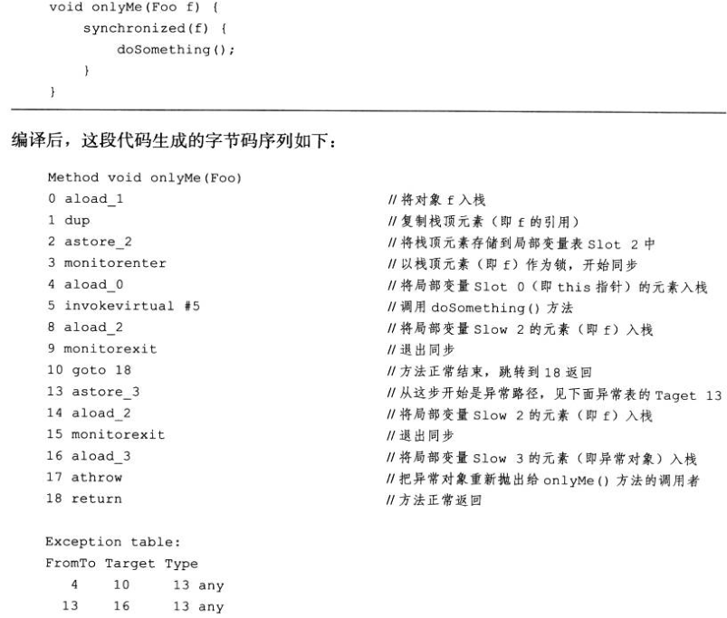

# JVM的字节码详情

JVM的作用是加载编译器编译好的字节码，并解释成机器码。Class文件中包含了JVM指令集和符号表以及若干其他辅助信息，方法内的代码被保存到code属性中，字节码指令序列就是方法的调用过程。

JVM规范要求在Class文件中使用许多强制性的语法和结构化约束，任何语言只要编译出JVM接受的有效的Class文件即可加载到JVM中运行。

由于JVM采用面向操作数栈而不是寄存器的架构，所以大多数的指令都不包含操作数，只有一个操作码。面向栈的指令可以方便移植和紧凑简单，面向寄存器则是直接依赖硬件了，当然也有更快的速度与更少的指令集。

## 字节码指令简介

字节码指令集的特点是数据量短小精干，便于传输，跨平台。同时也损失一定的解释执行效率。

- 由操作码+操作数组成。
  JVM的指令由一个字节长度的、代表着某种特定操作含义的数字（称为操作码，Opcode）以及跟随其后的零至多个代表此操作所需参数（称为操作数，Operands）而构成。

- 指令集的操作码是单字节的，总数不可能超过256条。为了尽可能获得短小精干的编译代码。
- 操作数的长度不对齐，长度超过1字节的以big一endian顺序存储，即高位在前的字节序。如：两个无符号字节存储的值就是：（byte1<<8)|byte2。不对齐可省略很多填充和间隔符号。
- 字节码指令流单字节对齐，但除Iableswitch和lookupswitch两个指令例外（4字节为界，少的补空）。

操作码一个字节长度，是8位二进制数字，也就是两位十六进制数字。它在class文件中是数字形式，但有他对应的显式的助记符形式。

指令的设计是逻辑功能点与数据类型的结合。

## 指令支持的数据类型

JVM指令集中，大多数的指令都包含了其所操作的数据类型信息。

数据类型相关的操作码助记符中的首字母都跟操作的数据类型相关：i代表对int类型的数据操作，l代表long，s代表short，b代表byte，c代表char，f代表float，d代表double，a代表reference。

指令集并非支持所有类型，byte、char、short、boolean等类型，都用操作数的运算类型（computational type）为int的指令来完成。byte和short类型的数据带符号扩展（sign-extend）为相应的int类型数据，boolean和char类型数据零位扩展（zero-extend）为相应的int类型数据。

## 指令集

- **加载和存储指令**，加载存储指令用于局部变量与操作数栈交换数据以及常量装载到操作数栈，如push、load、store、const。按数据类型不同在指令前面加i/l/f/d/a等，操作数放指令后面，超过4直接写下标，例：iload_3、iload 4。
- **运算指令**，加add、减sub、乘mul、除div、求余rem、取反neg、移位sh（l左r右）、与and、或or、异或xor、自增inc、cmp比较。
- **类型转换指令**，<T>2<T>，表示操作类型 到 目标类型，从小字节类型转大是宽化指令，从大字节类型转小窄化指令。
- **对象创建与访问指令**，创建对象new、创建基本类型数组newarray、创建引用类型数组anewarray、创建多维数组multianewarray。
- **操作数栈管理指令**，出栈pop、交换swap、复制栈顶并压栈dup、
- **控制转移指令**，条件跳转指令：if与eq/ne/lt/le/gt/ge组合（与0比较或加cmp表示栈顶两个操作数比较）、复合条件跳转指令tableswitch与lookupswitch、无条件跳转指令goto、
- **方法调用和返回指令**，调用对象的实例方法invokevirtual、调用接口方法invokeinterface、调用特殊实例方法invokespecial（如初始化方法）、调用类静态方法invokestatic、调用动态链接方法invokedynamic。返回指令return（带类型）、（以及SE6之前的jsr、ret）。
- **异常处理指令**，athrow。
- **同步指令**，monitorenter monitorexit。

## 附：指令汇总及含义

| 指令   | 原文                  | 指令意义                             |
| ------ | --------------------- | ------------------------------------ |
| push   | push                  | 将一个常量加载到操作数栈             |
| load   | load                  | 将一个局部变量加载到操作栈           |
| const  | const                 | 将一个常量加载到操作数栈             |
| store  | store                 | 将一个数值从操作数栈存储到局部变量表 |
| add    | add                   | 加法                                 |
| sub    | subduction            | 减法                                 |
| mul    | multiplication        | 乘法                                 |
| div    | division              | 除法                                 |
| inc    | increase              | 自增                                 |
| rem    | remainder             | 取余                                 |
| neg    | negate                | 取反                                 |
| sh     | shift                 | 移位                                 |
| and    | and                   | 与                                   |
| or     | or                    | 或                                   |
| xor    | exclusive OR          | 异或                                 |
| 2      | to                    | 类型转换                             |
| cmp    | compare               | 比较                                 |
| return | return                | 返回                                 |
| eq     | equal                 | 相等                                 |
| ne     | not equal             | 不相等                               |
| lt     | less than             | 小于                                 |
| le     | less than or equal    | 小于等于                             |
| gt     | greater than          | 大于                                 |
| ge     | greater than or equal | 大于等于                             |
| if     | if                    | 条件判断                             |
| goto   | goto                  | 跳转                                 |
| invoke | invoke                | 调用                                 |
| dup    | dump                  | 复制                                 |

## 一个例子

