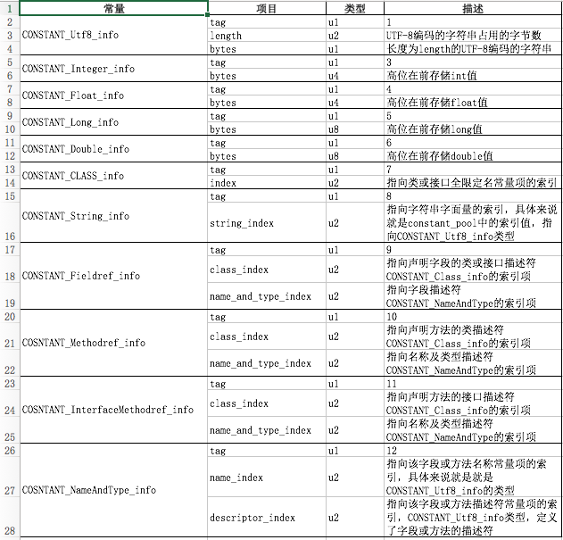

# JVM中的class文件结构

Java源代码使用Javac编译器编译成class文件，然后交给JVM执行。但是JVM不仅具有平台无关性，还具有语言无关性，class文件是jvm运行的基石，无论上层是Java还是Kotlin，JVM只认识class文件，只要class文件符合JVM的规范就能运行。

## class文件

class文件是二进制文件，它的内容具有严格的规范，文件中没有任何空格，全是连续的0/1。class文件中的所有内容被分为两种类型：无符号数和表。

- 无符号数
它表示class文件中的值，属于基本的数据类型，分为：u1、u2、u4、u8，分别代表1字节、2字节、4字节、8字节的无符号数。可以用来表示数字、索引引用、数量值、或UTF-8编码的字符串。
- 表
class文件中另外一部分数据由多个无符号数组成二维表，这种复合数据类型就是表，都以“_info”结尾。表用于表示有层次关系的复合数据，如。

## 文件内容详细信息

- **魔法数**，固定的值： 0XCAFEBABE，在class文件开头的四个字节，用来判断是不是class格式的文件的标准。
- **主版本号和小版本号**，紧接着魔法数的四个字节是class文件的小版本号和主版本号。不同的主版本表示被不同版本的JDK支持，如34（对应十进制的52）与JDK1.8，一般高版本可识别低版本的class。
- **常量池**，位于版本号后面的就是常量池相关的数据项，常量池大小与内容（类似数组）。常量池中几乎包含类中的所有信息的描述，详细内容单独一节来说明。
- **访问标志**，常量池之后，是2个字节来表示访问标志，标志public、final、interface、abstract等等。
- **类索引、父类索引、接口索引**，访问标志后的4个字节分别表示类索引、父类索引、接口个数、接口索引，各索引分别指向常量池中的第n个常量。
- **字段表、方法表、属性表**，接口索引后面紧跟着的是字段、方法、属性表信息，各表的入口前2个字节表示各内容的个数。属性则是Class文件、字段表、方法表中携带的自己的属性表集合。各表信息结构都有不同，其中字段与方法的结构相似。

## 常量池的详细内容

 常量池中存放了字符串， 常量值， 当前类的类名， 字段名， 方法名， 各个字段和方法的描述符， 对当前类的字段和方法的引用信息， 当前类中对其他类的引用信息等等。 

常量池中几乎包含类中的所有信息的描述， class文件中的很多其他部分都是对常量池中的数据项的引用，比如文件随后的内容：this_class, super_class, field_info, attribute_info等， 另外字节码指令中也存在对常量池的引用， 这个对常量池的引用当做字节码指令的一个操作数。 此外， 常量池中各个项也会相互引用。

常量池中主要存放2大类常量：字面量和符号引用。

- 字面量（Literal），主要指字符串、被声明为final的常量值。
- 符号引用（Symbolic References），主要是类和接口的全限定名、字段的名称和描述符、方法的名称和描述符。

常量池中的每个常量都是一个表类型，共有11种不同的表类型，每个类型都有自己的信息结构，在表类型开始的第一位是一个u1类型的tag标志位。

tag表示的数据类型如下表所示：

| 类型                        | 标志 | 描述                                                    |
| --------------------------- | ---- | ------------------------------------------------------- |
| CONSTANT_Utf8_info          | 1    | UTF-8编码的字符串                                       |
| CONSTANT_Integer_info       | 3    | 整形字面量，boolean、byte、char、short等类型都用int存放 |
| CONSTANT_Float_info         | 4    | 浮点型字面量                                            |
| CONSTANT_Long_info          | 5    | 长整型字面量                                            |
| CONSTANT_Double_info        | 6    | 双精度浮点型字面量                                      |
| CONSTANT_Class_info         | 7    | 类或接口的符号引用                                      |
| CONSTANT_String_info        | 8    | 字符串类型字面量                                        |
| CONSTANT_Fieldref_info      | 9    | 字段的符号引用                                          |
| CONSTANT_Methodref_info     | 10   | 类中方法的符号引用                                      |
| CONSTANT_InterfaceMethodref | 11   | 接口中方法的符号引用                                    |
| CONSTANT_NameAndType_info   | 12   | 字段或方法的部分符号引用                                |

## 附：class文件内容的格式

| 类型           | 描述                                   | 备注                |
| -------------- | -------------------------------------- | ------------------- |
| u4             | magic                                  | 魔数：0xCAFEBABE    |
| u2             | minor_version                          | 小版本号            |
| u2             | major_version                          | 主版本号            |
| u2             | constant_pool_count                    | 常量池大小，从1开始 |
| cp_info        | constant_pool[constant_pool_count - 1] | 常量池信息          |
| u2             | access_flags                           | 访问标志            |
| u2             | this_class                             | 类索引              |
| u2             | super_class                            | 父类索引            |
| u2             | interfaces_count                       | 接口个数            |
| u2             | interfaces[interfaces_count]           | 接口类索引信息      |
| u2             | fields_count                           | 字段数              |
| field_info     | fields[fields_count]                   | 字段表信息          |
| u2             | methods_count                          | 方法数              |
| method_info    | methods[methods_count]                 | 方法表信息          |
| u2             | attributes_count                       | 属性个数            |
| attribute_info | attributes[attributes_count]           | 属性表信息          |

## 附：常量池全景表

## 附：类、字段、方法的访问标志

| 标志名称       | 标志值 | 含义                               |
| -------------- | ------ | ---------------------------------- |
| ACC_PUBLIC     | 0x0001 | 是否为public类型                   |
| ACC_PRIVATE    | 0x0002 | private                            |
| ACC_PROTECTED  | 0x0004 | protected                          |
| ACC_STATIC     | 0x0008 | static，静态                       |
| ACC_FINAL      | 0x0010 | 是否被声明为final，只有类可以设置  |
| ACC_SUPER      | 0x0020 | JDK1.0.2以后这个标志都为真         |
| ACC_VOLATILE   | 0x0040 | volatile，不可和ACC_FIANL一起      |
| ACC_TRANSIENT  | 0x0080 | 在序列化中被忽略的字段             |
| ACC_NATIVE     | 0x0100 | 标识native方法                     |
| ACC_INTERFACE  | 0x0200 | 标识这是一个接口                   |
| ACC_ABSTRACT   | 0x0400 | 是否为abstract类型（接口或抽象类） |
| ACC_SYNTHETIC  | 0x1000 | 标识这个类并非由用户代码产生       |
| ACC_ANNOTATION | 0x2000 | 标识这是一个注解                   |
| ACC_ENUM       | 0x4000 | 标识这是一个枚举                   |

## 附：字段、方法信息结构表

| 类型           | 描述                         | 备注                                     |
| -------------- | ---------------------------- | ---------------------------------------- |
| u2             | access_flags                 | 记录字段、方法的访问标志                 |
| u2             | name_index                   | 常量池中的索引项，指定字段、方法的名称   |
| u2             | descriptor_index             | 常量池中的索引项，指定字段、方法的描述符 |
| u2             | attributes_count             | attributes包含的项目数                   |
| attribute_info | attributes[attributes_count] | 字段、方法的属性                         |

name_index代表着字段的简单名称，descriptor_index代表着字段的描述符。描述符的作用是用来描述字段的数据类型、方法的参数列表（包括数量、类型以及顺序）和返回值。

- descriptor_index描述符标识字符含义：

| 标识字符 | 含义                           |
| -------- | ------------------------------ |
| B        | 基本类型byte                   |
| C        | 基本类型char                   |
| D        | 基本类型double                 |
| F        | 基本类型float                  |
| I        | 基本类型int                    |
| J        | 基本类型long                   |
| S        | 基本类型short                  |
| Z        | 基本类型boolean                |
| V        | 特殊类型void                   |
| L        | 对象类型，如Ljava/lang/Object; |
| [        | 数组类型，多个维度则有多个[    |

- 方法表的结构与字段表的结构是一样的。

## 附：属性信息结构表

| 属性名称           | 使用位置           | 含义                                 |
| ------------------ | ------------------ | ------------------------------------ |
| Code               | 方法表             | Java代码编译成的字节码指令           |
| ConstantValue      | 字段表             | final关键字定义的常量值              |
| Deprecated         | 类、方法表、字段表 | 被声明为deprecated的方法和字段       |
| Exceptions         | 方法表             | 方法抛出的异常                       |
| InnerClasses       | 类文件             | 内部类列表                           |
| LineNumberTable    | Code属性           | Java源码的行号与字节码指令的对应关系 |
| LocalVariableTable | Code属性           | 方法的局部变量描述                   |
| SourceFile         | 类文件             | 源文件名称                           |
| Synthetic          | 类、方法表、字段表 | 标识方法或字段为编译器自动生成的     |

不同的属性有不同的数据结构。属性数据结构里还包含有其他属性。其中Code字节码指令最为关键，存储了字节码指令的一系列字节流。

- Code属性数据结构：

| 类型           | 名称                         | 含义                         |
| -------------- | ---------------------------- | ---------------------------- |
| u2             | attribute_name_index         | 属性名称索引                 |
| u4             | attribute_length             | 属性长度                     |
| u2             | max_stack                    | 操作数栈深度的最大值         |
| u2             | max_locals                   | 局部变量表所需的存储空间     |
| u4             | code_length                  | 字节码长度                   |
| u1             | code[code_length]            | 存储字节码指令的一系列字节流 |
| u2             | exception_table_length       | 异常表长度                   |
| exception_info | exception_table              |                              |
| u2             | attributes_count             |                              |
| attribute_info | attributes[attributes_count] |                              |

