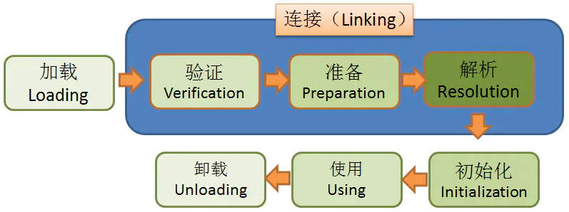
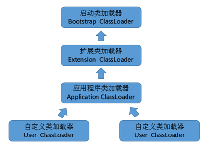

# JVM类加载与类加载器
虚拟机把class文件加载到内存，并对文件进行校验、转换解析和初始化，最终形成虚拟机中的Java类型，这就是虚拟机的类加载机制。

类加载的触发时机有以下几种情况：
- 遇到new一个对象的时候，或者set或者get一个类的静态属性，或者调用一个类的静态方法。
- 使用反射（java.lang.reflect）对类进行调用时。
- 初始化类时对父类的初始化。
- JVM启动时的主类。
- 反射调用（java.lang.invoke.MethodHandle）里面对类的静态属性或方法的调用时。

## 类加载的过程
类从被加载到内存中开始，到卸载出内存，经历了加载、链接、初始化、使用四个阶段，其中连接又包含了验证、准备、解析三个步骤。
总体上是如此顺序，但是因为Java有动态的特性，所以运行时的顺序则交叉进行，要复杂得多。

### 加载(Loading)
加载是整个类加载过程的第一步，当类需要被加载时（被触发），类加载（ClassLoader）将Jar中的class文件读入到JVM中。

这阶段主要任务有：
- 通过“类全名”来获取定义此类的二进制字节流。
- 将字节流所代表的静态存储结构转换为方法区的运行时数据结构。
- 在java堆中生成一个代表这个类的java.lang.Class对象，作为方法区这些数据的访问入口。

### 连接(Linking)

连接就是将已经读入到内存的类的二进制数据合并到虚拟机的运行时环境中去。包括验证**、**准备**、**解析三步。

- **验证(Verification)**

此阶段主要确保class文件的字节流中包含的信息符合当前虚拟机的要求，并且不会危害虚拟机的自身安全。

要验证的内容有：Class文件格式规范，字节码描述的元数据规范，字节码中的数据流和控制流等的合法性和逻辑性，符号引用。

- **准备(Preparation)**

为类的static静态变量分配内存，并赋初始“零值”，分配一个结构用来存储类信息，包括成员变量、方法、接口等。

- **解析(Resolution)**

把类中对常量池内的符号引用转换为直接引用。有类或接口、字段、类方法、接口方法、方法类型、方法句柄和调用点限定符等7类符号引用。

### 初始化(Initialization)

对类的static静态变量赋予正确的初始值，这阶段主要是显式指定与静态代码块中的初始值。

初始化时的检查：此类如未加载、连接，则先加载连接；此类的直接父类如果未初始化，则先初始化直接父类。最后依次执行初始化语句。

初始化的时机：new关键字创建类的实例、java.lang.reflect包的反射调用、对类的静态变量进行访问或赋值、调用类的静态方法、其子类初始化时、程序入口。

### 使用(Using)与卸载(Unloading)

当类初始化完成后，即可使用或卸载了。类的访问是方法区的数据结构，对象则是Heap区的数据。

只有在当JVM进程结束时，类会被卸载。其次由用户自定义的类加载器加载的类是可以被卸载的。

## 类加载器

类加载器负责加载所有的类，其为所有被载入内存中的类生成一个java.lang.Class实例对象，并赋予唯一的名字予以标识。一旦一个类被加载到JVM中，同一个类就不会被再次载入了。

在Java中，一个类用其全限定类名（包括包名和类名）作为标识；但在JVM中，一个类用其全限定类名和其类加载器作为其唯一标识。

JVM预定义有三种类加载器，当一个 JVM启动的时候，Java开始使用这三种类加载器。

- 根类加载器（bootstrap class loader）

也叫启动类或引导类加载器，用来加载Java核心类库，与JVM底层相关，使用C/C++语言实现的，嵌套在JVM内部，java程序无法直接操作这个类。并不是继承自java.lang.ClassLoader，也没有父类加载器。

由它来加载扩展类加载器和应用程序类加载器，并成为他们的父类加载器，只加载包名为：java、javax、sun开头的类。

- 扩展类加载器（extensions class loader）

由sun.misc.Launcher$ExtClassLoader实现，在Java程序中可以使用，它是java.lang.ClassLoader的子类，父类加载器为根类加载器。

加载系统属性java.ext.dirs指定目录下和jre/lib/ext目录下的类库。

- 应用类加载器（application class loader）

也叫系统类加载器，由sun.misc.Launcher$AppClassLoader实现。它负责在JVM启动时加载来自Java命令的-classpath选项、java.class.path系统属性，或者CLASSPATH指定的JAR包和类路径。

父类加载器为扩展类加载器。用户自定义的类加载器默认情况下都是继承此加载器。

程序通过静态方法ClassLoader.getSystemClassLoader()可以使用此加载器。

## 类加载器的特点

- **层级结构**：类加载器被组织成了有父子关系。最上层是根类加载器。
- **双亲委托模式**： 先让父类加载器试图加载该Class；只有父加载器无法加载时，才自己去加载。
- **可见性限制**：一个子类加载器可以查找父类加载器中的类，反之不行。
- **不允许卸载**：类一旦加载就不可以卸载它。
- **隔离性**：同一个类，被不同类加载器加载，类的实例也不可以相互强转。

