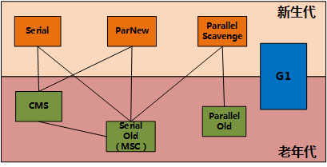

# JVM的垃圾回收设计

## 什么是垃圾回收

GC（Garbage Collection）就是"自动内存管理系统"，是一个把不再需要的内存空间自动释放和回收的机制。GC 的核心算法解决两个问题：判断对象是否存活，以及用什么策略回收。

不被直接或间接引用的对象视为"死亡"，就是所谓的垃圾，需要被回收。

判断对象是否存活有两种方法：

- 根搜索算法（可达性分析或引用链法）：从根出发，递归遍历所有被引用的对象并标记，没被标记的就是垃圾。标记-清除、复制等主流算法都采用这种方式。
- 引用计数法：在每个对象中保存引用计数，引用增减时更新计数，计数减至 0 时释放该对象。

这里的"根"是判断对象是否被引用的起始点。不同语言规定不同，但基本上把变量和运行栈空间作为根。

### GC Roots

以 HotSpot 虚拟机为例，可以作为 GC Roots 的对象有：虚拟机栈引用的对象、方法区的类静态属性引用的对象、方法区常量引用的对象、本地方法栈中 Native 方法引用的对象。

JDK 8 起永久代被元空间（Metaspace）取代，方法区的回收目标也随之变为类的元数据。

## GC 核心算法

现有的多种 GC 算法大都是对标记-清除、标记-整理、复制、引用计数几种基础算法的拆分组合。

### 标记-清除算法

标记-清除（Mark and Sweep）是最早的 GC 算法，分两个阶段：标记阶段从根开始，用递归的方式标记所有可能被引用的对象；清除阶段把没有标记到的对象作为垃圾回收。

它在需要清理大量对象时要逐个遍历垃圾对象，整体耗时较长，且不压缩内存，会产生碎片。

### 标记-整理算法

标记-整理（Mark and Compact）是标记-清除的改进，标记阶段相同，清除阶段多了压缩（Compact）操作：把幸存对象移动到内存的一端。成本相对高，但没有碎片。

### 复制算法

复制收集（Copy and Collection）改进了标记-清除算法，总体流程是：开辟新空间，复制对象，清空旧空间。它将从根开始被引用的对象复制到另一块空间，再把被复制对象所能引用的对象用递归的方式不断复制下去。

复制算法需要双份空间，空间消耗大；如果存活对象很多，复制开销大，效果差。它适合存活对象少的场景，这正是新生代的典型特征。

### 引用计数法

引用计数（Reference Counting）是最简单的实现，与标记-清除出现时间相近。原理是：在每个对象中保存该对象的引用计数，引用发生增减时更新计数，计数减至 0 时释放该对象的内存。

它对循环引用的对象无法释放，运行时还要维护计数，效率较差，但不会产生长时间停顿，适用场景有限。

## GC 的主要性能指标

- 吞吐量：应用程序花费在非 GC 上的时间百分比，即应用程序耗时 / 系统总运行时间。
- GC 负载：应用程序花在 GC 上的时间百分比，即 GC 耗时 / 系统总运行时间。吞吐量与 GC 负载之和为 100%。
- 停顿（STW，Stop The World）：停顿时长，也就是不可用时间，常称延迟。
- 反应时间：一个对象变成垃圾后，多长时间内被释放。
- 垃圾回收频率：多长时间回收一次。

## Java 的内存区域与回收

垃圾回收主要发生在 Java 堆区和方法区，这两部分内存的分配和回收是动态的。程序计数器、虚拟机栈和本地方法栈三个区域随线程启动与销毁，不需要考虑回收。

### 分代收集

现代收集器基本都采用分代收集算法，其依据是分代假设：程序中大部分对象朝生夕死，而熬过多次收集的对象往往会长期存活。HotSpot 据此把堆划分为新生代和老年代：新对象在新生代分配，熬过若干次收集后晋升老年代。这样新生代可以频繁使用复制算法快速回收，老年代对象稳定，用标记-整理算法低频回收，两套策略各取所长。

## HotSpot 的垃圾收集器

不同 JVM 提供的垃圾收集器差别很大。下面以应用最广泛的 HotSpot 虚拟机为例，先介绍 JDK 7/8 时代的经典收集器。

- **Serial**

  新生代串行收集器，JDK 1.3 之前唯一的选择。针对新生代，采用复制算法的单线程收集器，一旦启动，其他线程全部进入暂停（Stop-The-World）状态。它简单而高效，内存较小时没有线程切换开销，单线程收集效率最高，是 client 模式下的默认新生代收集器。

  可由 `-XX:+UseSerialGC` 指定。

- **ParNew**

  新生代多线程并行收集器，是 Serial 的多线程版本，同样使用复制算法，关注缩短垃圾收集时间，在单 CPU 情况下效果不好。它是 CMS 的默认搭配新生代收集器。

  可由 `-XX:+UseParNewGC` 指定。

- **Parallel Scavenge**

  新生代多线程并行收集器，与 ParNew 相似，同样使用复制算法，但关注吞吐量，也称吞吐量收集器（Throughput Collector），目标是减少垃圾收集总时间。

  它支持自适应调节策略（GC Ergonomics），开启后可以自动调节新生代与老年代的比例、对象晋升老年代的年龄等参数。

  适用多 CPU、后台计算为主的场景。

  可由 `-XX:+UseParallelGC` 指定。

- **Serial Old**

  老年代单线程串行收集器，使用标记-整理算法，关注单次垃圾收集效率，是 client 模式下的默认老年代收集器，在 server 模式下也作为 CMS 失败时的后备收集器。

  可由 `-XX:+UseSerialOldGC` 指定。

- **Parallel Old**

  老年代多线程并行收集器，与 Parallel Scavenge 一样关注吞吐量，采用标记-整理算法，JDK 6 提供。与 Parallel Scavenge 搭配适合吞吐量优先的多 CPU 后台场景。

  可由 `-XX:+UseParallelOldGC` 指定。

- **CMS**

  老年代多线程并发标记-清除收集器，关注并发收集、低停顿，也称并发低停顿收集器（Concurrent Low Pause Collector）或低延迟（low-latency）收集器。它采用标记-清除算法（不压缩，会产生内存碎片），部分过程与用户线程并发执行，停顿较低；代价是抢占部分 CPU 资源，CPU 紧张时会引起响应变慢、总吞吐量下降。

  它的过程分四个阶段：

  初始标记：标记 GC Roots 能直接关联到的对象，单线程执行，需要短暂停顿（STW）。

  并发标记：与应用程序并发执行，从初始标记出的对象开始找出所有存活对象。

  重新标记：修正并发标记期间引用变动的那部分对象，多线程执行，需要一次较长的停顿（STW），会遍历 Eden 区、并发标记期间引用变化的 dirty card 和 GC Roots。

  并发清除：并发移除不再使用的对象，并重置 CMS 的数据结构。

  可由 `-XX:+UseConcMarkSweepGC` 指定。当内存不够抛出 Concurrent Mode Failure 时，会退化为 Serial Old 执行 Full GC。CMS 已在 JDK 14 中移除。

- **G1（Garbage-First）**

  JDK 7 引入的收集器，并行、并发、分代收集，兼顾吞吐量和停顿时间。它把整个堆划分为多个大小相等的独立区域（Region），在逻辑上分代，有 Eden 区、Survivor 区、Old 区和 Humongous（巨型对象）区。

  它的回收过程与 CMS 类似，有初始标记、并发标记、重新标记、筛选回收阶段，有三种回收模式：Eden 区满时进行 Minor GC（Young GC）；存活对象越来越多进入 Old 区时进行 Mixed GC（回收整个新生代和部分老年代）；Old 区满时进行 Full GC。

  G1 支持可预测的停顿目标，以 Region 为单位整理回收，不产生碎片，主要用在服务端大内存、多 CPU 的场景。

  可由 `-XX:+UseG1GC` 指定。

- **ZGC**

  可伸缩的低延迟垃圾收集器，目标是无论堆多大（从数百 MB 到数 TB）都能把停顿控制在 10 ms 以内，实测通常在亚毫秒级。它于 JDK 11 作为实验特性引入，JDK 15 转为正式特性；JDK 23 起默认以分代模式运行，JDK 24 移除了非分代模式。适合超大堆、极低延迟要求的服务端场景。

  可由 `-XX:+UseZGC` 指定。

  除上述收集器外，OpenJDK 还有 Shenandoah（与 ZGC 同类的低延迟并发收集器，部分发行版提供）和 Epsilon（只做分配、不做回收的无操作收集器，用于性能基线测试）。

### 默认收集器的版本演变

JDK 7、JDK 8 在 server 模式下的默认组合是：新生代 Parallel Scavenge + 老年代 Serial Old；client 模式下是 Serial + Serial Old。

从 JDK 9 开始默认收集器改为 G1，但单 CPU 或物理内存小于 1792 MB 的受限环境仍会自动选择 Serial。

JDK 27（JEP 523）起，G1 成为所有环境下的默认收集器，不再按环境降级为 Serial。

## Minor GC 和 Full GC

Minor GC 指发生在新生代的垃圾收集动作，非常频繁，回收速度也比较快。Eden 区满时触发。

Major GC 指发生在老年代的垃圾收集动作，速度很慢，一般比 Minor GC 慢 10 倍以上。

Full GC 指收集整个堆（新生代 + 老年代，以及方法区/元空间）的垃圾收集。Major GC 和 Full GC 常被混用，严格来说 Major GC 只针对老年代，只有在老年代独占触发时二者才重合。老年代或方法区空间不足，或晋升老年代的平均大小大于老年代可用空间时，都会触发 Full GC。

G1 还有一个 Mixed GC 模式，同时回收整个新生代和部分老年代。

## STW（Stop-The-World）

执行垃圾收集时，JVM 会在安全点（Safepoint）挂起所有应用线程，让垃圾收集线程独占运行，native 代码可以正常执行。STW 是垃圾收集停顿的来源，低延迟收集器的核心目标就是压缩 STW 的时长。

另外，JVM 中有一条特殊的 VM 线程，专门执行 Dump、线程栈收集等 VM Operation，同样会引起停顿。

## JVM 内存分配担保机制

当新生代空间不足以分配新对象时，虚拟机会先把新生代中的存活对象转移到老年代，腾出新生代后再分配新对象，这就是分配担保。另外，需要分配超大对象时，也会跳过新生代，直接分配到老年代。

这个机制的目的是避免新生代复制大对象时产生大量开销。

## JVM 引用类型

JVM 通过对象是否被引用判断其存活。为了允许特殊控制回收时间点，定义了四种引用类型：强引用、软引用、弱引用、虚引用，引用强度依次递减。

正常情况下程序中都是强引用。特殊场景如缓存，才会用到其他三种：

- 强引用（StrongReference）：最常见的引用类型，只要强引用存在，对象就无法回收。
- 软引用（SoftReference）：内存不足即将溢出前，会回收只被软引用关联的对象。
- 弱引用（WeakReference）：每次垃圾收集时，只被弱引用关联的对象都会被回收。
- 虚引用（PhantomReference）：不影响对象的回收时机，仅通过引用队列感知对象被回收的消息。
