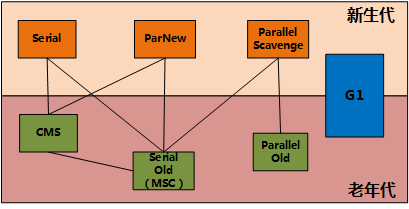

# JVM的垃圾回收设计

- 垃圾回收主要是在Java堆区和方法区内存，这部分内存分配和回收是动态的。
程序计数器、虚拟机栈和本地方法栈3个区域随线程启动与销毁，则不需要考虑回收。
- 现代的收集器基本都采用分代收集算法。
- 新生代内存不足时，或者要分配超大对象时，都会启动“分配担保”，直接将内存分配在老年代。

## JVM的垃圾收集器
不同的JVM所提供的垃圾收集器可能会有很在差别，到现在应用最广泛的JDK7/8后，HotSpot虚拟机所有收集器及组合（连线）如下：

- **Serial**

新生代串行收集器，JDK1.3前唯一选项。针对新生代的采用复制算法单线程收集器，
一旦启动，其他线程就全部进入暂停“Stop-the-world”状态。
它的优势在简单而高效，在内存较小的情况没有线程切换可以有最高的收集效率。
目前在client模式下是默认的新生代收集器。

可由"-XX:+UseSerialGC"指定。

- **ParNew**

新生代多线程并行收集器，是Serial的多线程版本，一样使用了复制算法，关注缩短垃圾收集时间。
在单CPU情况下，效果不好。

可由"-XX:+UseParNewGC"指定。

- **Parallel Scavenge**

新生代多线程并行收集器，与ParNew相似使用了复制算法。
关注吞吐量，也称为吞吐量收集器（Throughput Collector），即减少垃圾收集时间。

支持自适应的调节策略（GC Ergonomics），开启后可以自动调节生老区比例、进老年代的对象年龄等等。

适用在多CPU情况下，后台计算为主的场景。

可由"-XX:+UseParallelGC"指定。

- **Serial Old**

老年代单线程串行收集器，使用标记整理算法，关注单次垃圾收集效率。
标记整理是标记清除的改进，在标记阶段是相同的操作，
在整理阶段的方法是Sweep（清理，将废弃的对象清理）和Compact（压缩，移动幸存对象到另外一端）。
成本相对高但是没有碎片。

可由"-XX:+UseSerialOldGC"指定。

- **Parallel Old**

老年代多线程并行收集器，同Parallel Scavenge收集器的一样关注吞吐量，不同的是采用了"标记-整理"算法。

可由"-XX:+UseParallelOldGC"指定。

- **CMS**

老年代多线程并发标记清理收集器，关注并发收集、低停顿，也称为并发低停顿收集器（Concurrent Low Pause Collector）或低延迟（low-latency）垃圾收集器。
采用了"标记-清除"算法(不进行压缩操作，产生内存碎片)，部分过程可以与用户线程一起工作，所以有较低的停顿。
同样也因为抢占了部分CPU资源，对CPU资源要求较高，会引起响应较慢与总吞吐量降低。

它的过程比较复杂，分四个阶段：

初始标记：标记GC Roots能直接关联到的对象，单线程标记，需要短暂停顿（STW）。

并发标记：与应用程序并发进行，从初始标记出的对象开始找出所有存活的对象。

重新标记：修正从开始以来变动的那部分对象，需要长一点的停顿（STW），进行多线程标记。
这个过程会遍历Eden区、并发标记时引用变化的dirty card、GC Root。

并发清除：并发移除那些不用的对象，并重置CMS的数据结构。

可由"-XX:+UseConcMarkSweepGC"指定。
另外，在内存不够报"Concurrent Mode Failure"时，会使用"Serial Old"。

- **G1（Garbage-First）**

新版垃圾收集器，仍然是并行、并发、分代收集，兼顾吞吐量和停顿时间。
它是将整个堆划分为多个大小相等的独立区域（Region），在逻辑上进行分代，有Eden区、Survivor区、Old 区、Humongous(巨型对象)区。

如同CMS一样有初始标记、并发标记、重新标记、筛选回收阶段。
有三种模式的垃圾回收，eden区满的时进行Minor GC、越来越多对象进入Old区时Mixed GC、Old 区满时进行Full GC。

还具有可预测的停顿（STW）以及空间整合，不产生碎片。
主要用在服务端大内存多CPU的情况下。

可由"-XX:+UseG1GC"指定。

## JDK最新的ZGC
是一个实验阶段的可伸缩的、低延迟的垃圾收集器，处理超大内存，绝大部分情况下，延迟都不会超过 10 ms。

> DK7,JDK8的默认垃圾收集器的组合是：年轻代用并行吞吐量优先收集器（Parallel Scavenge），老年代用串行收集器（Serial Old）。
> 
> 从JDK9开始默认垃圾收集器G1。

## Minor GC和Full GC
Minor GC，指发生在新生代的垃圾收集动作，非常频繁，一般回收速度也比较快。

Major GC，指发生在老年代的垃圾收集动作，速度非常慢，一般比Minor GC慢10倍以上。

Full GC，因为在Major GC同时一般伴随至少一次Minor GC（所以也可以理解为整个堆空间），所以Major GC等价与Full GC。

> G1有个Mixed GC模式，收集整个新生代与部分老年代的垃圾。
>
> 当eden区满时触发Minor GC；当old区、方法区空间不足时触发Full GC，进入老年代平均大小大于可用空间时，也会触发Full GC。

## JVM中的作为GCRoots
可以作为GCRoots的对象：
虚拟机栈引用的对象、
方法区的类静态属性引用的对象、
方法区常量引用的对象、
本地方法栈中Native方法引用的对象。
## STW（Stop-The-World）
在执行垃圾收集时，JVM的所有线程会挂起，让垃圾收集线程可以运行。同时native代码可以正常执行的。

另外VM Threads，是JVM里有一条特殊的线程专门用来执行一些特殊的VM Operation，它也可以引起停顿，如执行Dump时。

## JVM内存分配担保机制
就是当在新生代无法分配内存的时候，把新生代的对象转移到老生代，然后把新对象放入腾空的新生代。

这个机制主要目的是避免新生代复制大对象时产生大量的开销。

## Jvm引用类型
JVM通过是否被引用来判断对象的存活，为了允许特殊控制收回时间点，定义了对象的引用类型有：强引用、软引用、弱引用、虚引用，这四种引用强度依次递减。

正常情况下，程序中都是强引用，在一些特殊场景如缓存，需要使用其他几个引用类型。
> 有强引用(StrongReference)存在无法回收，这是最常见的引用类型；
> 
> 有软引用(SoftReference)存在将在内存溢出前进行第二次回收；
> 
> 有弱引用(WeakReference)存在将在第二次扫描到时回收；
> 
> 有虚引用(PhantomReference)存在不影响回收，仅通过引用队列能感知到垃圾回收的消息；