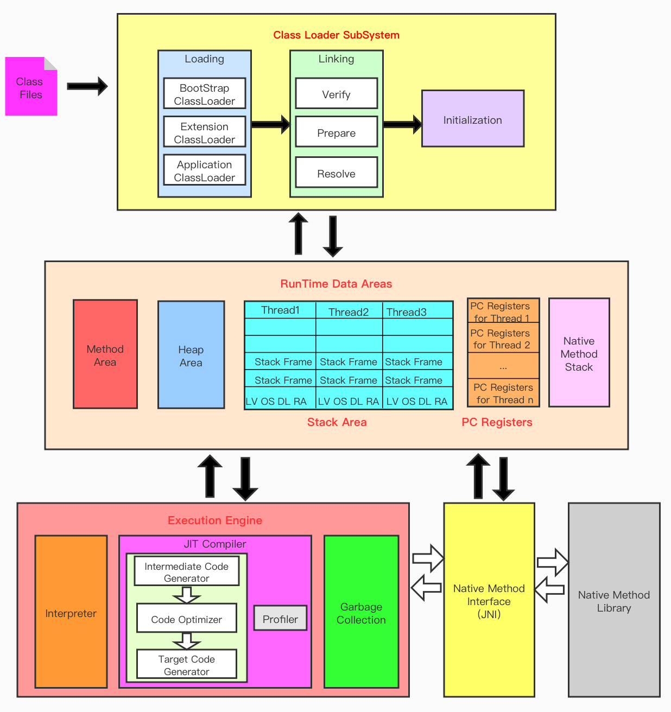
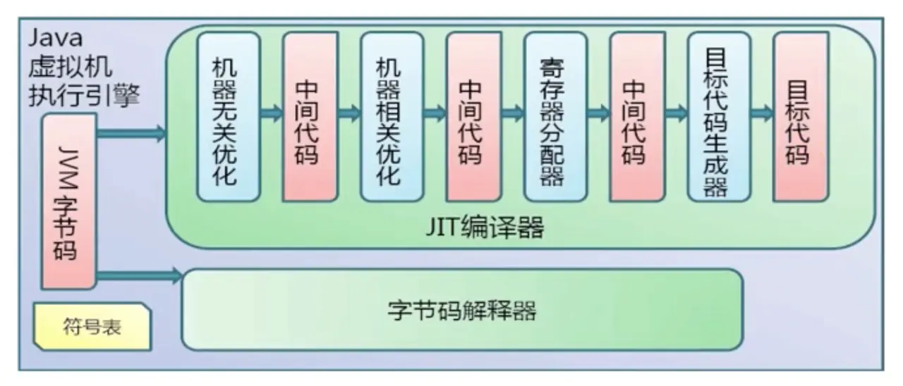

# JVM执行过程

执行引擎是Java虚拟机（JVM）最核心的组成部分之一。虚拟机与物理机两个概念的区别在执行引擎的不同。

- 物理机的执行引擎是直接建立在处理器、缓存、指令集和操作系统层面上的。
- 虚拟机的执行引擎则是由软件自行实现的，可以定制指令集与执行引擎的结构体系。

JVM规范中制定了字节码执行引擎的概念模型，各个具体的JVM实现时都需要遵守，对外是统一的形式。

## 执行引擎职责范围

所有的JVM的执行引擎输入、输出都是一致的：输入的是字节码二进制流，处理过程是字节码解析执行的等效过程，输出的是执行结果。

执行引擎的任务就是将字节码指令解释/编译为对应平台上的本地机器指令才可以，充当了将高级语言翻译为机器语言的译者。

## 执行引擎的工作过程

1，执行过程是输入的是字节码二进制流，处理过程是字节码解析执行的等效过程，输出的是执行结果。

2，执行引擎执行的字节码指令由PC寄存器来指定。

3，执行完一项指令操作后，PC寄存器会更新下一条指令地址。

4，方法在执行的过程中，执行引擎有可能会通过存储在局部变量表中的对象引用准确定位到存储在Java堆区中的对象实例信息，以及通过对象头中的元数据指针定位到目标对象的类型信息。

JVM执行引擎执行class字节码的流程：

Java的半解释半编译，现在JVM在执行Java代码的时候，会将解释执行与编译执行二者结合起来进行。

- 解释执行就是将对字节码先逐行解释，“翻译”为对应平台的本地机器指令执行。
- JIT （Just In Time Compiler）即时编译器，目的是第一次将整个函数体编译成为机器码，后面每次执行机器码，可以使执行效率大幅度提升。
- AOT（Ahead Of Time Compiler）静态提前编译器，将所输入的Java 类文件转换为机器码，并存放至生成的动态共享库之中。新的JDK就引入了AOT，可以直接加载已经预编译成二进制库，可以直接执行。第一次执行都能最大效率执行。但影响跨平台。

