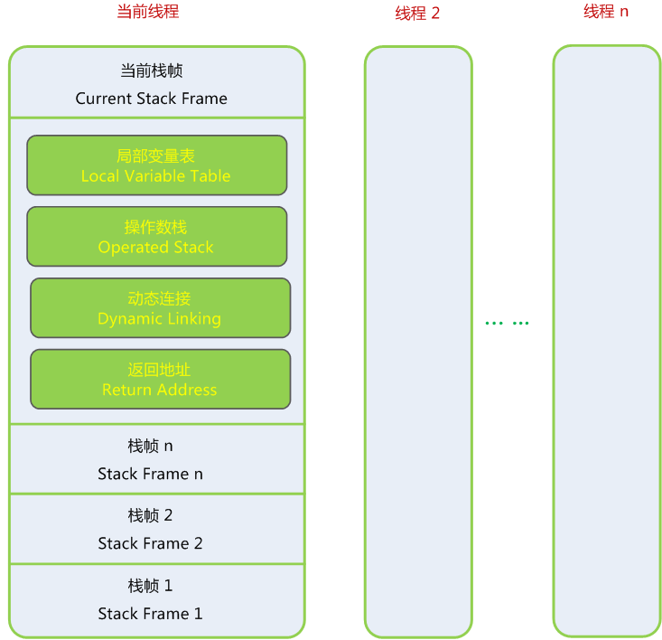

# JVM的栈帧结构

JVM的内存划分为程序计数器、虚拟机栈、本地方法栈、堆和方法区。栈帧（Stack Frame）是用于支持JVM进行方法调用和方法执行的数据结构，在数据区中的JVM栈的栈元素。栈帧存储了方法的局部变量表、操作数栈、动态连接和方法返回地址等信息。

每一个方法从调用开始至执行完成的过程，都对应一个栈帧在JVM栈里面从入栈到出栈的过程。在编译程序代码的时候，栈帧中需要多大的局部变量表，多深的操作数栈都已经完全确定了，并且写入到方法表的Code属性之中，因此一个栈帧需要分配多少内存，不会受到程序运行期变量数据的影响，而仅仅取决于具体的JVM实现。

## 栈帧整体结构

在活动线程中，JVM栈顶的栈帧称为当前栈帧(Current Stack Frame)，这个栈帧所关联的方法称为当前方法(Current Method)。运行的所有字节码指令都只针对当前栈帧进行操作。

## 局部变量表（Local Variable Table）

一组变量值存储空间，用于存放方法参数和方法内部定义的局部变量。Class文件中在方法的Code属性的max_locals数据项中确定了该方法需要分配的局部变量表的最大容量。

变量槽 （Variable Slot）是局部变量表的最小单位，一个 Slot可以存放 boolean、byte、char、short、int、float、reference和 returnAddress 8种类型，Slot的长度并未规定，但是这几个类型32位足够。但是后面的reference也可能是64位，long 和 double 是64位，JVM会为其分配两个连续的 Slot 空间，进行高位对齐。（returnAddress 新的JVM已经没有这个类型了。）

JVM通过索引定位的方式使用局部变量表，第0位索引的 Slot 默认就是this（非static方法时），也就是此方法所属对象实例的引用。

为了节省栈帧空间，局部变量表中的 Slot 是可以重用的。当离开了某些变量的作用域之后，这些变量对应的 Slot 就可以交给其他变量使用。这种机制有时候会影响垃圾回收行为。

## 操作数栈（Operand Stack）

JVM的解释执行引擎称为”基于栈的执行引擎“，这里的栈就是指操作数栈。也常称为操作栈，是一个后入先出栈。在Class 文件的Code 属性的 max_stacks 指定了执行过程中最大的栈深度。

方法执行时进行的算术运算、调用其他的方法进行参数传递等，都是通过操作数栈进行的。

当一个方法开始执行时，此方法的操作数栈为空，当各种字节码指令往操作数栈中写入与提取内容，也就是出、入栈操作。

在概念模型中，两个栈帧是相互独立的。但是大部分的JVM实现时会优化两个栈帧之间的传参，令两个栈帧出现一部分重叠，减少参数传递的复制过程。

## 动态连接（Dynamic Linking）

为了支持方法调用过程中的动态连接，每个栈帧都包含一个该栈帧所属方法的引用，这个方法的引用是在执行运行时的常量池中。

在Class 文件中存放了大量的符号引用，字节码中的方法调用指令的参数，就是常量池中指向方法的符号引用。这一部分符号引用是静态解析，在类加载阶段或第一次使用时转化为直接引用；另外一部分在运行时才转化为直接引用，叫动态连接。

静态解析的直接引用就是编译期间就能确定调用的版本，包括：调用静态方法、调用实例的私有构造器、私有方法、父类方法。

运行时常量池，每一个被JVM装载的类或者接口都有一份内部版本常量池。（class把他们所有的引用符号放在一个地方——常量池。每一个class文件有一个常量池。）

## 方法返回地址

方法返回时可能需要在栈帧中保存一些信息，用来于恢复调用者（调用当前方法的上一个方法）的执行状态。

- 方法正常退出时，调用者的程序计数器的值就可以作为返回地址，栈帧中很可能会保存这个计数器值。

- 方法异常退出时，返回地址是要通过异常处理器表来确定的，栈帧中就一般不会保存这部分信息。

方法返回的过程实际上等同于把当前栈帧出栈，可能执行的操作有：

- 恢复调用者的局部变量表和操作数栈。
- 把返回值（如果有的话）压入调用者栈帧的操作数栈中。
- 调整程序计数器的值使其指向方法调用指令后面的一条指令等等。

## 附加信息

在JVM规范中，允许JVM增加一些规范里没有描述的信息到栈帧之中。比如：调试、性能收集相关的信息，这部分信息完全取决于具体的JVM实现。

一般会把动态连接、方法返回地址和其他附加信息全部归为一类，称为栈帧信息。

