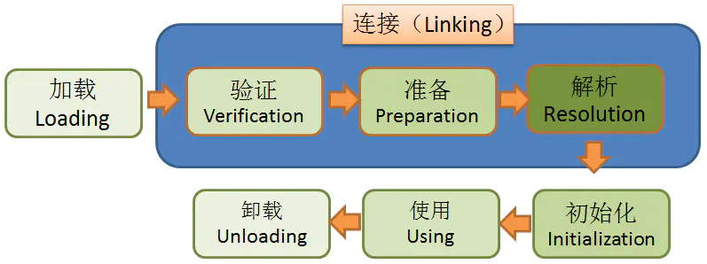

# JVM类加载机制
虚拟机把class文件加载到内存，并对文件进行校验、转换解析和初始化，最终形成虚拟机中的Java类型，这就是虚拟机的类加载机制。

类加载的触发时机有以下几种情况：
- 遇到new一个对象的时候，或者set或者get一个类的静态属性，或者调用一个类的静态方法。
- 使用反射（java.lang.reflect）对类进行调用时。
- 初始化类时对父类的初始化。
- JVM启动时的主类。
- 反射调用（java.lang.invoke.MethodHandle）里面对类的静态属性或方法的调用时。

# 类加载的顺序
类从被加载到内存中开始，到卸载出内存，经历了加载、链接、初始化、使用四个阶段，其中连接又包含了验证、准备、解析三个步骤。
总体上是如此顺序，但是因为Java有动态的特性，所以运行时的顺序则交叉进行，要复杂得多。

## 加载(Loading)
加载是整个类加载过程的第一步，当类需要被加载时（被触发），类加载（ClassLoader）将Jar中的class文件读入到JVM中。

这阶段主要任务有：
- 通过“类全名”来获取定义此类的二进制字节流
- 将字节流所代表的静态存储结构转换为方法区的运行时数据结构
- 在java堆中生成一个代表这个类的java.lang.Class对象，作为方法区这些数据的访问入口

## 验证(Verification)
连接阶段，连接就是将已经读入到内存的类的二进制数据合并到虚拟机的运行时环境中去。

验证阶段是链接阶段的第一步，此阶段主要确保class文件的字节流中包含的信息符合当前虚拟机的要求，并且不会危害虚拟机的自身安全。

## 准备(Preparation)、

## 解析(Resolution)、

## 初始化(Initialization)、

## 使用(Using)、

## 卸载(Unloading)、

# 类加载器

# 加载顺序，双亲委派模型

