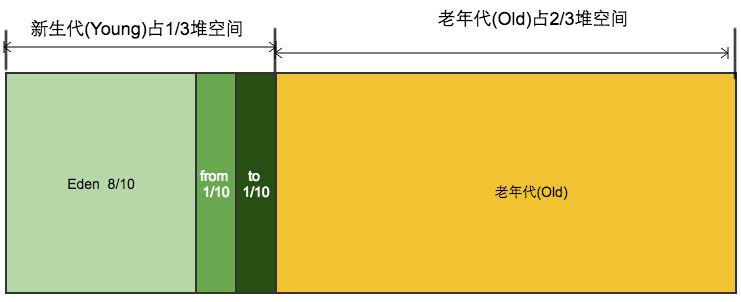

# JVM内存结构
JVM内存结构，由Java虚拟机规范定义，Java虚拟机的运行时划分的区域。
JVM规范规定了Java程序执行过程中，由JVM管理的不同数据区域。
而在具体虚拟机实现时，都有一些细微的差异，尤其是方法区。
不同的垃圾回收机制，堆的管理也不相同。

数据区域主要包括程序计数器、Java虚拟机栈、本地方法栈、java堆、方法区以及本地直接内存。

> 不同的虚拟机实现会有不同，HotSpot JDK8的方法区在直接内存中的元数据区，JDK7时还在永久代（非堆内存）。

> 另外的一个容易混淆的概念是：Java内存模型，是通过共享内存与线程之间的一系列规则，来解决多线程通信的。

# 程序计数器
有些地方也叫PC寄存器，用来记录正在执行的虚拟机字节码指令的地址，一块线程私有的较小的内存空间。
做为线程所执行的字节码的行号指示器。
- 如果是执行Java方法，程序计数器记录的是正在执行的字节码指令的地址。通过改变程序计数器的值来选取下一条需要执行的字节码指令。
- 在多线程上下文切换时，从程序计数器中获取该线程需要执行的字节码的偏移地址，可以恢复到正确的执行位置。
- 执行native方法时程序计数器值则为空（Undefined）。
> 不会有OutOfMemoryError

# Java虚拟机栈
虚拟机栈为每个线程维护一个单独的栈空间，线程独享，不一定连续。
生命周期随着线程，线程启动而产生，线程结束而消亡。
每个方法在执行的同时会创建一个栈帧，调用方法的开始与结束就是向栈空间压入和弹出栈帧的过程。

> 栈帧（Stack Frame），用来记录函数的调用时数据的数据结构。
> 包括有：局部变量表、操作数栈、动态链接、返回地址、附加信息。
> （通常把动态连接、方法返回地址、附加信息统称为栈帧信息）
- 局部变量表：一组变量存储空间，存储参数与局部变量，以容量槽（slot）为最小单位。运行时不会改变空间大小。
- 操作数栈：运行的工作空间，或者叫存储计算的中间结果。在方法的执行过程中，会有各种字节码指令向操作数栈中写入/读出（出栈/入栈）。
- 动态链接：指向运行时常量池中该栈帧所属性方法的引用（符号引用），为了支持方法调用过程中的动态连接。
- 返回地址：即本方法执行后下一步指令的地址，方法正常退出时，调用者PC计数器的值就可以作为返回地址，异常退出时，返回地址是要通过异常处理器来确定。
- 附加信息：具体的虚拟机放一些规范里没有描述的信息。
> 超过了 Java 虚拟机栈允许的最大容量，会抛出StackOverflowError
>
> 没有足够的内存去创建对应的虚拟机栈，会抛出OutOfMemoryError

# 本地方法栈
与Java虚拟机栈类似，只不过是Native方法的工作空间。
当线程调用Native方法时，Java虚拟机栈保持不变，动态连接到Native方法，本地方法栈开始入栈。
> 虚拟机规范并未强制规定使用方式、语言、本地方法栈的栈帧结构。
> HotSpot虚拟机选择合并了虚拟机栈和本地方法栈。

# java堆
Java堆（Heap）在虚拟机启动时创建，是被所有线程共享的最大一块内存区域，也称为 “GC堆”。
储存对象实例和数组，是垃圾收集器管理的主要区域。

由于垃圾回收整体采用分代收集的策略，堆内存分为新生代 (Young) 和老年代 (Old) ，默认比例是1:2。
新生代 (Young) 按8：2划分为两个部分：Eden、Survivor。
Survivor又分1：1为两个部分：From Survivor、To Survivor。
- Eden：绝大多数对象都会被创建到这里，主要采用标记整理算法了回收该区域，一次GC后清空此区（Minor GC）。
- Survivor：GC后在Eden存活的对象复制到此区的From区；再次GC时，From区存活对象复制到To区，再把From与To标记互换角色。一次GC后清空From区。
- Old：老年代，存放在Surviver中没有被清除出去的对象（复制15次仍生存的），另外还有大对象也直接分配到此区。
老年代满或存放不下会Full GC（MajorGC）。
> 部分由于逃逸分析而在对外分配的对象会被直接分配在栈上。
> 各区域的大小都可以重新设置。
> –XX:NewRatio=n设定新生代/老年代的比例。
>
> -XX:SurvivorRatio=n设定Eden/Survivor的比例（From/To永远是1：1）。
>
> –Xms/-Xmx指定堆的最小最大值。
>
> –Xms/-Xmx指定堆的最小最大值。
- 使用G1垃圾回收器时，java堆是均分成大小相同的区域（Region）。仍然有eden、survivor或old区，但是是一个或多个不连续的区域组成的。
另外它还加了一个Humongous区域存储巨型对象。
# 方法区
与Java堆一样，方法区是所有线程共享的内存区域。但是它并没有一个真正独立的区域，不同的JVM对它有不同实现。

存储已被虚拟机加载的类信息、常量、字符串常量、类静态变量、即时编译器编译后的代码等数据。
还有一部分是运行时常量池。
> 对于HotSpot来说，方法区JDK1.7是在永久代，而JDK1.8在元空间（堆外的直接内存）。
> 存储的内容也有细微的不同。
# 直接内存
也叫堆外内存，不是虚拟机运行时数据区的一部分。可以通过DirectByteBuffer对象管理。
