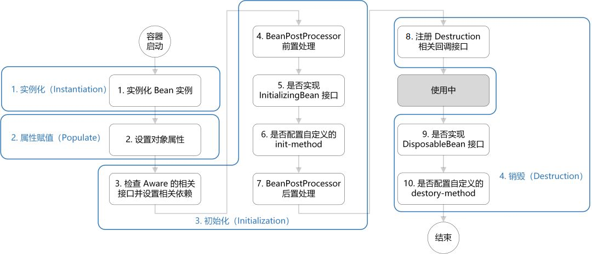

# Spring的Bean管理及依赖注入

IOC容器的初始化后，在容器中就建立BeanDefinition数据映射。依赖注入常见有两种时机，一个是在用户第一次向IoC容器getBean时触发，另外一个是在初始化容器时会将non-lazy-init的单例Bean预先实例化，内部也是调用getBean。

getBean()方法，在IOC容器的顶层接口BeanFactory中定义，然后在IOC容器的具体实现类DefaultListableBeanFactory类的基类AbstractBeanFactory实现了getBean()方法。

## Bean的生命周期

Bean 的生命周期概括起来就是实例化 -> 属性赋值 -> 初始化 -> 销毁 4 个阶段：

- 实例化（Instantiation），容器启动完成容器的初始化后，就可以根据BeanDefinition信息用各种手段进行实例化，如调用构造器、Cglib等。
- 属性赋值（Populate），按照Spring的上下文将Bean依赖的属性进行IOC注入。
- 初始化（Initialization），对Bean对象进行全面初始化，包括通过Aware接口让Bean获得到Spring容器的底层组件、此Bean关联的BeanPostProcessor接口的前置与后置处理、处理Spring配置此Bean的init-method初始化方法、处理此Bean 实现的InitializingBean接口。
- 销毁（Destruction），在容器关闭时调用的，会调用DisposableBean的destory()接口方法，以及bean使用的destory-method 声明销毁方法。

## Bean的扩展点

在Bean初始化过程中Aware接口，有几个重要的可能被Bean实现的接口：

- BeanNameAware，Spring将Bean的Id传递给setBeanName()方法。
- BeanFactoryAware，Spring将调用setBeanFactory()方法，把BeanFactory容器实例关联给Bean。
- BeanClassLoaderAware，Spring将调用setBeanClassLoader()方法，关联Bean的类装载器。
- ApplicationContextAware，Spring将调用Bean的setApplicationContext()方法，把应用上下文容器实例关联给Bean。

在Bean实例化与初始化过程的前期与后期分别有扩展的接口：

- BeanPostProcessor，作用于初始化阶段的前后。
- InstantiationAwareBeanPostProcessor，是BeanPostProcessor的子类，作用于实例化阶段的前后，处理如对目标对象实例化前可替换、实例化后可对属性进行调整、或者处理其他的事。

Bean生命周期中的扩展点接口处理有：

- InitializingBean，接口方法afterPropertiesSet()，可以在bean初始化完成，所有属性设置完成后执行特定逻辑，例如对自动装配对属性进行验证等等。
- DisposableBean，接口方法destroy()，用于在bean被销毁前执行特定的逻辑，例如做一些回收工作等。

容器调用的Bean自身的扩展方法：

- init-method，初始化方法。
- destroy-method，销毁方法。

## Bean的存放位置

Spring的IOC容器初始化完成后，BeanDefinition对象保存到BeanFactory的实例变量的beanDefinitionMap与beanDefinitionNames集合中（这个对象在DefaultListableBeanFactory中），注：解决BeanDefinition属性继承（bean标签的parent属性）最后都使用合并mergedBeanDefinitions容器。

完成Bean的初始化之后，不同作用域的Bean实例存放不同位置。

- singleton作用域的Bean实例最终保存在singletonObjects集合中（这个对象在DefaultSingletonBeanRegistry中）。
- 对于prototype作用域的Bean实例，不用保存直接返回。
- 对于其他作用域的Bean实例则保存在对应的容器中，如request作用域的Bean放在HttpServletRequest，session作用域的Bean放在HttpSession中。

Spring托管的Bean基本上都是singleton作用域的Bean实例，为了缓存或者解决循环依赖，涉及到的几个存放位置有：

- singletonObjects，单例对象列表，beanName -> bean实例。
- singletonFactories，单例工厂列表，beanName -> beanFactory。
- earlySingletonObjects，Bean的早期引用存储位置。循环对象依赖列表，对象在创建之后，进行注入过程中，发现产生了循环依赖，那么会将对象放入到这个队列，并且从singletonFactories中移除掉。
- singletonsCurrentlyInCreation，正在创建的单例名称队列。
- registeredSingletons，已经创建成功的单例名称列表。
- aliasMap，存放Bean的别名。

Spring查找Bean的顺序是singletonObjects -> earlySingletonObjects -> singletonFactories。

## Bean 作用域

Spring 中为 Bean 定义了5种作用域， 分别为 ：

- singleton（单例）、默认作用域，Spring IOC 容器中只会存在一个共享的Bean实例。
- prototype（原型）、每次通过Spring容器获取时创建。
- request、一次 request 一个实例。
- session 和 global session，一次Http Session中，容器会返回该Bean的同一实例。global表示一个全局的Http Session。

## 依赖注入方式

对于spring配置一个bean时，如果需要给该bean提供一些初始化参数，则需要通过依赖注入方式，常见三种方式：构造器注入、setter 方法注入、成员变量注入，另外还有工厂方法注入。。

- constructor注入，通过提供给构造器参数来注入，立刻可用，但是容易出现循环依赖。
- setter注入，通过setter方法进行注入依赖。
- 成员变量注入，通过成员变量赋值完成注入。

Spring提供了五种autowire自动装配模式：

- no：不进行自动装配，手动设置Bean的依赖关系。
- byName：根据Bean的名字进行自动装配。
- byType：根据Bean的类型进行自动装配。
- constructor：类似于byType，不过是应用于构造器的参数，如果正好有一个Bean与构造器的参数类型相同则可以自动装配，否则会导致错误。
- autodetect：如果有默认的构造器，则通过constructor的方式进行自动装配，否则使用byType的方式进行自动装配。

