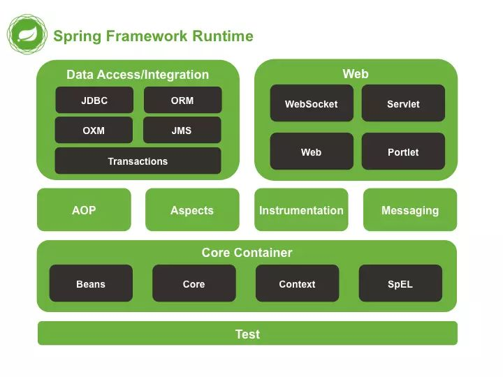

# Spring框架的架构思想及体系

Spring是一个开源框架，它由Rod Johnson创建。最初的思想来自他所著书籍《Expert One-on-One J2EE Design and Development》、《Expert One-on-One J2EE Development without EJB》，阐述了在不使用EJB开发JAVA EE企业级应用的一些设计思想和具体的做法。

## 核心思想

Spring目标是一站式的轻量级应用开发框架，Spring的API不侵入到业务代码中，主要体现在控制反转、依赖注入、面向切面编程这几个核心思想。

- 控制反转（IOC），将对象控制权的转移，从程序内部反转到了外部的部署，把对象的创建、初始化、销毁等工作交给了spring容器来控制，由Spring容器进行控制对象的生命周期。
- 依赖注入（DI），它是控制反转的具体实现，程序在运行的过程中，若需要调用另一个对象，无需自己创建，而是由容器全权负责的对象的装配，然后把符合依赖关系的对象通过JavaBean属性或者构造函数传递给需要的对象。
- 面向切面（AOP），一个程序中跨越多个点的功能被称为横切关注点，这些横切关注点在概念上独立于应用程序的业务逻辑。AOP 帮助你将横切关注点从它们所影响的对象中分离出来，封装到一个可重用模块。

Spring将开发过程中的共性问题，封装成了各种组件，再通过社区贡献形成一个生态。

## 相关知识点

框架依赖的Java的核心技术是反射与注解。

- 反射，可以在运行时获取类的完整构造，并调用对应的方法。很多优秀的开源框架都是通过反射完成的。
- 注解编程，注解可以说是类反射的延伸。它是一个标签作用，为当前读取该注解的程序提供判断依据。

在Spring的架构中使用了大量的模式，主要目标都是为了更好的解耦。

- 动态代理模式，是利用反射，拦截直接访问对象，可以给对象进行增强的一项技能。
- 工厂模式，它提供了一种创建对象的最佳方式，把对象交给专用的工厂来创建，是一种解藕方式。
- 责任链模式，为请求创建了一个接收者对象的链。将请求的发送者和接收者进行解耦。
- 观察者模式，当对象间存在一对多关系时，当一个对象被修改时，则会自动通知依赖它的对象。
- 建造者模式，使用多个简单的对象一步一步构建成一个复杂的对象。

## 体系结构

从总体来看，Spring分为3层，最底层是核心层，包括IOC、AOP等核心模块，中间层是封装的JavaEE服务、各中间驱动组件，最上层是各个应用。

核心容器由 spring-core，spring-beans，spring-context。以及spring-context-support和spring-expression等模块组成。

- Core核心组件作为Spring的核心组件，其中包含了很多关键类，包括 IoC 和依赖注入功能。一个重要的组成部分就是定义了资源的访问方式。
- Bean 组件在 Spring 的 org.springframework.beans 包下。这个包下的所有类主要解决了三件事：Bean 的定义、Bean 的创建以及对 Bean 的解析。
- Context在Spring的org.springframework.context包下，它实际上就是给Spring提供一个运行时的环境，用以保存各个对象的状态。Context 模块继承自 Bean 模块，并且添加了国际化、事件传播、资源加载和透明地创建上下文（比如，通过 Servelet 容器）等功能。
- SpEL（Spring表达式语言）在Spring的org.springframework.expression包下。是一种能够支持运行时查询和操作对象图的强大的表达式，是JSP2.1 规范中定义的统一表达式语言的扩展。

中间层组件有AOP，Aspects，Instrumentation等。

- AOP模块提供面向切面编程实现，它提供拦截器来拦截一个方法，在方法执行之前或之后添加额外的功能。

上层应用最主要聚焦在数据库访问和Web支持，数据库访问层有：JDBC、ORM、OXM、JMS和事务模块组成。Web层包含spring-web、spirng-webmvc、spring-websocket。

