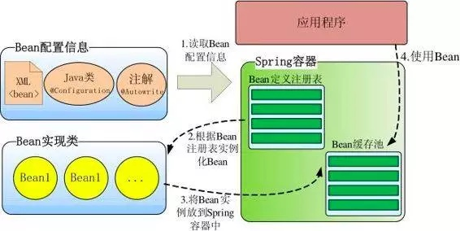
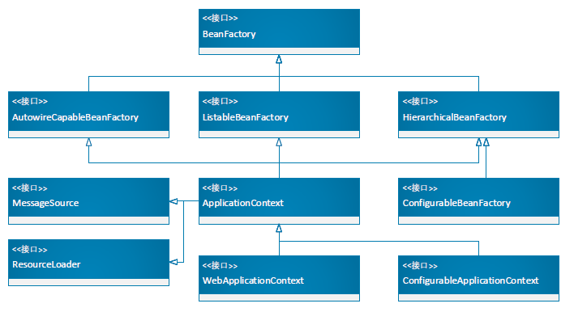

# Spring的核心IOC容器

IOC（Inversion of Control）即“控制反转”，把对象交给容器控制，而不是在自己的对象内部直接控制。它是一种思想，能指导松耦合设计。具体实现是在程序运行时，动态的向某个对象提供它所需要的其他对象，这一点是通过DI来实现的。

DI（Dependency Injection）即“依赖注入”，组件之间依赖关系由容器在运行期决定，Spring就是通过反射，将IOC容器内托管的对象注入到需要的对象中。

## IOC容器的实现

IOC容器就是工厂模式的典型应用，它是个Bean工厂，用来管理所有的对象以及依赖关系。还提供了 Bean 实例缓存、生命周期管理、 Bean 实例代理、事件发布、资源装载等高级服务。

Spring 启动时读取应用程序提供的Bean配置信息，并在Spring容器中生成一份相应的Bean配置注册表，然后根据这张注册表实例化Bean，装配好Bean之间的依赖关系。一般情况下上层应用无需关注此过程，容器自动装配完成，当然也可直接调用getBean获取。

为Spring容器提供配置元数据的主要方式有xml配置文件、注解配置、Java的配置@Configuration等。

对已经实例化的单实例Bean，Spring放在HashMap 实现的缓存单实例 Bean 的缓存器。

## IOC 容器的体系

在Spring中BeanFactory是IOC容器的实际实现者，它提供了最初级的功能，有最基本的DI支持。ApplicationContext则是较高级的容器，也被称为 Spring 上下文。另外还有面向Web应用的容器。

- BeanFactory，是 Spring 框架的基础设施，主要是面向 Spring 本身。它会缓存单实例（ singleton）的 Bean，以 beanName 为key保存在DefaultSingletonBeanRegistry 类中的HashMap 中。BeanFactory体系的直接实现类有DefaultListableBeanFactory。
- ApplicationContext，才是面向应用程序的开发者。是BeanFactory的派生类，有两个最重要的实现类，ClassPathXmlApplicationContext：默认从类路径加载配置文件；FileSystemXmlApplicationContext：默认从文件系统中装载配置文件。
- WebApplicationContext，ApplicationContext子类中专门为 Web 应用准备的，它允许从相对于 Web 根目录的路径中装载配置文件完成初始化工作。把整个 Web 应用上下文对象作为属性放置到 ServletContext 中，key为常量ROOT_WEB_APPLICATION_CONTEXT_ATTRIBUTE。它有两个重要的实现类：AnnotationConfigWebApplicationContext、XmlWebApplicationContext。

## 容器的组件构成

IoC容器中有很多较为重要的协助组件，这些组件都是为BeanFactory组件工作的（但不是仅仅为其服务），常见的主要组件有：

- **Resource**：资源组件，是Spring内部对资源的一种统一描述，不同资源文件如xml、properties文件等，格式不同，由ResourceLoader加载获得相应的Resource对象。有具体ClassPathResource、FileSystemResource、UrlResource等类型。
- **BeanDefinition**：Bean描述组件，BeanDefinition体系是Spring内部对Bean相关信息的基本数据结构，包括属性、构造方法参数、依赖的 Bean 名称及是否单例、延迟加载等，同时也提供了一系列操作 Bean 元数据的set、get方法。它是实例化 Bean 的原材料，Spring 就是根据 BeanDefinition 中的信息实例化 Bean。整体上分两类，一个描述通用的Bean，用在xml定义的<bean>标签，另外一个是描述注解形式的Bean。

- **ResourceLoader**：资源加载组件，负责加载xml、properties等各类资源，解析并生成Resource对象。它有两个子接口，DefaultResourceLoader是ResourceLoader的默认实现；另外一个是ResourcePatternResolver是为了提供各种资源匹配模式。

- **BeanRegistry**：Bean注册组件，SingletonBeanRegistry/BeanDefinitionRegistry，将BeanDefinition对象注册到BeanFactory（BeanDefinition Map）中去。
- **BeanDefinitionReader**：Bean构造组件，它利用ResourceLoader读取Resource并将其数据转换成对应的BeanDefinition对象，利用BeanDefinitionRegistry完成注册。

## IOC容器初始化过程

不论是使用BeanFactory系列还是ApplicationContext系列来创建容器基本都会使用到DefaultListableBeanFactory类，它也是实际上默认的IOC容器。

ApplicationContext的各种子类创建IOC容器，最终都会调用AbstractApplicationContext的一个重要方法refresh()，这里面包含了完整过程。在IOC容器初始化过程核心有三个步骤。

- Resource定位（Bean的定义文件定位），ResourceLoader接口实现了不同的Resource加载策略，将不同的资源转换为resource对象。
- 将Resource定位好的资源载入到BeanDefinition，把Bean的信息实例化为BeanDefiniton对象。
- 将BeanDefiniton注册到容器中，调用BeanDefinitionRegistry，把BeanDefiniton对象注入到IOC容器（beanDefinitionMap）中，完成注册。

经过这几步后，IOC容器维护了整个Bean的配置信息，以BeanDefiniton对象为形式放置在beanDefinitionMap中，供下一步的依赖注入（getBean）时检索与使用。

