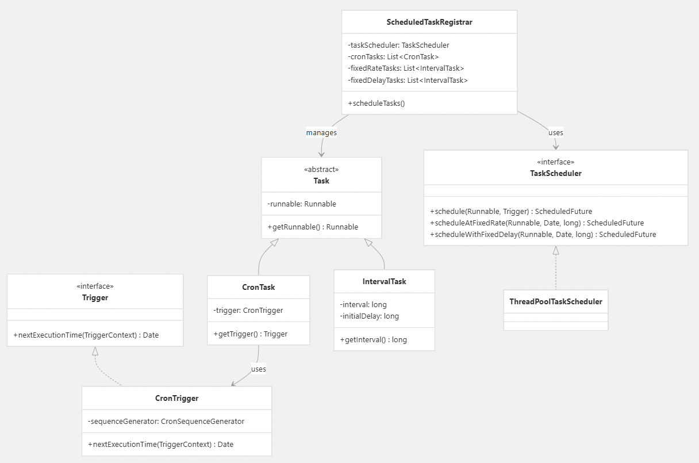

# Spring Task 核心架构

> Spring Task 驱动入口是`@EnableScheduling`。依赖于 Spring 的 `TaskScheduler` 体系，底层是对 JDK `ScheduledThreadPoolExecutor` 的封装。
>
> 下面示例基于 Spring Framework 6.x / Spring Boot 3.x。

## 1 入口链路

`@EnableScheduling` 通过 `@Import(SchedulingConfiguration.class)` 向容器注册 `ScheduledAnnotationBeanPostProcessor`，它是 `@Scheduled` 注解模型的唯一引擎，负责从扫描到调度的全流程。

```
@EnableScheduling
       │
       ▼
ScheduledAnnotationBeanPostProcessor (Bean后置处理器)
       │ (扫描所有 Bean 的 @Scheduled 方法)
       ▼
Registrar (ScheduledTaskRegistrar)
       │ (匹配策略并组装 Task)
       ▼
TaskScheduler（ThreadPoolTaskScheduler/ConcurrentTaskScheduler）
       │
       ▼
ScheduledExecutorService (JDK 线程池提交并调度)
```

### 1.1 加载与解析阶段

1. **触发入口**：`@EnableScheduling` 导入了 `SchedulingConfiguration` 配置类，注册了一个关键 Bean —— **`ScheduledAnnotationBeanPostProcessor`**。

2. **扫描与注册**：该 BeanPostProcessor 在 Bean 初始化后（`postProcessAfterInitialization`），扫描 `@Scheduled` 方法。

3. **任务封装**：针对不同的注解参数，封装为不同的 `Task` 对象：

   | Task模型         | 时间规则                | 对应属性                                         |
   | ---------------- | ----------------------- | ------------------------------------------------ |
   | `TriggerTask`    | 任意 Trigger            | 编程式注册                                       |
   | `CronTask`       | CronTrigger             | cron，内部通过 `CronExpression` 进行下次时间解析 |
   | `FixedRateTask`  | duration + initialDelay | fixedRate + initialDelay                         |
   | `FixedDelayTask` | duration + initialDelay | fixedDelay + initialDelay                        |

4. **提交 Registrar**：封装好的 Task 会被添加进 `ScheduledTaskRegistrar` 管理器中。

### 1.2 任务调度与线程池执行

1. **线程池初始化**：当所有单例 Bean 初始化完成后，Spring 会触发 `ScheduledTaskRegistrar` 的初始化（`afterPropertiesSet`）。
2. **查找 TaskScheduler**：
   - 寻找类型为 `TaskScheduler` 或 `ScheduledExecutorService` 的 Bean。
   - **注意**：如果找不到，默认会创建一个**单线程**的 `Executors.newSingleThreadScheduledExecutor()`（如果是SpringBoot，则是注入默认的 `ThreadPoolTaskScheduler` ）。
3. **注册到底层线程池**：`TaskScheduler` 将 Task 转化提交给底层的 `ScheduledExecutorService` 执行：
   - `fixedRate` -> `scheduleAtFixedRate()`
   - `fixedDelay` -> `scheduleWithFixedDelay()`
   - `cron` -> 动态计算下一次执行时间，使用 `schedule(runnable, delay)` 循环触发。

## 2 接口体系



### 2.1 顶层接口定义

`TaskScheduler` 是标准定时任务的入口接口，对调度能力做统一抽象，`ThreadPoolTaskScheduler` 是其默认实现。

```java
public interface TaskScheduler {
    // 1. 一次性/ Cron/ Trigger 任务
    ScheduledFuture<?> schedule(Runnable task, Trigger trigger);
    ScheduledFuture<?> schedule(Runnable task, Instant startTime);

    // 2. 固定频率任务（fixedRate 语义）
    ScheduledFuture<?> scheduleAtFixedRate(Runnable task, Duration period);

    // 3. 固定间隔任务（fixedDelay 语义）
    ScheduledFuture<?> scheduleWithFixedDelay(Runnable task, Duration period);
}
```

`Trigger` 抽象用于动态计算下一次执行时间。`TriggerContext` 提供上一轮执行的事实，供触发器计算下一次执行时间。

```java
public interface Trigger {
    Instant nextExecution(TriggerContext triggerContext);
}

public interface TriggerContext {
    Instant lastScheduledExecution(); // 上次计划触发时间
    Instant lastActualExecution();    // 上次实际开始时间
    Instant lastCompletion();         // 上次实际结束时间
}
```

`TaskExecutor`，任务执行抽象，`ThreadPoolTaskExecutor` 是其默认实现。

`TaskExecutor` 是对 JUC `Executor` 的 Spring 封装，仅一个 `execute(Runnable)` 方法；

和 `TaskScheduler` 分工不同：

- `ThreadPoolTaskExecutor`：包装 `ThreadPoolExecutor`，执行一次性任务，是 `@Async` 的默认落地；
- `ThreadPoolTaskScheduler`：包装 `ScheduledThreadPoolExecutor`，执行带时间条件的任务，是 `@Scheduled` 的默认落地。

调度线与执行线是两套独立的线程体系，参数互不共享。

### 2.2 调度器实现

默认的调度器实现为 `newSingleThreadScheduledExecutor`，底层是对 JDK `ScheduledThreadPoolExecutor` 的封装。

当容器中未显式配置 `TaskScheduler` 或 `ScheduledExecutorService` 的 Bean 时，`ScheduledTaskRegistrar` 触发兜底策略：

```java
// ScheduledTaskRegistrar 内部逻辑（简化）
protected void scheduleTasks() {
    if (this.taskScheduler == null) {
        // 兜底：未配置时创建单线程调度器
        this.localExecutor = Executors.newSingleThreadScheduledExecutor();
        this.taskScheduler = new ConcurrentTaskScheduler(this.localExecutor);
    }
    // 遍历注册任务
    for (CronTask task : this.cronTaskList) {
        this.taskScheduler.schedule(task.getRunnable(), task.getTrigger());
    }
    // ...注册 fixedRate / fixedDelay 任务
}
```

**Spring Boot 自动配置的兜底**：`TaskSchedulingAutoConfiguration` 默认会向容器注入一个 `ThreadPoolTaskScheduler`（Bean 名称为 `taskScheduler`），默认线程池大小为 1。此时 taskScheduler 就不是 null ，不会触发 Spring 原生的兜底策略。

## 3 Cron 任务

`fixedRate` 与 `fixedDelay` 直接依赖 JDK 线程池的周期调度。Cron 任务由于触发时间间隔不固定，无法直接映射为 JDK 的固定周期 API，Spring 通过 **循环 Reschedule（重新调度）装饰器** 实现。

### 3.1 `ReschedulingRunnable` 执行流程

所有 Trigger 任务最终被封装为 `ReschedulingRunnable` 提交给执行器。

- 通过 `CronTrigger` 计算出距离下一次执行的延迟毫秒数 `initialDelay`，然后调用底层的 `ScheduledExecutorService.schedule(runnable, initialDelay, timeUnit)` 提交**单次**延时任务。

- 当时间到达，Worker 线程执行该任务，调用 `CronTrigger.nextExecutionTime(...)` **重新计算下一个触发节点**。

- 计算新的 `delay`，将自己（`ReschedulingRunnable`）**再次提交**回 `ScheduledExecutorService` 中。

代码逻辑（伪代码）：

```java
public class ReschedulingRunnable extends DelegatingErrorHandlingRunnable implements ScheduledFuture<Object> {
    private final Trigger trigger;
    private final SimpleTriggerContext triggerContext = new SimpleTriggerContext();

    @Override
    public void run() {
        Date actualExecutionTime = new Date();
        // 1. 执行目标任务
        super.run();
        Date completionTime = new Date();
        
        // 2. 更新上下文并计算下一次触发时间
        this.triggerContext.update(this.scheduledExecutionTime, actualExecutionTime, completionTime);
        Date nextExecutionTime = this.trigger.nextExecutionTime(this.triggerContext);
        
        // 3. 重新向调度器提交下一次任务
        if (nextExecutionTime != null) {
            this.currentFuture = this.executor.schedule(this, nextExecutionTime);
        }
    }
}
```

### 3.2 Cron 调度的核心设计

1. **基准时间计算**：`CronTrigger` 默认以 `lastCompletionTime`（上次完成时间）为基准计算下一次触发点。若任务执行时间过长导致错过中间的触发点，不会补偿补跑，直接顺延至下一个满足表达式的时间。
2. **调度独立性**：每次执行完成后才重新计算并调用 `executor.schedule()`。长任务会跳过错过的点顺延到下一个。
3. **可控中断**：若 `Trigger.nextExecutionTime()` 返回 `null`，循环调度终止。