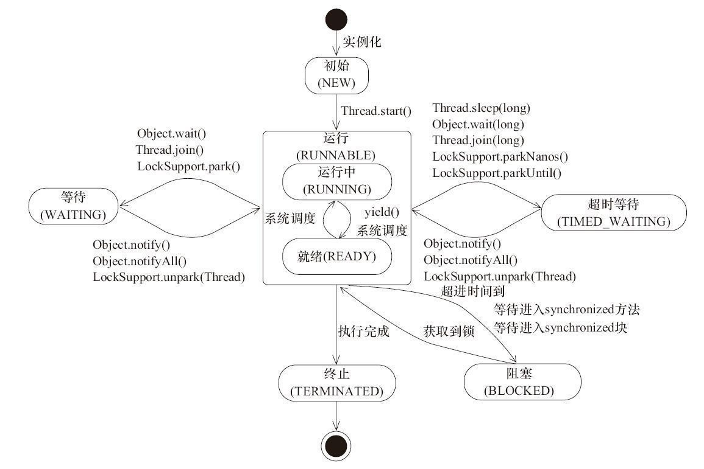

# Java的线程及处理流

线程（Thread）是操作系统能够进行运算调度的最小单位。它被包含在进程之中，是进程中的实际运作单位。一条线程指的是进程中一个单一顺序的控制流，一个进程中可以并发多个线程，每条线程并行执行不同的任务。

- 进程：是一个正在执行中的程序。每一个进程执行都有一个执行顺序。该顺序是一个执行路径，或者叫一个控制单元。

- 线程：就是进程中的一个独立的控制单元。线程在控制着进程的执行。一个进程中至少有一个线程。

## 线程的生命周期

Java线程的状态主要有以下几种：

- 新建状态（New），新创建的线程的初始状态，尚未执行。
- 就绪状态（Runnable的Ready），线程拿到对象锁可以运行，等待分配CPU。
- 运行状态（Runnable的Running），运行中的线程。

- 等待状态（Waiting），运行中的线程因为某些操作而在等待中，不会被分配CPU执行时间，需要唤醒。
- 超时等待状态（Timed Waiting），运行中的线程因为执行sleep()方法正在计时等待，也不会被分配CPU执行时间，到一定时间自动唤醒。
- 阻塞状态（Blocked），运行中的线程，因为某些操作被阻塞而挂起，放弃了CPU执行时间。
- 死亡状态（Terminated），线程已终止。

## 线程的优先级

线程有一个优先级的概念，但是不同操作系统中线程的优先级不一样，Windows7个优先级、Linux有140个优先级、Freebsd则有255个。

在Java中，线程的优先级是一个整数，其取值范围是1 （Thread.MIN_PRIORITY ） - 10 （Thread.MAX_PRIORITY ），默认为Thread.NORM_PRIORITY （数值为5）。

优先级的值越大，优先运行的机会越明显，但并不是严格遵守线程优先级别来执行的。在相同优先级的情况下，基本上是按照FIFO的原则，但是也不能完全保证。所以推荐只使用Thread中表示优先级别的三个常量。

## Java 内存访问模型

Java 内存模型规定了所有的变量都存储在主内存中。每个线程有自己的程序执行计数器，有自己的工作内存（也有栈内存，工作内存也是栈内存一部分）。

## JVM线程实现

Java里的线程是由JVM来管理的。它怎样相应到操作系统的线程是由JVM的实现来确定的。JVM通常采用宿主系统上的线程库来实现。在Linux上，JVM线程跟内核轻量级进程有一一相应的关系。

由内核完毕线程切换，内核通过操纵调度器（Thread Scheduler）实现线程调度。程序一般不直接使用该内核线程，而是使用其高级接口，即轻量级进程（LWP）。

Java线程调度就是抢占式调度，也就是每个线程将由系统来分配执行时间，线程的切换不由线程本身来决定。

## Java线程的使用

一个Java程序实际上是一个JVM进程，JVM进程用一个主线程来执行main()方法，在main()方法内部，我们又可以启动多个线程。此外，JVM还有负责垃圾回收的其他工作线程等。

在Java中创建线程有三种方式，第一种是继承Thread，第二种是实现Runnable接口，第三种是实现 Callable 接口的方式创建线程。

每个线程都有一个id和name，id是一个递增的整数，每创建一个线程就加一，name的默认值是"Thread-"后跟一个编号，可以在Thread的构造方法或setName方法指定名称。

几个操作线程的重要方法是：

- runnable.run()/thread.run()/Callable.call()，定义线程的目标任务。
- thread.start()，启动一个线程，之后它会调用run方法。
- Thread.sleep(long millis)，当前线程进入TimedWaiting状态，但是不释放对象锁，时间到后进入Ready状态，会让出CPU执行时间。

- Object.wait()和Object.notify()，当前线程释放对象锁，进入等待队列。notify或时间到唤醒。
- thread.join()/thread.join(long millis)，让调用join的线程等待该线程结束。
- Thread.yield()，当前线程变为Ready状态，让出CPU执行时间，让OS再次选择线程。
- LockSupport.park()/LockSupport.unpark(Thread thread)，让当前线程进入WAITING/TIMED_WAITING状态，unpark唤醒。

## 多线程的主要问题及解决方案

多线程共享内存的两个问题，一个是多线程竞争访问，另一个是内存可见性。

- synchronized，保证了代码块在任意时刻最多只有一个线程能执行。synchronized 实例方法保护的是当前实例对象（this），它有一个锁和一个等待队列，锁只能被一个线程持有，其他试图获得同样锁的线程需要等待。
- volatile，禁止重排序与强制内存可见性，可通过此特征轻量级地解决多线程遇到的上述问题。变量被volatile修饰之后，Java会在操作对应变量时先从主内存刷新最新值，保证读写到主内存最新值，而非工作内存的旧值。此变量赋值操作会产生内存屏障，不允许赋值前后的指令重新排序。

- CAS 无锁编程模型，CAS（Compare and Swap），是 JDK 提供的非阻塞原子性操作，它通过硬件保证了比较-更新的原子性。在 cas 指令修改主内存变量值的时候，先判断值和原来的值相等说明还没有被其它线程改过，则执行修改，否则不修改。

