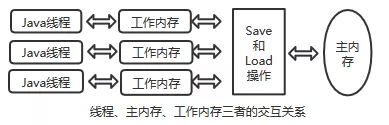

# Java 内存访问模型与线程

一个Java程序实际上是一个JVM进程，JVM进程用一个主线程来执行main()方法，在main()方法内部，我们又可以启动多个线程。此外，JVM还有负责垃圾回收的其他工作线程等。

计算机为了解决CPU与内存的速度差，做了基于高速缓存的存储交互的设计，但是也有缓存一致性问题，各CPU有自己的高速缓存，在特定的协议下与共享的主内存进行读写。

和线程有关系的还有指令重排序，指令重排序也会造成在多线程访问下结束和设想的不一样的情况。

Java虚拟机的内存模型是为了屏蔽硬件、操作系统的内存访问差异，让java程序在各种平台上都能达到一致的内存访问效果。

##  Java内存访问模型

Java 内存模型规定了所有的变量都存储在主内存中。每个线程有自己的程序执行计数器，有自己的工作内存。但是这个主内存与工作内存并非JVM的堆栈划分。

- 主内存，java内存模型规定所有的变量都存储在主内存中。相当于堆中的对象实例的数据部分。
- 工作内存，每个线程都有自己的工作内存，可类比与高速缓存。相当于栈中的部分区域。

线程的工作内存中保存了该线程使用到的变量的主内存副本拷贝，线程对变量的所有操作（读取，赋值等 ）都必须在工作内存中进行，而不能直接读写主内存中的变量。

不同的线程之间也无法直接访问对方工作内存中的变量，线程间变量值的传递均需要通过主内存来完成。

## Java内存模型中的操作与规则

Java内存模型中，用于内存间的相互操作有：

- lock(锁定):作用于主内存的变量；它把这一个变量标识为一个线程独占的状态。
- unlock(解锁):作用于主内存的变量，把一个变量释放。
- read(读取):作用于主内存的变量，把一个变量的值从主内存传输到工作内存中，以便随后的load使用。
- load(载入):作用于工作内存变量，它把从主内存中read的变量值放入工作内存的变量副本中。
- use(使用):作用于工作内存的变量，把工作内存中一个变量的值传递给执行引擎，每当虚拟机遇到一个需要使用到变量的值的字节码指令时将会执行这个操作。
- assign(赋值):作用于工作内存的变量，把一个执行引擎接收到值赋给工作内存的变量，每当虚拟机遇到一个给变量赋值的字节码指令时执行这个操作。
- store(存储):作用于工作内存的变量，它把工作内存中一个变量的值传递到主内存，以便随后的write操作。
- write(写入):作用于主内存的变量，它把store操作从工作内存得到的变量的值放入主内存的变量中。

模型对这些操作的规定：

- read和load、store和write操作需要成对出现。
- 变量有赋值的必须同步到主内存，没有赋值的不允许回写，只能是来自主内存的变量才可回写。
- 在同一时刻，一个变量只允许一个线程对lock，可多次，但是需要unlock同样次数，并且只能对本线程lock的变量进行unlock。unlock变量前一定是先同步到主内存。

## 关于volatile特殊规则

volatile修饰的变量有两种特性，可见性、禁止指令重排序优化。

- 可见性，一个线程对象volatile修饰的变量进行修改后，对于其他线程是立即可见的。
- 指令重排序，为了充分利用cpu，当两个机器指令没有依赖关系时，就可以改变它们的执行顺序，这就做乱序执行。使用volatile可以禁止指令重排序优化，在代码中插入许多内存屏障指令来保证处理器不发生乱序执行。

JVM内存模型专门对volatile定义了一些特殊的访问规则：

- 对变量进行的read，load，use必须是连续的。保证线程读取变量时都是从主内存读取到最新的值。

- 对变量进行的assign，store，write必须是连续的。保证线程修改变量时都能立刻同步到主内存中去。

- 对多个volatile修饰的变量同时操作时，先进行use/assign操作的变量，先进行load/store操作。

## synchronized的使用

synchronized可以用于修饰类的实例方法、静态方法和代码块，归根结底它上锁的资源只有两类：一个是对象，一个是类。从class字节码文件可以表现出来，一个是通过方法flags标志，一个是monitorenter和monitorexit指令操作。

synchronized修饰的类或对象的所有操作都是**原子性**的，执行过程无法中断。volatile不具备原子性。

synchronized和volatile都具有**可见性**，synchronized对一个类或对象加锁时，一个线程必须先获得它的锁才可访问，在释放锁之前会将对变量的修改刷新到主内存，其他线程就可见了。

synchronized的锁的状态对于其他任何线程都是可见的。如果某个线程占用了该锁，其他线程就必须在锁池中等待锁的释放。

synchronized和volatile都具有**有序性**，synchronized保证了每个时刻都只有一个线程访问同步代码块，也就确定了线程执行的同步代码块是分先后顺序的，保证了有序性。

## happens-before规则

- 程序次序规则，在一个线程中，按控制流顺序在前面的代码先行发生。
- 管程锁定规则，一个unlock操作先行发生于后面（时间上的先后顺序）对同一个锁的lock操作。
- volatile变量规则，对一个volatile变量的写操作先行发生于后面（时间上的先后顺序）这个变量的读操作。
- 线程启动规则，Thread对象的start()方法先行发生于此线程的每一个动作。
- 线程终止规则，线程中的所有操作先行发生于此线程的终止检测。
- 线程中断规则，对线程interrupt()方法调用先行发生于被中断线程的代码检测到中断事件的发生。
- 对象终结规则，一个对象的初始化先行发生于对象的finalize()。
- 传递性，A先行于B，B先行与C，则A先行于C。