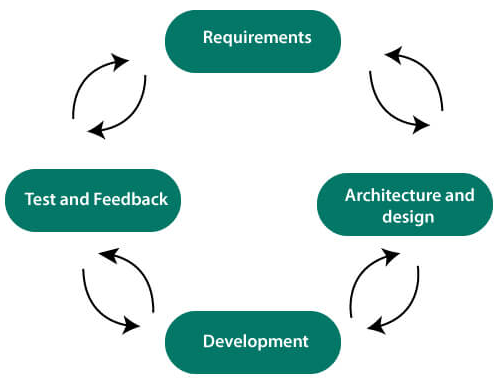
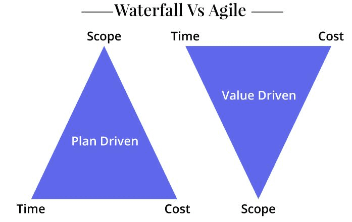
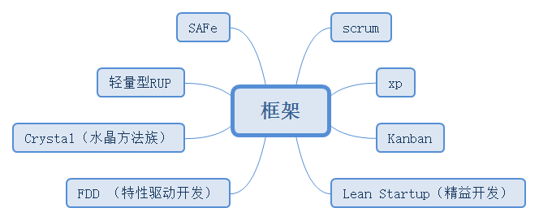

# Agile，敏捷

Agile，敏捷，这个概念最初主要应用于软件开发和新产品开发领域，为了解决传统的瀑布式开发流程的在应对变更方面成本过大问题，而产生的主动拥抱变化的一种思维模式和方法。

在1990年代前后，人们开始使用Scrum方法，并在2001年Agile概念与敏捷宣言正式提出。随着在工作中成熟应用和发展，它的一些理念和方法论也开始逐步应用于传统项目管理领域。

## 宣言

建立的价值观是：

- 个体和交互 胜过 流程和工具
- 可以工作的软件 胜过 面面俱到的文档
- 客户合作 胜过 合同谈判
- 响应变化 胜过 遵循计划

总结来说，更重视项目开发进度和质量。

## 原则

针对宣言的十二个原则是：

1. 客户满意度，通过及早和持续不断地交付有价值的软件使客户满意。
2. 拥抱变化，面对需求变化，掌握变化。
3. 提供可工作的软件，时间越短越好。
4. 协作，业务人员与开发人员相互合作完成整个项目。
5. 激励与信任，激发个体的斗志，提供所需的环境和支援，充分信任他们能完成工作。
6. 面对面的交谈，最有效果和效率的传递信息。
7. 可工作的软件是进度的关键和主要衡量标准。
8. 可持续的开发进度，责任人、开发人员和用户要能够共同维持其步调稳定延续。
9. 持续关注好的设计与优秀的技能，并持续改进。
10. 简单，应采用和目标一致的最简单的方法建构系统。包括最简单的术语。
11. 自组织团队，最好的架构，要求和设计来自于自组织团队。
12. 定期反思回顾，不断的对团队的组织方式、规则、规范、关系等进行调整，以保持对变化的环境的适应性。

## 思想

敏捷主要的方法就是迭代，循序渐进，把一个大的项目分为多个可以独立运行的小项目，然后分别完成，过程中不断的交付使用，以得到客户的及时反馈，并及时调整。

敏捷的核心思想是：

- 更快的交付价值，将可用的软件更快的让客户用起来，尽早的验证其商业模式和商业价值。这个目标的达成，可以让价值更高的需求先投入市场，变更尽早出现，风险更早发现，那么解决的成本就更低。根据市场反馈进行需求内容调整、优先级调整，项目的范围也会更灵活。
- 协作至上、沟通至上，与业务充分协作、面对面沟通，一起工作，一起推动项目的完成，让沟通顺畅进行，信息传递无阻碍。
- 自组织团队，团队由责任人、开发人员和用户等组成一个小的跨职能团队，每个人都是主要角色，需要充分挖掘潜能。多数情况下，内部就可以解决问题，领导只是服务角色，团队成员都自组织与自管理。
- 持续优化，每个迭代的回顾会议都会进行分析、讨论、总结，在下个迭代中改进、调整和优化。团队持续跟进好的设计与优秀的技能。

在敏捷的思想中也并非追求极致的敏捷，项目中仍然需要平衡：

- 虽然强调沟通至上代码至上，但是基本的文档仍然是不可缺少的，不追求事无巨细的描述。

- 不提倡做全面的规划，仍然有多层次的规划，迭代级别规划总体功能安排，发布级别规划可用功能截止日期。
- 不做过度设计，但是需要每个迭代都要持续重构，让优秀的架构设计在过程中诞生，不过这也要求成员有较高的自主性。实际上是设计无处不在，并持续优化。

## 敏捷开发

敏捷软件开发方法基于：发布和迭代。单个发布版本包含多个迭代。每个迭代中包括需求、Bug、优化或者其他项，这些需要提前预估时间与优先级，然后安排进发布。

敏捷软件开发的生命周期有需求收集和分析、设计、开发与部署、测试与反馈。

敏捷开发过程需要外部工具支撑，如持续集成 和 持续交付 (CI/CD) ，项目管理工具，Bug系统等等。

## 敏捷项目

敏捷项目管理是一种项目哲学或框架，它采用迭代方法来完成项目。在敏捷中，项目的进度和成本基本固定，范围可变，重点是交付价值。并不总遵守开始时制定的严格而详细的计划，而是需要根据客户的最新信息和反馈进行调整项目范围。

与传统的项目的计划驱动的范围时间成本三角形不同，敏捷的项目的三角形则是价值质量约束。相比较如下：

- 价值，在客户的角度看价值，交付价值。
- 质量，产品的可靠、适应性。
- 约束，这才是传统的范围、时间和成本。

团队在工作中定期评估成本与时间，使用速度、燃耗和燃尽图来衡量工作，而且项目经理的角色非常必要存在，或者更多承担协调员。

目前Scrum 项目管理是项目经理使用的最流行的敏捷方法之一，另外一个常用的框架则是看板。

## 框架

敏捷提出了一套价值观和原则，主要还是一种思想和态度，具体的敏捷方法则有很多，各自都有所偏向。

- Scrum，“橄榄球”式方法，使用范围最广的一种敏捷方法，提倡团队自治。它由一系列价值、工件、角色、仪式、规则和最佳实践组成。
- Kanban，“看板”方法，把项目过程和产品进行可视化的方法。团队持续协作并鼓励积极、持续的学习和改进。
- XP，极限编程，需求变化为重点，进行快速、持续交付，同时强调团队合作。
- FDD，功能驱动开发模式，提倡“刚刚好”，它的主要目的是及时地重复交付切实可行的软件。
- Crystal，“水晶”系列方法。

