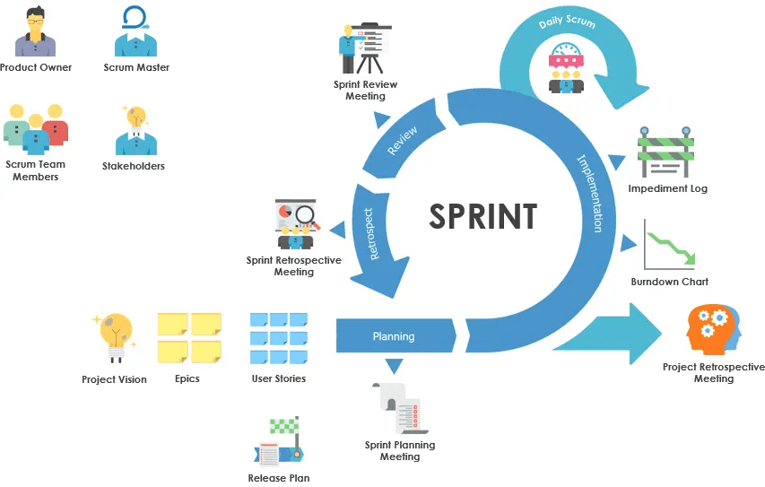

# Scrum敏捷框架

敏捷是解决传统项目管理对复杂和变化应对不足的替代方案，提出了一组价值观和原则。起源自敏捷开发方法，一种以人为核心、迭代、循序渐进的开发方法。符合敏捷价值观和原则的开发方法有很多，其中以Scrum框架最流行。

Scrum原意是橄榄球运动的争球，用来象征积极的快速前进的团队。

Scrum核心思想是增量、迭代，整个开发过程由若干个短的Sprint(迭代周期)组成，每个Sprint大约2到4周。需求则由产品Backlog(产品待办事项)来管理，进入迭代中的需求则由Sprint backlog(迭代待办事项)来管理。

## 流程

Scrum 流程通过特定的概念和实践区别于其他敏捷流程，分为角色、事件、工件和规则三类。

整个过程循环进行，大的流程如下：

1. 准备阶段，确定Product Backlog，也就是分析阶段，一般用Epic和User Story来描述。
2. 开始前，产品、研发、测试需要一同开一次 sprint planning meeting（迭代计划会议），按优先级安排sprint backlog。同时也会讨论发布计划。
3. 进入Sprint，成员对这个迭代的工作整理、拆分、设计、评估时间、安排优先级、开发、测试。
4. 在Sprint中，每天站会，汇报：昨天完成、今天要完成、难题，更新burndown chart。
5. 完成Sprint时，进行Sprint Review Meeting（评审会议），演示评审结果。
6. 最后，进行Sprint Retrospective Meeting（迭代复盘会议），总结经验、教训、优化。

## 三个角色

Scrum 团队是自组织、跨职能的完整团队，尽量内部拥有完成工作所需要的全部技能。

- **PO**，Product Owner（产品经理），管理产品待办事项列表，排User Story的优先级，迭代结束时评估交付成果。他是产品以及开发团队工作的最大负责人，要保证团队对待办事项透明、清晰，下一步工作明确。团队必须尊重他的决定。
- **Team**，Development Team（开发成员组），工作所需的专业人员，最主要是开发者，自组织跨职能且平等，一般3-9人规模，过犹不及。一般来说测试团队，需求分析师，UI设计师专业团队可能不包含在内。
- **SM**，Scrum Master（敏捷专家），协助PO和团队，主持迭代相关的各种会议，解决沟通问题，协助角色，帮忙团队改进Scrum过程。

## 三个清单

为保证关键信息的透明性，有三个重要的清单：

- **Product Backlog**，产品待办事项清单，由PO经需求分析后持续维护内容，其中包括User Stoty，任务，Bug，优化等等。
  每个事项都必须有优先级、价值描述、评估等，其细节也按优化次序不断梳理清晰。
  由此清单可以追踪剩余工作总量，以及燃尽图也可显示出进度的趋势。
- **Sprint Backlog**，迭代待办事项清单，是Team从Product Backlog选出的条目，要在本迭代中完成。
  此清单的意义包括细化的User Story、详细到小时的工作量评估、一份足够具体的计划、任务责任人、要交付的Product Increment等方面。
  清单包括User Stoty(或更细分为任务)，任务，Bug，优化等，对客户带来高价值的事项总会优先完成，并且紧急的高优先级的也可加入到清单中，尤其是Bug类。
  当任务进行或完成，需要更新任务的估算剩余时间，所有剩余工作总和都可以被计算，通过燃尽图也可显示出进度趋势。
  在Sprint结束时更新的发布燃尽图可以跟踪到整个发布计划的进度。
- **Product Increment**，产品增量清单，当Sprint完成时，所有验收可以交付的成果物清单，包括之前所有完成的。Team完成任务后，由PO验收，最后由PO决定是否发布。

Backlog中最重要的是User Story（用户故事），是从客户、业务的角度描述想要解决的问题，想要得到的功能，包含三个要素：角色、活动、价值。需要注意的是不能够使用技术语言来描述。

## 五个事件

- Sprint，迭代，是Scrum的核心，一般是2到4周的一个时间段，用来开发构建可用的、潜在可发布的产品增量。一个完整的Sprint由计划会议、每日站会、开发工作、 评审会议和回顾会议构成。
- Sprint 计划会议，迭代开始时，会议中整个团队协作完成这个迭代的计划，做什么、如何做和预估工作量。
- 每日站会，每天进行的时间短、内容简的会议，用来检视完成 Sprint 目标的进度，每个成员都需要说明，昨天做了什么，今天准备做什么，有哪些阻碍。
- Sprint 评审会议，迭代结束时，检视所交付的产品增量的会议。参与人包括团队及需求相关方，演示完成的工作，大家讨论所交付的产品增量的问题，讨论完成和未完成的工作，也讨论下一步工作，修订产品待办列表，以及下一迭代的待办列表。
- Sprint 回顾会议，在评审会议结束后，下个迭代开始前进行。总结经验，检视迭代问题，讨论改进方案。

## 五个价值观

1. 承诺，愿意对目标做出承诺，但不过度承诺。
2. 专注，把心思和能力都用到已经开始的工作上去，限制正在进行的工作数量。
3. 开放，寻求并重视反馈和学习机会。让障碍、失败和学习成果变得清晰可见。 
4. 尊重，团队合作，认可每个成员的工作和成就，建立与人的信任关系。
5. 勇气，都有勇气接受错误、寻求帮助、学会拒绝以及大胆质疑。

