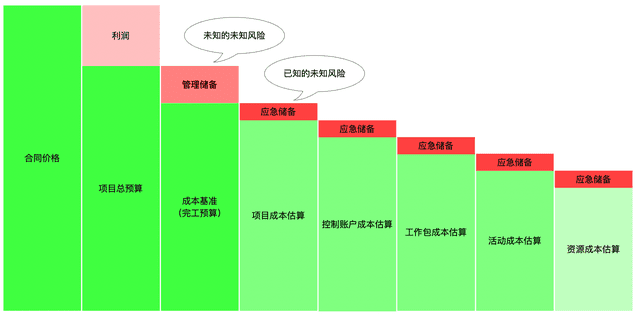
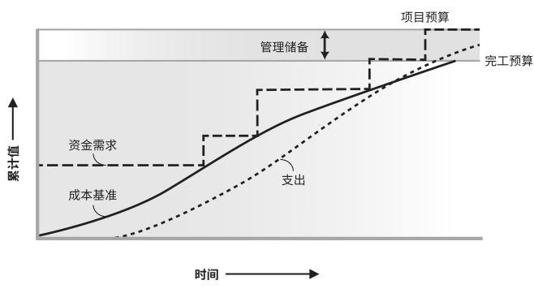

## 项目成本管理

项目成本管理主要是确保项目在批准的预算内保质按期完工，而对成本进行规划、估算、预算、融资、筹资、管理和控制的各个过程。

经过对成本的估算并制定预算，成本批准后形成**成本基准**，在项目实施过程中通过**挣值管理**与数据分析来维护成本基准。

## 成本及成本基准

项目的成本结构从小到大进行逐级汇总。

- 资源成本、活动成本、工作包成本、控制账户成本、项目成本、各自加上应急储备向上汇总，最后组成**成本基准**。
- 在成本基准上再加上管理储备是**项目总预算**，也就是项目资金需求。
- 在项目总预算上再加上利润是合同价格。

**成本基准**，是经过批准的、按时间段分配的**项目预算**，是不同进度活动经批准的预算的总和。可据以监督和控制项目绩效。

成本基准不包括任何管理储备，只有通过正式的变更控制程序才能变更，用作与实际结果进行比较的依据。

## 挣值管理

挣值管理（Earned Value Management, EVM），用来综合考察项目范围和进度绩效。比较计划工作量、WBS的实际完成量与实际成本花费，分析成本与进度是否符合原定计划。

挣值管理相关联的指标有：

- **挣值** (Earned Value，EV)，已完成的实际工作价值，常用来计算项目完成百分比。
- **计划价值**（Planned Value, PV），截止到某时间点计划要完成工作量的价值。
- **实际成本**（Actual Cost, AC），截止到某时间点实际已经发生的成本。
- **完工预算**（Budget At Completion, BAC），对完成该项目的计划预算。

基于挣值和挣值管理的扩展：

- 挣得进度 (Earned Schedule，ES)，截止到某时间点实际已经完成工作量的时间价值。提供了预测项目完成日期的计算公式。

- 挣值分析 (EV Analysis，EVA)，将实际进度和成本绩效与绩效测量基准进行比较，计算并监测计划价值、挣值、实际成本。
- 实际时间（Actual Time，AT），截止到某时间点实际已经发生的时间成本。

## 规划成本管理

**规划成本管理过程**是确定如何估算、预算、管理、监督和控制项目成本。在整个项目期间为如何管理项目成本提供指南和方向。

此过程输出成本管理计划，是项目管理计划的组成部分，描述将如何规划、安排和控制项目成本，如资源计量单位、精确度、准确度、控制临界值（偏差）、绩效测试规则（挣值管理规则）等等。

## 估算成本

**估算成本过程**是对完成项目工作所需资源成本进行近似估算。将在整个项目期间定期开展，在特定时间点，根据已知信息做成本预测，确定项目所需资金。项目估算的准确性亦将随着项目的进展而逐步提高。

估算成本根据范围基准（项目范围说明书、WBS及词典）进行，对工作包或活动的成本进行最具体、细致的估算。

成本估算可以以货币单位进行，也可以人时或人天等其他单位。应当考虑全部资源成本，如人工、材料、服务等，可以在活动层级呈现，也可以汇总形式呈现。

估计方法：

- 类比估算，类似项目的参数估算，参数包括范围、成本、预算、持续时间和规模指标等。特点是成本低，耗时小，准确性低。
- 参数估算，利用历史项目数据之间的统计关系和其他变量，建立参数模型，来估算项目成本。特点是可靠性高。
- 自下而上估算，滚动式规划，先估算单个工作包或活动，汇总到高级层次。
- 三点估算，将成本按最可能、最可悲、最乐观来估算。公式有：三角分布（最可能+最可悲+最乐观）/3；贝塔（最可能+最可悲+4最乐观）/6。

成本中还需要考虑到的有：

- 储备/应急费用，需要分析不确定性，加入定量的应对成本。
- 质量成本，是为达到特定质量要求而增加的投入。

成本估算需要清晰完整的支持信息：估算依据、假设条件、制约因素、考虑风险、估算区间说明、最终估算的置信水平。

## 制定预算

**制定预算过程**是汇总所有单个活动或工作包的估算成本，建立一个经批准的成本基准。

项目预算和成本基准是不同层面的汇总，由成本基准，确定了**项目总资金需求**和**阶段性资金需求**（如季度或年度）。

- 项目预算包括经批准用于执行项目的全部资金。
- 成本基准是经过批准且按时间段分配的项目预算，包括应急储备，但不包括管理储备。

成本与需求关系如图：

制定预算涉及到的工作有：

- 成本汇总，先把成本估算汇总到 WBS 中的工作包，再由工作包汇总至 WBS 的更高层次，最后得到总成本。
- 建立管理储备。
- 在建立成本预测模型时，对历史数据审核。
- 根据对项目资金限制因素，进行资金平衡。
- 融资，为项目获取资金。

## 控制成本

**控制成本过程**是监督项目状态，并更新项目成本和管理成本基准变更。应分析项目资金支出与相应完成的工作，来预测成本，比较之间的偏差，经过变更控制进行批准后，才能增加预算。

其实施的内容有：

- 监控成本执行情况以确定与计划的偏差。
- 确使所有发生的变化被准确记录在成本基准上。
- 避免不正确的、不合适的或者无效的变更反映在成本基准上。
- 相关方报告变更及相关成本。
- 对变更进行影响及处理，并保证成本支出及预算的成本支出都不超过目前的范围。

对项目成本的执行情况的分析手段主要是挣值管理，具体方法有：

- 挣值分析，分析实际进度和成本绩效与绩效测量基准，判断趋势。要计算出计划价值、挣值、实际成本。
- 偏差分析，分析成本与进度偏差，判断原因和程度，通过进度绩效指数与成本绩效指数的计算结果，来决定是否需要采取纠正或预防措施。
- 趋势分析，审查项目完成的工作的成本随时间的变化情况，判断趋势向好还是向坏。
- 储备分析，分析储备的使用情况，并调整。

预测完成剩余工作所需的成本与剩余预算之比，也就是完工尚需绩效指数（TCPI），可以指导成本的控制。

