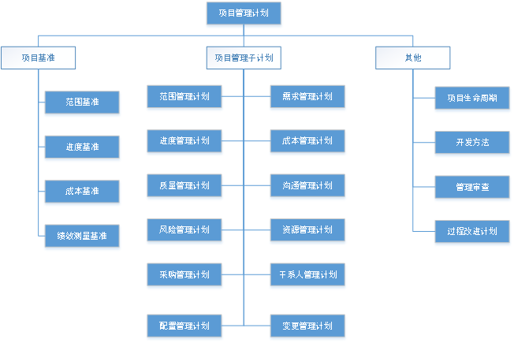

# 项目整合管理

项目整合管理，包括识别、定义、组合、统一和协调各项目管理过程组的各个过程和活动。由项目经理负责，整合其他过程领域的成果，并汇总掌握项目总体情况，同时需要将各方的需求进行综合性汇总，并能够权衡得失，规避风险。

管理内容是：制定项目章程、制定项目管理计划、项目计划实施、管理项目知识、监控整体项目工作与项目整体变更控制，最后结束项目。

## 【启动阶段】制定项目章程

**制定项目章程过程**：授权项目经理使用组织资源开始项目活动的文件，记录可交付产物的高层级、宏观上、总体性信息。

风险方面可以找专家，评估战略与效益，估算成本及风险，也可提供行业知识与技术知识。

过程中的数据收集方式有：团队头脑风暴、相关方与专家进行焦点小组会议、与相关方一对一访谈等。

管理人际和团队有：冲突管理、引导、会议管理。

这个阶段完成时：

- 正式批准项目初步要求，大概范围。
- 任命项目经理，给予范围内的授权。
- 正式启动项目。

**项目章程**，发起人发布正式批准项目的文件，实际上就是有关项目的要求和项目实施者的责、权、利的规定。确保相关方在总体上就主要可交付成果、里程碑以及每个项目参与者的角色和职责达成共识。

具体包括的内容有：

- 项目与相关方的要求与期望。
- 项目最终成果的要求和规定，以及目的和理由。
- 大致的里程碑、进度、预算，项目经理权限、组织及约束等说明。

项目章程依据的材料是：

- 起始决策，包括可行性分析、主要目标、指标等。
- 项目合同。
- **SOW（statement of work）**，项目工作说明书，是对项目产出物和项目工作的说明，这是项目业主或用户给出的项目具体要求说明书，其主要内容有项目要求、项目产出物和工作的说明以及组织战略规划目标等。
- 市场环境、内部组织环境等因素，如标准、法律法规、文化氛围、期望等。
- 组织的信息、知识、经验等，如流程、知识库、模板等。

## 【规划阶段】制定项目管理计划

**制定项目管理计划过程**：将确定、编写、协调与组合所有部分计划所需要的行动形成文件，使其成为项目管理计划。项目管理计划确定后续执行、监控、结尾的相关流程，以及用于确定所有项目工作的基础及其执行方式，即基准化。

项目管理计划组件包括（但不限于）：

项目管理计划主要作用是：整合并综合了所有子管理计划和基准，以及管理项目所需的其他信息。可以是概括性的也可以是详细的，项目开展后，所有的计划或基准变化都需要修改项目管理计划。

- 材料与制定方式

制定项目管理计划过程需要的资料，同制定项目章程过程一样，项目章程、各个环境、其他过程的资料汇总及组织资产。

制定的方式也一样，请专家来做判断，头脑风暴、小组会议、一对一访谈、标准化的核对单来收集数据，同样需要使用冲突管理、引导、会议管理来管理人际关系与团队技能。

- 产出物

项目经理负责组织编写项目各个基准与子计划，经评审与批准后，形成了项目的基准计划，这个过程就算结束了。

## 【执行阶段】指导与管理项目工作

**指导与管理项目工作过程**：在整个项目期间，为了提高实现项目目标的成功率，项目经理与项目管理团队一起指导实施已计划好的项目活动，并实施已批准变更。

除了跟进项目管理计划、项目文件、事业环境因素、组织过程资产，更重要的是跟进已经批准的变更，并实施。

其中项目文件有：变更日志、风险报告与登记表、里程碑清单、项目进度计划、需求跟踪矩阵、沟通记录、经验教训登记表等。

组织过程资产主要指的是用于问题与缺陷管理系统中的记录，有问题与缺陷、风险与变更、绩效等。

**过程手段**，此过程应使用项目管理系统来管理相关数据，需要组织各种会议讨论和解决项目的相关事项，另外专家可以帮助了解相关知识与成本预算等管理。

会议有很多类型：开工会议、技术会议、敏捷或迭代规划会议、每日站会、指导小组会议、问题解决会议、进展跟进会议以及回顾会议。

**过程产出物**，以可交付成果为中心，记录过程绩效数据、问题日志，指导变更请求的实施，更新管理计划、项目文件、组织过程资产。

## 【执行阶段】管理项目知识

**管理项目知识过程**：将过程中产生的新知识管理起来，将隐性知识显性化，并且帮助组织分享学习。

利用会议、分享活动、讨论小组或直接培训等方式，激发团队能分享知识或关注他人的知识，并用于项目过程。

将这些知识记录下来，做为项目交付的一部分，或组织资产的一部分。随时做项目管理计划更新、组织过程资产更新、写入经验教训登记册。

## 【监控阶段】监控项目工作

**监控项目工作过程**：跟踪、审查和报告整体项目进展，以实现项目管理计划中确定的绩效目标。

此过程将在整个项目周期中进行，主要活动是收集、测量和发布绩效信息，分析测量结果和预测趋势。让相关方了解项目的当前状态，并了解未来项目状态，支撑相关方做出对应改进决策和行动，保障项目目标得到实现。

分析决策的方式，可以请专家参与判断，召开用户小组会议或用户审查会议，对数据分析内容进行讨论与决策。数据分析技术可使用：备选方案分析、成本收益分析、挣值分析、根本原因分析、趋势分析、偏差分析。

最终将工作绩效记录到报告，或响应变更过程，或者更新项目管理计划及其他项目文件。

## 【监控阶段】实施整体变更控制

**实施整体变更控制过程**：审查所有变更请求、批准变更，管理对可交付成果、项目文件和项目管理计划的变更。

此过程将在整个项目周期中进行（主要在基准确定后），主要活动是审查所有变更请求，并决策处置方案。目标是确保对记录在案的变更做综合评审。

变更范围包括：项目范围、产品范围、各子计划、各项目文件。

与监控项目工作过程结合，分析与决策变更及方案。使用变更控制工具做：识别配置项、记录并报告配置项状态、核实审计，以及变更的识别、记录与跟踪。

由项目经理、变更控制委员会（CCB）或指定的团队成员一起召开变更控制会，根据变更管理计划处理变更请求。

## 【结束阶段】结束项目或阶段

**结束项目或阶段过程**：终结项目、阶段或合同的所有活动，主要工作是移交可交付成果，交付最终收尾报告，总结，存档信息，完成计划的工作，释放组织团队资源。

