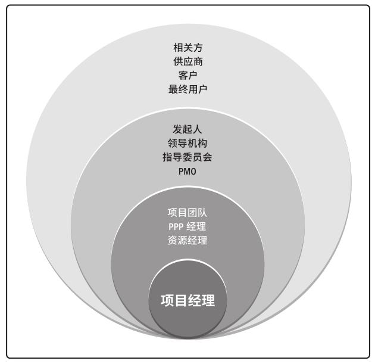
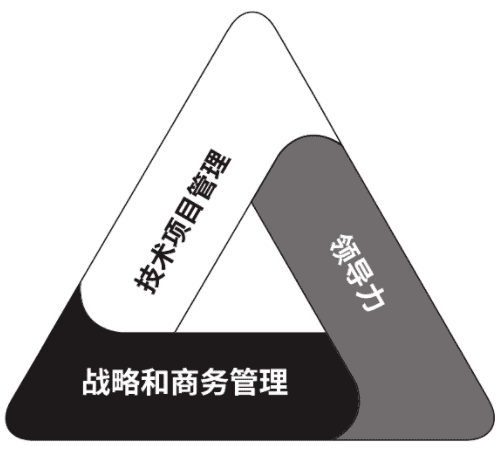

# 项目经理

项目经理就是项目负责人，在领导项目团队达成项目目标方面发挥至关重要的作用。由执行组织委派，负责整个项目的计划、实施和控制，是项目管理的核心。

项目经理可能从项目启动时参与项目，直到项目结束。或者可能会在项目启动之前就参与评估和分析活动。还可能参与后续跟进活动，以实现项目的商业效益。

## 权力与职责

项目经理可能需要授予的权力有：

- 指挥权，人、财、物等资源的指挥调度及优化和调整。
- 人事权，项目成员的选择、考核、聘任和解聘。
- 财务权，范围内的财务决策权，包括项目活动费用开支、管理成本及应急储备的支配。
- 技术决策权，审查和批准技术措施和方案，必要时召集技术方案论证会或外请咨询专家。
- 实物资源的采购与控制权。

项目可能需要承担的职责很多，总结起来有：

- 确保项目目标实现，保证相关方满意。
- 制定项目阶段性目标、项目总体控制计划。
- 创建和管理团队。
- 及时决策项目过程中遇到的方案、措施、安排、变更等等。
- 处理变更。
- 对外沟通。

## 在各范围上的影响力

项目经理在其影响力范围内担任多种角色，有各自的价值和作用。

**项目**

- 领导项目团队实现项目目标和相关方的期望。
- 充分利用资源，平衡制约因素。
- 团队与其他相关方之间的沟通。
- 使项目相关方之间达成共识，平衡有冲突和竞争的目标。
- 

**组织**

- 项目经理要积极地与会受到影响的其他项目的项目经理互动，消除影响。
- 与项目发起人合作处理内部的政治和战略问题，项目会被这些问题影响。
- 在组织内扮演强有力的倡导者的角色。
- 提高组织的项目管理能力。
- 项目经理可能向职能经理报告，或者向PMO、项目组合或项目集经理报告。

**行业**

项目经理应时刻关注行业的最新发展趋势，对其进行影响分析。如：新技术、新变化、标准、工具等等。

**专业学科**

项目经理进行持续的知识传递和整合，推进相应的专业发展，如项目管理专业、或其所在行业。

**跨领域**

项目经理可以指导和教育其他专业人员项目管理方法。

## 能力要求

项目管理人才三角：技术项目管理、领导力、战略和商务管理，重点关注三个关键技能组合。技术项目管理是核心技能，同时领导力与商业智慧有助于支持更长远的战略目标，以实现赢利。

- 技术项目管理，与项目、项目集和项目组合管理特定领域相关的知识、技能和行为。

- 领导力。指导、激励和带领团队所需的知识、技能和行为，可帮助组织达成业务目标。

- 战略和商务管理。关于行业和组织的知识和专业技能，有助于提高绩效并取得更好的业务成果。

## 技术项目管理

项目经理掌握充足的专业知识和技能，运用在项目管理中，实现项目集或项目的预期成果。

关键技能：

- 重点关注关键管理要素：项目成功的关键因素、进度、财务报告，问题日志等。需要随时准备好相关资料。
- 针对每个项目裁剪传统和敏捷工具、技术和方法。
- 花时间制定完整的计划，并谨慎排定优先顺序。
- 管理项目要素，包括进度、成本、资源和风险等。

## 战略和商务管理
战略和商务管理技能包括纵览组织概况，有效协商和执行有利于战略目标的能力。项目经理应掌握足够的行业和组织的知识。

- 经理应掌握足够的业务知识，以：向其他人解释关于项目的必要商业信息；与项目发起人、团队和主题专家合作制定合适的项目交付策略；以实现项目商业价值最大化的方式执行策略。
- 项目经理应掌握足够的领域知识，以及能向组织说明：有关项目的主题；战略；使命；目的和目标；产品和服务；运营；市场和市场条件；竞争。
- 还应确定商务和战略因素对项目造成的影响：风险和问题；财务影响；成本效益分析（例如净现值、投资回报率）；商业价值；效益预期实现情況和战略；范围、预算、进度和质量。

通过运用这些商务知识，项目经理能够为项目提出合适的决策和建议。随着条件的变化，项目经理应与项目发起人持续合作，使业务战略和项目策略保持一致。

## 领导力

领导力技能包括指导、激励和带领团队的能力。这些技能可能包括协商、抗压、沟通、解决问题、批判性思考和人际关系技能等基本能力。

人际交往占据项目经理工作的很大一部分。通过沟通技能，与所有项目相关方合作。

领导力的技能和品质归根究底就是处理政治的能力，涉及影响、谈判、自主和权力。充分了解组织动作方式，结合项目数据，从而得出计划和执行大多数行动所需的信息和知识。

借助人际关系落实相关事项，主动寻求和运用权力和职权，去影响项目各种因素。

与管理相比，领导力以人为本，关注愿景和创新，做正确的事；管理则是以事为本，关注稳定和有序，正确的做事。另外一方面领导更注重激发信任。

## 执行整合

项目经理与与项目发起人携手合作，了解战略目标，并确保一致性。在项目过程中，项目经理需要整合过程、知识和人员，指导团队。

- 过程层面，整合变更请求，实施整体变更控制过程。
- 认知层面，尽量掌握所有项目管理知识领域，将经验、见解、领导力、技术以及商业管理技能运用到项目管理中。
- 背景层面，意识到项目背景和这些新因素，加以利用。

