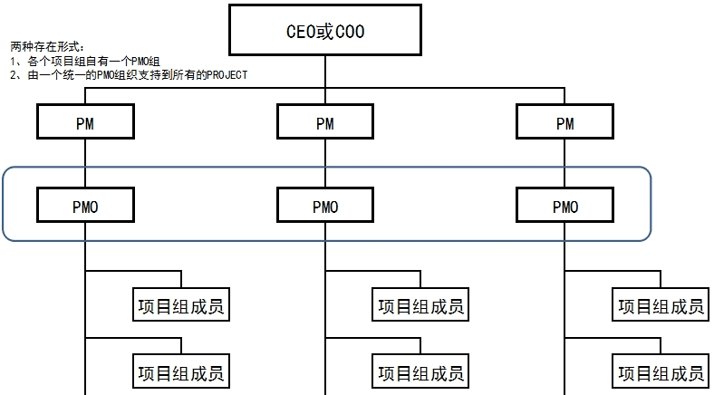

# 项目管理办公室（Project Management Office）

PMO，项目管理办公室（Project Management Office），是对与项目相关的治理过程进行标准化，并促进资源、方法论、工具和技术共享的一个组织结构。

PMO可以提供项目管理的支持服务，也可以直接管理一个或多个项目。

## PMO类型

根据PMO对项目的控制和影响程度，有几种不同类型：

- 支持型，担当顾问的角色，向项目提供模板、最佳实践、培训，或者提供外部信息以及经验教训。
- 控制型，除了给予支持外，还让项目服从一些控制：包括采用项目管理框架或方法论、特定的模板、格式和工具，以及服从治理。
- 指令型，这种类型PMO就直接管理和控制项目了，项目经理由 PMO 指定并向其报告。

- 战略型，他可具有承上启下的双重作用，承担着企业战略目标分解、项目筛选、项目组合管理等多重任务。确保所有项目能围绕组织战略目标来进行，并且确保项目能为组织带来相应的利益。

根据PMO所管辖的项目范围的不同，PMO可以分为组织级和部门级两种。

- 组织级PMO直接向组织最高管理层汇报，负责组织内部所有项目的选择、监控和收益评估。其职能包括：在整个组织中建立流程、标准、规则和方法论，通过资源管理、优先级管理、系统思考等手段提高所有项目的绩效，从而保证组织战略的实现。

- 部门级PMO存在于组织的某个部门之内，直接向部门经理汇报，负责部门内部所有项目的选择、监控和收益评估。部门级PMO从部门角度出发，通过资源优化等手段，追求最佳投入产出比，支持部门及组织战略目标的实现。

## PMO相关方

PMO需要与多方面的相关方进行沟通和协作，包括：

- PMO的直接领导，也就是组织的总裁或部门总经理，他们提供了组织战略、工作方向、职能要求等，也要求PMO向他们汇报项目的整体情况。
- 项目发起人、项目经理和项目团队，为项目团队提供支持，也进行监控、建议、纠偏。
- 其他职能部门，PMO进行的活动可能需要相关的职能部门参与和支持。

## PMO的职能

PMO团队每天履行各种职能、可能有权在项目中充当重要相关方和关键决策者：

- 提出建议。
- 领导知识传递。
- 终止项目。
- 根据需要采取其他行动。

PMO为让项目处于受控中，还可能向项目经理提供支持：

- 识别和制定项目管理方法、最佳实践、标准和政策，以及提供程序和模板，还有其他共享文件（组织过程资产）。
- 提供指导、辅导、培训。
- 通过项目审计，监督这些标准和流程的使用。
- 管理全部项目的共享资源。
- 管理跨项目的依赖关系，并对沟通进行协调。
- 报告财务信息，例如投资回报率。
- 监视和评估项目绩效是否达到既定目标。
- 准备风险分析和行动计划以减轻风险
- 收集有关项目进度的数据并生成报告。

## PMO带来的问题

起初PMO只是关注比较小范围的活动，如本部门，后来出现了企业级PMO，协调整个组织的项目管理活动。

PMO可能带来的问题有：

- 官僚机制，制定控制为目的的程序。
- 增加了管理成本。
- 无法衡量其工作绩效。
- 无管理层的足够支持。
- 承担了行政管理职能。
- 当作了管理层的政策制定机构。
- 与项目利益不相关，自身定位不清。

最佳实践是淡化PMO的保证性角色，PMO将需要对整个业务系统的绩效提供更多的支持和评审，同时对大项目和项目组合提出独立评估意见。