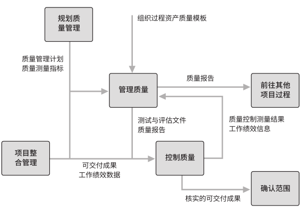

# 项目质量管理

项目的质量管理主要是为了确保项目按照相关方规定的要求完成，制定质量政策，识别质量要求，并应用于规划、管理、控制项目。此外，还将以执行组织的名义支持过程的持续改进活动。

质量管理主要是依赖于质量计划、质量控制、质量保证及质量改进所形成的质量保证系统来实现的。

核心概念：

- 兼顾项目管理与项目可交付成果。
- 质量靠规划、设计、以及实在和不取巧。
- 预防胜于检查。

现代的项目质量管理力求缩小差异，交付的成果满足相关方要求。趋势是：

- 让客户满意。
- 项目过程中持续改进。
- 强调了管理层的责任。
- 与供应商的互利合作关系。

**质量成本 (COQ)** 是为了保证和提高产品质量、满足用户需要而支出的费用，以及因未达到质量标准而产生的一切损失费用的总和。包括以下成本：

- 预防成本，预防质量低劣所带来的成本。
- 评估成本，评估、测量、审计和测试所带来的成本。
- 失败成本（内/外），因与期望不一致导致的成本。

按质量成本代价大小来区分的质量问题：

- 客户发现缺陷，代价最大，可能需要担保、召回、返工，商誉受损。
- 交付前检测和纠正缺陷（验收或回归），可能带来评估成本与内部失败成本。
- 检查并纠正过程本身，过程中解决问题。
- 质量融入规划和设计中，从源头防止问题的出现。
- 质量文化，从思想层面就关注与重视。

质量管理的各个过程的关系如下：

## 规划质量管理

**规划质量管理过程**，识别项目及其可交付成果的质量要求和/或标准，并制定质量管理计划和质量测量指标。为在整个项目期间如何管理和核实质量提供指南和方向。

质量管理计划是项目管理计划的一部分，描述如何实施适用的政策，定义了一系列有计划、有系统的行动和过程。它的组成部分有：

- 质量标准。
- 质量目标。
- 与质量相关的角色与职责。
- 需要审查的可交付成果与过程。
- 规划的质量控制和质量管理活动。
- 用于质量控制工具。
- 处理纠正或改进流程。

质量测量指标专用于描述项目或产品的质量属性，以及描述控制质量过程是如何进行验证的。可能包含的指标有：

- 准时性。
- 预算控制。
- 可用性。
- 可靠性。
- 故障率。
- 缺陷数。
- 代码缺陷比例等。

计划过程需要进行分析的有：

- 成本效益，估算备选方案的优劣。
- 质量成本，在预防成本和评估成本之间平衡，规避失败成本。

## 管理质量

**管理质量过程**，在项目上应用组织的质量政策，并将质量管理计划转化为可执行的质量活动的过程。提高实现质量目标的可能性，以及识别无效过程和导致质量低劣的原因。在整个项目期间开展。

管理质量，有时也叫质量保证，但是需要加上产品设计和过程改进等工作内容。

管理质量是所有人的共同职责，包括项目经理、项目团队、项目发起人、执行组织的管理层，甚至是客户。用到的项目资源除了自己的项目团队，甚至可以包括跨组织的质量保证部门。

最终需要进行分析资料有：

- 备选质量方案。
- 质量报告、测试报告、绩效报告和偏差分析等文件。
- 所有过程，识别过程改进机会与不足之处。
- 根本原因，分析偏差、缺陷和风险的根本原因，用来及时处理。

最终产出的资料有：

- 质量报告、测试报告、测试与评估文件。

- 变更请求，对可能被影响的部分（各计划或各组成部分或过程）进行变更。

在分析中，可以使用下面的工具进行辅助：

- 亲和图，可以对潜在缺陷成因进行分类。
- 流程图（过程图），展示引发缺陷的过程。
- 矩阵图，展示因素、原因和目标之间的关系强弱。
- 因果图（鱼骨图、石川图）：适用于根本原因分析。
- 直方图（统计）：数值数据统计。
- 散点图（相关图）：两个变量的关系图。

## 控制质量

**控制质量过程**，监督和记录质量管理活动执行结果，评估绩效，确保项目输出完整、正确且满足客户期望，可交付成果和工作已经达到主要相关方的质量要求，可供最终验收。

控制质量，主要是对结果进行质量核实，为验收做准备，通常是由质量控制部门或类似的质量组织单元实施。

主要工作有：

- 收集并分析数据，使用核对单、核查表、抽样、问卷等手段找到问题。
- 检查，也可称为审查、同行审查、审计或巡检等，对成果或产品进行检验或确认缺陷。
- 测试。
- 提交变更请求。

使用到的工具有：

- 核对单：checklist（单次）。
- 核查表：计数表，排列各种事项，收集属性数据（记录所有的核对单记录）。
- 统计抽样：从目标总体中抽样检查。
- 问卷调查：外部客户层面，收集客户满意度。

同时也包括绩效审查和根本原因分析。

