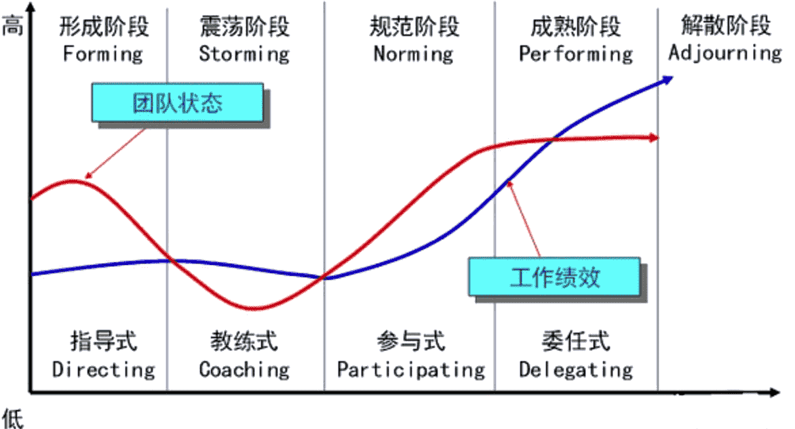

# 项目资源管理

项目资源管理主要是识别、获取和管理所需资源，确保项目经理和项目团队在正确的时间和地点使用正确的资源。

资源包括：

- 团队资源，也就是人力资源，这是资源的重点管理对象，团队成员可能全职或兼职，并随项目进度增加或减少。项目经理重点关注专业技能、满意度、积极性以及对项目的责任感。
- 实物资源，包括设备、材料、设施和基础设施。项目经理重点关注有效和高效分配及使用。

项目资源管理过程包括：

- 在规划阶段，规划资源管理、估算活动资源。
- 在执行阶段，获取资源、建设团队，管理团队。
- 在监控阶段，控制资源。

项目资源管理的新趋势有：

- 精益管理、准时制 (JIT) 生产、Kaizen（持续改善）、全员生产维护 (TPM)、约束理论等多种方法。
- 项目经理的自我管理及对外的关系管理等情商的提升。
- 敏捷方法强调的自组织团队。
- 现代项目的虚拟团队/分布式团队。

## 规划资源管理

**规划资源管理过程**是定义如何估算、获取、管理和利用团队以及实物资源。主要制定出资源管理计划和团队章程。

资源管理计划包括：

- 识别和量化资源的方法。
- 如何获取资源的指南。
- 定义角色与职责，包括：给成员分配职务，团队的决策、签字批准、验收的权利，成员的职责，成员应当有的技能等。
- 项目成员组织图，包括成员层级及汇报关系。
- 如何定义、配备、管理和最终遣散项目团队资源的指南。
- 培训策略。
- 团建的方法。
- 奖励办法。
- 资源控制的方法。

团队章程包括：

- 团队价值观。

- 沟通指南。

- 决策标准和过程。

- 冲突处理过程。

- 会议指南。

- 团队共识。

记录和阐明团队成员的角色与职责的方式有：

- 有层级的组织结构图，自上而下地显示各种职位及其相互关系，如工作分解结构 (WBS)，有助于明确高层级的职责；组织分解机构（OBS），有助于明确各自的工作职责；资源分配结构（RBS），与WBS结合，展示实物资源的层级列表。

- 职责分配矩阵(RAM)，可定义项目团队、小组或部门负责 WBS 中的哪部分工作；或者内部为具体活动分配角色、职责和职权。可以通过RACI（执行、负责、咨询和知情）的方式来分配每个人的工作职能。
- 文本型详细描述团队成员的职责。

## 估算活动资源

**估算活动资源过程**是估算执行项目所需的团队资源，以及材料、设备和用品等实物资源的类型和数量，在规划阶段估算，也可以在整个项目期间开展。

估算的结果是：

- 估算的资源需求汇总。
- 以及估算的依据。
- 将资源依类别和类型的层级展现，也就是资源分解结构。

根据范围内的活动清单和成本估算，以及资源日历，进行资源的估算，估算的手段有：

- 自下而上，从活动开始估算，然后汇总成工作包、控制账户和总体项目层级。
- 类比，根据相似项目估算，在项目高层级的进行大致估算。
- 参数估算，把历史数据参数化，使用某种算法，将本项目的参数传入进行估算。

## 获取资源

**获取资源过程**是获取项目所需的团队成员、设施、设备、材料、用品和其他资源。

内部资源由职能经理或资源经理负责获取（分配），外部资源则是通过采购过程获得。对团队成员不一定有决策权，需要考虑有可能无法获得有效的资源，需要在规划阶段进行说明后果。

最终需要给出：

- 实物资源分配单，记录了项目将使用的材料、设备、用品、地点和其他实物资源。
- 项目团队派工单，记录了团队成员及其在项目中的角色和职责。
- 资源日历，标记每种具体资源可用时的工作日、班次、正常营业的上下班时间、周末和公共假期。
- 可能产生的变更请求。

获取资源的过程需要在选择项目的实物资源或项目团队时选择多种标准，对潜在资源进行评级。标准包括：

- 规定的时间上，资源的可用性。
- 增加资源的成本，是否在预算内。
- 成员是否具体所需的能力。
- 另外还有经验、知识、技能、态度等。

项目经理获取资源时需要面对的事项：

- 项目经理常常需要找职能经理要最佳资源，找其他团队要特殊资源，或者寻找外包资源。

- 某种原因已经提前预分派了某些团队成员的工作分派。
- 面对虚拟团队的环境，需要加强沟通规划。

## 建设团队

**建设团队过程**是提高工作能力，促进团队成员互动，改善团队整体氛围，以提高项目绩效。

关于团队发展的**塔克曼阶梯**模型：

- 形成阶段：成员认识相对独立（相互认识）。
- 震荡阶段：本职工作和项目管理方法确认（不信任导致效率低下）。
- 规范阶段：协同工作，互相学习（调整习惯，互相信任）。
- 成熟阶段：有序工作，互相依靠（组织有序，相互依靠，平稳高效）。
- 解散阶段：释放资源。

团队协作是项目成功的关键因素，而建设高效的项目团队是项目经理的主要职责之一。项目经理应当能够定义、建立、维护、激励、领导和鼓舞项目团队。

项目经理激励团队的有效行为有：

- 使用开放与有效的沟通。

- 创造团队建设机遇。

- 建立团队成员间的信任。

- 以建设性方式管理冲突。

- 鼓励合作型的问题解决方法。

- 鼓励合作型的决策方法。

增加团队的效率的有效手段有：

- 集中办公，就可以找团队会议室，或者张贴进度计划，增加沟通和集体感。
- 虚拟团队或者在线团队，可以拉近团队成员与供应商、客户或其他重要相关方。使用WIKI、视频或音频会议、Email等增强沟通。

- 还有能用在人际关系和团队关系的技能有，建设性的冲突管理、影响力、激励、谈判，团建。
- 对成员的优良行为给予认可与奖励，实施奖励计划。
- 实施培训，提高项目团队成员能力，应当资源管理计划中的预定安排。
- 个人和团队评估，用多项工具洞察成员的优势和劣势，增进团队成员间的理解、信任、承诺和沟通。

除了团队效率提升，还需要输出团队绩效评价，正式/非正式评价都可以，指标有：技能的改进、胜任力改进、团队成员离职率的降低、团队凝聚力的加强。

## 管理团队

**管理团队过程**是跟踪团队成员工作表现，提供反馈，解决问题并管理团队变更，以优化项目绩效。

管理项目团队需要借助多方面的管理和领导力技能，来促进团队协作，整合团队成员的工作。运用的技能包括沟通、冲突管理、谈判和领导技能。需要项目经理针对团队成员的意愿和能力，调整管理和领导力方式。

管理人际关系和团队的技能：

- 冲突管理：冲突不可避免，团队基本规则、团队规范和成熟的项目管理实践减少冲突；适当的冲突可改进工作关系、提升创造力和改进决策。对于解决冲突手段有：撤退/回避（双输）；缓和/包容（双输，强调一致性）；妥协/调解（双输，双方满意）；强迫/命令（输赢）；合作/解决（双赢）

- 制定决策：谈判能力以及影响组织和团队的能力。
- 情商：了解、评价和管理自我情绪、他人情绪及团队情绪的能力，通过对团队成员情绪的管理，减轻压力、加强合作。
- 影响力：影响相关方达成一致，利用说服与倾听，收集相关信息解决问题。
- 领导力：是领导团队、激励团队做好本职工作的能力。
- 权力：组织政策、专业知识、声誉名望个人特质等参考权。

## 控制资源
**控制资源过程**是确保按计划为项目分配实物资源，以及根据资源使用计划监督资源实际使用情况，并采取必要纠正措施。

应当在整个生命周期中持续开展控制资源过程，且适时、适地和适量地分配和释放资源。

对过程中的备选方案、成本效益、绩效趋势进行分析，对出现的问题进行识别、定义、调查、分析、解决、检查等步骤来解决。

