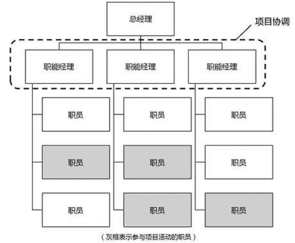
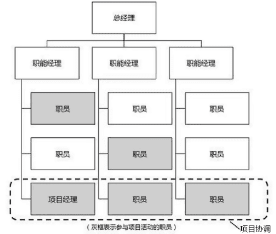
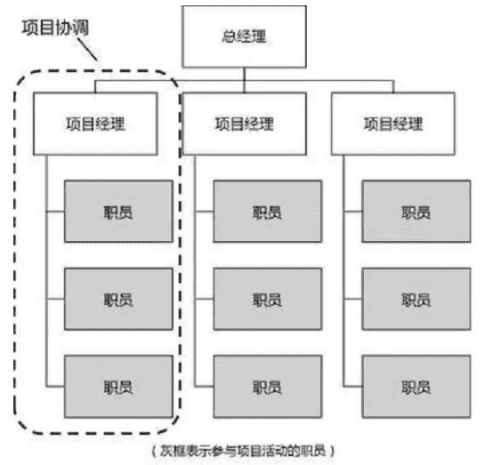

# 项目团队

项目团队由临时为承担特定角色和职责的个人组成，他们为实现项目目标而共同努力。团队成员包括：

- 被指派为项目可交付成果和项目目标而工作的全职或兼职的人员。他们需要了解、规划、完成项目的工作。可能来自多个部门或组织。
- 有时，也会把项目利益相关者包括到项目团队中，如项目业主、项目发起人、客户等等。

项目团队的特征有：

- 有特定目的，要完成项目目标。
- 临时的，随项目启动而组建，项目结束即可解散。
- 内部紧密合作，与外部强调沟通。
- 成员是变化的，成员随项目阶段而定。
- 项目经理领导项目团队。
- 需要进行团队建设，而提高团队效率。

## 项目团队的发展阶段

项目团队从组建到解散，是一个不断成长和变化的过程，关于团队发展的**塔克曼阶梯**模型：

- 形成阶段：也叫组建或启蒙阶段，成员相互认识了解，但还相对独立。成员开始了解项目的目标，尝试确定自己的定位。在这一阶段，项目经理需要进行团队的指导和构建工作，共同讨论以便取得一致意见。
- 震荡阶段：项目工作已经展开，形成各种观念，激烈竞争、碰撞的局面。成员开始明确本职工作，团队逐步确认了项目管理方法。相互不信任导致效率低下，需要的是教练式领导， 强调团队成员的差异，相互包容。允许暴露问题，共同解决与决策。
- 规范阶段：也叫成熟阶段，规则，价值，行为，方法，工具均已建立，团队趋于规范，开始表现出凝聚力。项目经理可以参与式领导，鼓励成员个性发挥，做好支持与帮助，重点培育团队文化。
- 成熟阶段：团队的结构完全功能化，有序工作，互相依靠。可以授予团队成员更大的权力，发挥各自的潜力，重点放在掌握成本进度范围的完成情况，跟踪项目计划，组织培训和整理工作绩效，给予激励。
- 解散阶段：释放资源。

塔克曼阶梯理论多数还是应对小型团队，实际团队的发展轨迹可能并非线性的，仅具指导意义，需要根据项目、成员特征主观判断。

## 组织结构

组织结构的类型包括职能型、项目型以及位于两者之间的各种矩阵型结构。

无论选择什么样的项目组织结构，首先要考虑到能平衡项目与原职能组织需要，使权威性、资源分配及项目成果能与主流运营业务融合。一定要选择与组织文化相融合的组织结构。

- 职能型组织

职能型组织结构是一种常规的线型组织结构，也称垂直团队或命令团队。项目是以部门为主体来承担项目的，一个项目可能被多个部门承担，有部门经理也有项目经理，所以项目成员有两个负责人。

对于特定聚能领域中的项目比较容易达成。难以适应灵活多变的项目。

- 矩阵型组织

矩阵型组织在组织结构上，它是把职能划分的部门和按产品（项目）划分的小组结合起来组成一个矩阵，一名管理人员同时处理原职能部门和项目小组的工作。项目小组是临时性组织，完成任务以后成员回原部门。

矩阵型组织可分为弱矩阵、平衡矩阵和强矩阵。区别是项目经理的组织归属不同，强矩阵有专门的项目经理及其组织，对项目控制力强；弱矩阵项目成员都是调派来的；平衡矩阵有全职项目经理，但未授予全权。

- 项目型组织

项目型组织结构是将项目从公司组织中分离出来，作为独立的单元来处理，有其自己的技术人员和管理人员。团队成员通常集中办公，组织的大部分资源都用于项目工作，项目经理拥有很大的自主性和职权。

## 建设团队

团队协作是项目成功的关键因素，而建设高效的项目团队是项目经理的主要职责之一。项目经理激励团队的有效行为有：

- 使用开放与有效的沟通。

- 创造团队建设机遇。

- 建立团队成员间的信任。

- 以建设性方式管理冲突。

- 鼓励合作型的问题解决方法。

- 鼓励合作型的决策方法。

增加团队的效率的有效手段有：

- 集中办公，就可以找团队会议室，或者张贴进度计划，增加沟通和集体感。
- 虚拟团队或者在线团队，可以拉近团队成员与供应商、客户或其他重要相关方。使用WIKI、视频或音频会议、Email等增强沟通。

- 还有能用在人际关系和团队关系的技能有，建设性的冲突管理、影响力、激励、谈判，团建。
- 对成员的优良行为给予认可与奖励，实施奖励计划。
- 实施培训，提高项目团队成员能力，应当资源管理计划中的预定安排。
- 个人和团队评估，用多项工具洞察成员的优势和劣势，增进团队成员间的理解、信任、承诺和沟通。

## 团队管理

项目团队成员需要明确对可接受行为的期望，这就需要建立团队章程。尽早让团队成员讨论，并认可和遵守明确的规则，如行为规范、沟通、决策、会议礼仪等领域，了解彼此重要的价值观，有助于减少误解，提高生产力。

**团队章程**内容可能包括：

- 团队价值观。

- 沟通指南。

- 决策标准和过程。

- 冲突处理过程。

- 会议指南。

- 团队共识。

项目经理还需要确保全体团队成员都清楚地理解其角色和职责，可以记录和阐明团队成员的**角色与职责**，其方式有：

- 有层级的组织结构图，自上而下地显示各种职位及其相互关系，如工作分解结构 (WBS)，有助于明确高层级的职责；组织分解机构（OBS），有助于明确各自的工作职责；资源分配结构（RBS），与WBS结合，展示实物资源的层级列表。

- 职责分配矩阵(RAM)，可定义项目团队、小组或部门负责 WBS 中的哪部分工作；或者内部为具体活动分配角色、职责和职权。可以通过RACI（执行、负责、咨询和知情）的方式来分配每个人的工作职能。
- 文本型详细描述团队成员的职责。

项目经理应用在人际关系和团队的**管理技能**可以包括：

- 冲突管理：冲突不可避免，团队基本规则、团队规范和成熟的项目管理实践减少冲突；适当的冲突可改进工作关系、提升创造力和改进决策。对于解决冲突手段有：撤退/回避（双输）；缓和/包容（双输，强调一致性）；妥协/调解（双输，双方满意）；强迫/命令（输赢）；合作/解决（双赢）
- 制定决策：谈判能力以及影响组织和团队的能力。
- 情商：了解、评价和管理自我情绪、他人情绪及团队情绪的能力，通过对团队成员情绪的管理，减轻压力、加强合作。
- 影响力：影响相关方达成一致，利用说服与倾听，收集相关信息解决问题。
- 领导力：是领导团队、激励团队做好本职工作的能力。
- 权力：组织政策、专业知识、声誉名望个人特质等参考权。
