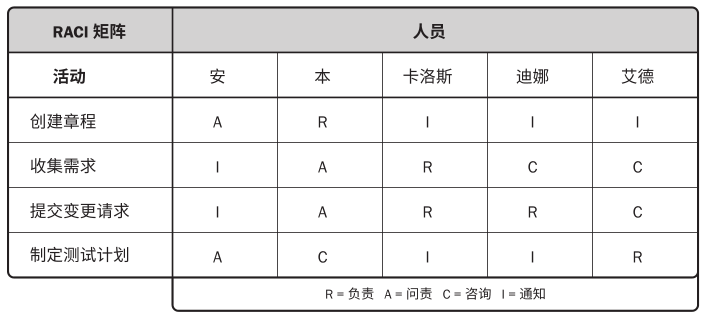
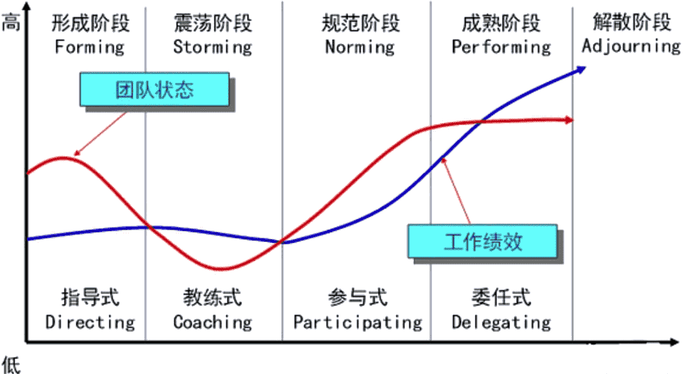

# 项目团队

团队章程包括：

- 团队价值观。

- 沟通指南。

- 决策标准和过程。

- 冲突处理过程。

- 会议指南。

- 团队共识。

记录和阐明团队成员的角色与职责的方式有：

- 有层级的组织结构图，自上而下地显示各种职位及其相互关系，如工作分解结构 (WBS)，有助于明确高层级的职责；组织分解机构（OBS），有助于明确各自的工作职责；资源分配结构（RBS），与WBS结合，展示实物资源的层级列表。

- 职责分配矩阵(RAM)，可定义项目团队、小组或部门负责 WBS 中的哪部分工作；或者内部为具体活动分配角色、职责和职权。可以通过RACI（执行、负责、咨询和知情）的方式来分配每个人的工作职能。
- 文本型详细描述团队成员的职责。

**建设团队过程**是提高工作能力，促进团队成员互动，改善团队整体氛围，以提高项目绩效。

关于团队发展的**塔克曼阶梯**模型：

- 形成阶段：成员认识相对独立（相互认识）。
- 震荡阶段：本职工作和项目管理方法确认（不信任导致效率低下）。
- 规范阶段：协同工作，互相学习（调整习惯，互相信任）。
- 成熟阶段：有序工作，互相依靠（组织有序，相互依靠，平稳高效）。
- 解散阶段：释放资源。

团队协作是项目成功的关键因素，而建设高效的项目团队是项目经理的主要职责之一。项目经理应当能够定义、建立、维护、激励、领导和鼓舞项目团队。

项目经理激励团队的有效行为有：

- 使用开放与有效的沟通。

- 创造团队建设机遇。

- 建立团队成员间的信任。

- 以建设性方式管理冲突。

- 鼓励合作型的问题解决方法。

- 鼓励合作型的决策方法。

增加团队的效率的有效手段有：

- 集中办公，就可以找团队会议室，或者张贴进度计划，增加沟通和集体感。
- 虚拟团队或者在线团队，可以拉近团队成员与供应商、客户或其他重要相关方。使用WIKI、视频或音频会议、Email等增强沟通。

- 还有能用在人际关系和团队关系的技能有，建设性的冲突管理、影响力、激励、谈判，团建。
- 对成员的优良行为给予认可与奖励，实施奖励计划。
- 实施培训，提高项目团队成员能力，应当资源管理计划中的预定安排。
- 个人和团队评估，用多项工具洞察成员的优势和劣势，增进团队成员间的理解、信任、承诺和沟通。

除了团队效率提升，还需要输出团队绩效评价，正式/非正式评价都可以，指标有：技能的改进、胜任力改进、团队成员离职率的降低、团队凝聚力的加强。

管理项目团队需要借助多方面的管理和领导力技能，来促进团队协作，整合团队成员的工作。运用的技能包括沟通、冲突管理、谈判和领导技能。需要项目经理针对团队成员的意愿和能力，调整管理和领导力方式。

管理人际关系和团队的技能：

- 冲突管理：冲突不可避免，团队基本规则、团队规范和成熟的项目管理实践减少冲突；适当的冲突可改进工作关系、提升创造力和改进决策。对于解决冲突手段有：撤退/回避（双输）；缓和/包容（双输，强调一致性）；妥协/调解（双输，双方满意）；强迫/命令（输赢）；合作/解决（双赢）

- 制定决策：谈判能力以及影响组织和团队的能力。
- 情商：了解、评价和管理自我情绪、他人情绪及团队情绪的能力，通过对团队成员情绪的管理，减轻压力、加强合作。
- 影响力：影响相关方达成一致，利用说服与倾听，收集相关信息解决问题。
- 领导力：是领导团队、激励团队做好本职工作的能力。
- 权力：组织政策、专业知识、声誉名望个人特质等参考权。

