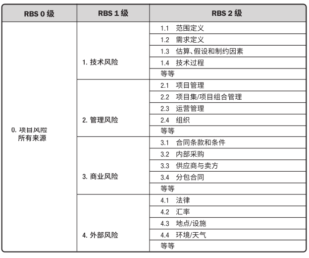

# 项目风险管理

项目风险管理主要目标是削弱负面风险，增强正面风险，将风险敞口保持在可接受的范围，扩大项目实现的概率。

项目风险管理旨在识别和管理未被其他项目管理过程所管理的风险。包括规划风险管理、识别风险、开展风险分析、规划风险应对、实施风险应对和监督风险的各个过程。

- 风险：是一种不确定性的事件或条件，一旦发生，会至少对一个项目目标造成影响，如范围、进度、成本、或者质量。能带来风险一般包括需求、假设、制约因素或状况等发生变化。
- 风险敞口：也叫风险暴露，指未加保护的风险，是指对于风险未采取任何防范措施而可能导致出现损失的部分。

项目都在两个层面上存在风险：

- 单个风险：只对一个或多个项目目标产生正面或负面的影响。
- 整体风险：不确定性对项目整体产生影响。源于单个风险。

风险会产生正面或负面的影响：

- 正面影响：机会，需要利用或强化。
- 负面影响：威胁，需要规避或减轻。

团队需要清楚的知道可接受的风险敞口有多大，由可测量的风险临界值来定义。

- 风险临界值，能够承受的风险的严重性的最高限度。反映了组织与项目相关方的风险偏好程度，是项目目标的可接受的变异程度。应当明确并被团队知晓。

风险类别：

- 事件类，不确定性未来事件的风险，可能发生或不发生。
- 非事件类，包括变异性风险（已经规划但不确定性导致）、模糊性风险（未知且不确定性导致）。前者可用蒙特卡洛模拟分析概率分布，采取行动缩小风险；后者可填补认知与理解不足，可获取专家意见，或者增量开发。

为应对突发性风险，增强项目韧性，要求项目提高应对意识：

- 预留合理的应急预算和时间。
- 灵活的项目过程，强有力的变更管理。
- 留意早期预警信号，尽早识别处理。
- 明确征求相关方意见。

## 规划风险管理

**规划风险管理过程**是定义如何实施项目风险管理活动。确保风险管理的水平、方法和可见度与项目风险程度，以及项目对组织和其他相关方的重要程度相匹配。

**风险管理计划**描述如何安排与实施风险管理活动，包括的内容有：

- 风险管理战略，也就是管理的一般方法。
- 方法论，风险管理的具体方法、工具和数据源。
- 角色与职责，确定各项风险管理活动的人和职责。
- 资金与对应使用方案。
- 时间安排，包括频率。
- 风险类别，分类方式，一般有：风险分解结构（RBS），类别清单。
- 相关方风险偏好，描述为可测量的风险临界值。
- 风险概率和影响定义，结合相关方风险偏好和临界值制定风险概率。
- 概率和影响矩阵，可用高、高、中、低和很低或数值（概率X影响）来表达。
- 报告格式、跟踪过程。

## 识别风险
**识别风险过程**是识别单个项目风险以及整体项目风险的来源，并记录风险特征。主要内容是记录和汇集现有的单个项目风险，以及整体项目风险的来源。将在整个项目周期中迭代进行。

**确定参与人：**

鼓励所有的项目相关方参与到风险的识别工作，如项目经理、项目团队成员、客户、最终用户、运营经理。一方面确保责任感，另外一方面用统一格式确保被清楚、明确的理解，然后有效应对风险。

需要为单个项目风险指定风险责任人，可以在识别的过程中，也可以在定性分析过程中确认。

**收集风险核对单：**

项目团队可以组织头脑风暴或访谈，来获取单个或整体的项目风险清单。也可以编制核对单来列出过去曾出现且也可能在当前项目出现的风险，也可以直接采用某些行业通用的风险核对单。

核对单组成了风险分解结构（RBS）最底层数据。

**分析与识别风险：**

- 根本原因分析，从问题陈述中找到威胁，从收益陈述中找到机会。

- 假设条件和制约因素分析，确定哪些会引发风险，并从假设条件本身不完备性识别威胁。

- 优势、劣势、机会和威胁 (SWOT) 分析。
- 分析所有项目文件，找到各文件中不一致的地方，或不确定性或模糊性的地方，都可能是风险。
- 用提醒清单做框架，可以协助形成想法，识别单个项目风险，可以是由风险分解结构底层的风险类别组成。另外有些战略框架可以识别整体项目风险。

- 召开风险研讨会。

**输出风险登记册：**

风险登记册记录发已识别单个项目风险的详细信息，后面的过程也会作登记。内容包括：

- 已识别风险的清单，有标识号，详细描述，风险原因及风险影响。
- 潜在风险责任人。

- 潜在风险应对措施清单，如果同时识别出对应措施，随时记录下来。

- 以及其他数据：简短的风险名称、风险类别、当前风险状态、一项或多项原因、一项或多项对目标的影响、风险触发条件（显示风险即将发生的事件或条件）、受影响的  WBS组件，以及时间信息（风险何时识别、可能何时发生、何时可能不再相关，以及采取行动的最后期限）。

**风险报告**，在风险管理过程中渐进编制。提供关于整体项目风险的信息，以及关于已识别的单个项目风险的概述信息。

## 实施定性风险分析
**实施定性风险分析过程**是通过评估单个项目风险发生的概率和影响以及其他特征，对风险进行优先级排序，从而为后续分析或行动提供基础。

评估优先级主要通过风险发生概率、对目标的影响以及其他因素。评估过程具有主观性，需要纠正偏见。

**评估的结果**更新到风险登记册，包括概率、影响、优先级别、风险分值、风险责任人、紧迫性、风险类别等，还包括低风险的观察清单。同时也需要更新风险报告，给出简要的结论。

评估内容：

- 风险数据质量，确认风险数据的准确性和可靠性，可召开会议主或访谈进行确认。
- 风险概率和影响，发生可能性和潜在影响（威胁或机会）。
- 紧迫性、邻近性、潜伏期、可管理性、可控性、可监测性、连通性、战略影响力、密切度等。

风险的分类可依据风险分解结构（RBS），和工作分解结构（WBS），以及其他类别（如阶段、预算、角色和职责）。有助于集中注意力和精力。

参与到评估的技术手段有：

- 概率和影响矩阵，把每个风险发生的概率和一旦发生对项目目标的影响映射起来，形成矩阵表格。
- 层级图，多参数进行分类时可使用多维数据，如气泡图，X轴代表可监测性，Y轴代表邻近性，气泡大小表示影响值。

## 实施定量风险分析
**实施定量风险分析过程**是就已识别的单个项目风险和不确定性的其他来源对整体项目目标的影响进行定量分析。作用是量化整体项目风险敞口，并提供额外的定量风险信息，以支持风险应对规划。

定量分析需要额外的时间和成本投入，以及专业知识。并非必需过程，如有高质量风险数据，和各项目基准，则不需要。在大型复杂项目中，还是有必要进行定量分析，评估风险和不确定性的综合影响。

分析结果更新到风险报告中去，包括风险敞口评估、概率分析结果、优先级、趋势、应对建议。

分析手段和方法：

- 模拟，通常采用蒙特卡洛分析，分析成本风险、进度风险，或者两者结合。模拟的结果会得到在结果区间上的风险S曲线，表示了各种可能性。
- 敏感性分析，确定哪些是最大潜在影响，结果通常用龙卷风图表示。
- 决策树分析（EMV），分析备选方案中的最佳选择。

## 规划风险应对
规划风险应对是为处理整体项目风险敞口，以及应对单个项目风险，而制定可选方案、选择应对策略并商定应对行动，并为活动分配资源，记录到项目文件及项目管理计划中。

一旦完成对风险的识别、分析和排序，指定的风险责任人就应该编制计划，以应对足够重要的每项风险。

对应方案的结果需要登记到风险登记册。包括应对策略、行动，发生的信号、应急计划、弹回计划、残余及次生风险等。同时也更新风险报告，记录对应措施。

风险应对方案应当具备：

- 经济有效。
- 当前项目可实现。
- 有备选方案，并有最优方案。
- 相关方全体同意。
- 有责任人。
- 可能还需要制定应急计划。

五种应对威胁的备选策略：

- 上报：威胁超出权利范围或不在项目范围内，上报给上级组织，并由上级负责人负责。
- 规避：适用高概率、严重性高的高优先级威胁，采取措施包含消除威胁原因、延长进度计划、改变项目策略、缩小范围等。
- 转移：转嫁给第三方，支付费用由第三方管理风险并承担发生的影响。
- 减轻：通过不同的选择降低威胁的概率和影响。
- 接受，不处理。

五种应对机会的备选策略：

- 上报。
- 开拓：把握高优先级机会，分配资源短时间完成确保机会，提高概率至100%。
- 分享：转嫁给第三方。
- 提高：提高出现概率，最明显的增加资源。
- 接受，不处理。

## 实施风险应对
**实施风险应对过程**是执行商定的风险应对计划。确保按计划执行商定的风险应对措施，来管理整体项目风险敞口、最小化单个项目威胁，以及最大化单个项目机会。

主要行动人是风险责任人，需要他主动管理，必要时发起变更请求，最后将措施记录到风险登记册和更新风险报告。

## 监督风险
**监督风险过程**是在整个项目期间，监督商定的风险应对计划的实施、跟踪已识别风险、识别和分析新风险，以及评估风险管理有效性。

其中重要的分析工作有：

- 技术绩效（kpi）：客观、量化的测量指标。
- 储备分析（消耗）：剩余储备是否合理，以燃尽图表示。

实施完应对措施后。重要的事就是审计。

- 风险审计是一种审计类型，可用于评估风险管理过程的有效性。项目经理负责确保按项目风险管理计划所规定的频率开展风险审计。也可在专门的风险审计会进行。

