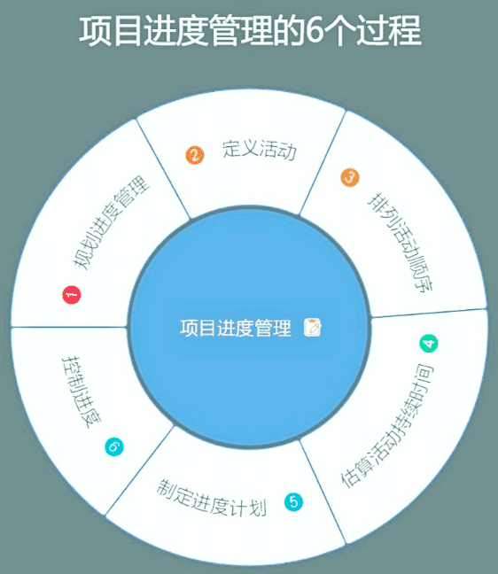

# 项目进度管理

项目进度管理主要目标保证按时完成项目、合理分配资源、发挥最佳工作效率。管理团队选择进度计划方法，创建项目进度模型，重要的成果就是项目进度计划。

项目的“三约束条件”：范围、时间、成本。时间关注项目需要多长时间完成，进度应该怎样安排，受范围变化影响，时间变化也对成本产生影响。需要跟踪项目的进展情况，进行分析，提供给项目干系人一个准确的报告。

关键产物：项目进度计划。

## 主要工作

主要工作包括，规划阶段中：定义项目活动、任务，活动排序，每项活动的合理工期估算，制定项目完整的进度计划；以及在监控阶段的控制项目进度等内容。

## 规划进度管理

**规划进度管理过程**，制定政策、程序和文档，目标是规划、编制、管理、执行和控制项目进度，为如何在整个项目期间管理项目进度提供指南和方向。

这个过程基于范围管理计划，制定出**进度管理计划**，可以非正式和概括的，也可以正式的，详细的。

**进度管理计划**是项目管理计划的组成部分，为编制、监督和控制项目进度建立准则和明确活动。具体规定了：

- 项目进度模型，规定用于制定项目进度模型的进度规划方法论和工具，以及如何维护。敏捷型的，还是按需型的。
- 进度计划的发布与迭代长度，敏捷型项目应指定固定发布时间、阶段、迭代时长。
- 准确度，定义工时估算的可接受区间。
- 计量单位，工时的单位或其他资源的单位。
- 其他：绩效测量规则及报告。

## 定义活动

**定义活动过程**，识别和记录过程中采取的具体行动，主要是将工作包分解为进度活动，确认进度基准和成本基准，包括变更，将在整个项目期间开展。

根据进度管理计划与范围基准（WBS、WBS 词典），把项目范围和项目可交付成果逐步划分为更小、更便于管理的**活动**，最后形成**活动清单**。同时找出**里程碑清单**，列出了所有项目里程碑。

- **活动**表示完成工作包所需的投入。用活动属性来扩充对活动的描述，如：唯一活动标识 (ID)、WBS 标识和活动标签或名称。还可能包括活动描述、紧前活动、紧后活动、逻辑关系、提前量和滞后量、资源需求、强制日期、制约因素和假设条件。
- **里程碑**是项目中的重要时间节点或事件。

在适应性的项目生命周期模式下，可以滚动式规划工作包，先在较高层级上粗略规划远期工作，再聚集在详细规划近期要完成的工作，渐进明细。

## 排列活动顺序

**排列活动顺序过程**，识别和记录项目活动之间的关系，定义工作之间的逻辑顺序。目标是在既定制约条件下达到最高的效率，将在整个项目期间开展。

根据范围基准、活动清单，里程碑清单，确认优先级和关联顺序，将活动清单转化为图表，即**项目进度网络图**。这也是进度基准的基础。

- **项目进度网络图**是表示项目进度活动之间的逻辑关系（也叫依赖关系）的图形。可以列举全部，也可只列出一项或多项概括性活动，加上简要文字描述。

常见的排列方法叫紧前关系绘图法（PDM），用节点表示活动，用一种或多种逻辑关系连接活动，以显示活动的实施顺序。

- 逻辑关系有：开始到开始SS（滞后量）、开始到结束SF、结束到开始FS（提前量）、结束到结束FF。
- 依赖关系有：强制性依赖：客观因素（法律或合同）；选择性依赖：最佳实践（逻辑、优先级等）；外部依赖：项目和非项目之间的（不可控）；内部依赖：项目活动之间（可控）。

## 估算活动持续时间

**估算活动持续时间过程**，也就是评估工时，根据资源估算的结果，估算完成单项活动所需工作时段数。确定完成每个活动所需花费的时间量，也将在整个项目期间开展。

活动持续时间估算将记录在活动属性中。

依据的信息有工作范围、所需资源类型与技能水平、估算的资源数量和
资源日历等。影响估算的有对持续时间受到的约束、相关人力投入、资源类型。

估算的方法有如下，一般都多种方法混合，提高准确性，还需要整体加入一定比例的时间应对风险和应急。

- 类比估算，与相似的历史数据进行对比，适合项目早期使用，成本低、耗时短、偏差高，是自上而下估算。
- 参数估算，基于历史数据，将其中完成的数量按单位参数化，加上当前项目参数，建构一个算法来估算。
- 三点估算，最有可能时间+最乐观时间+最悲观时间，取加权平均。
- 自下而上估算，从下到上逐层汇总 WBS 组成部分的估算。
- 进度储备，为应对未知工作量与已识别风险，加入一段活动持续时间估算值的某一百分比或某一固定的时间段。

估算还可能需要考虑其他影响，如：

- 收益递减率：收益会持续降低。
- 资源数量：时间、人力、机器等；并非两倍的资源可节省一半的时间。
- 技术进步：时间和资源的改变。
- 员工激励：拖延症（学生综合症）、帕金森定律（存在时间则功能蔓延）。

## 制定进度计划

**制定进度计划过程**，分析活动顺序、持续时间、资源需求和进度制约因素，创建进度模型，从而落实项目执行和监控，将在整个项目期间开展，反复进行。同时也需要随时修正时间估算、资源估算和进度储备。

进度计划最终批准后作为进度基准。进度基准的重要信息是：基准开始日期和基准结束日期。

项目进度计划是进度模型的输出，为各个相互关联的活动标注了计划日期、持续时间、里程碑和所需资源等信息。

同时在一个进度模型中，可能需要项目日历来编制项目进度计划。在项目日历中规定可以开展进度活动的可用工作日和工作班次。

制定进度计划的方法有：

- 进度网络分析，综合应用多项技术反复进行，创建可行的进度模型。如关键路径法、资源优化、建模技术等等。

- **关键路径法**，用在按需要进度计划类型中，在资源可用的情况下完成下一步事项。为每个最小任务单位计算工期、定义开始和结束日期、按照活动的关系形成顺序的网络逻辑图，找出必须的最长的路径。用于估算项目最短工期。不考虑任何资源限制，不考虑浮动时间。
- 资源优化，根据资源供需情况，调整活动的开始和完成日期。调整时需要注意资源平衡和资源平滑。

进度计划的调整方法：

- 提前量和滞后量，通过调整（提前或延后）紧后活动的开始时间来编制一份切实可行的进度计划。
- 进度压缩，不缩减项目范围的前提下，缩短或加快进度工期。一般情况可以增加资源来赶工，或者部分活动并行开展以快速跟进。

用于呈现进度计划的工具有：

- 横道图，也称为“甘特图”，纵向列示活动，横向列示日期，用横条表示活动自开始日期至完成日期的持续时间。
- 里程碑图，类似甘特图，标示出主要可交付成果和关键外部接口的计划开始或完成日期。
- 项目进度网络图，只有活动节点，没有时间刻度，显示活动及其相互关系。有时也称为“纯逻辑图”，如果包含时间刻度，也称为“逻辑横道图”。

在敏捷型的项目中，还需要做敏捷发布规划，就是高度概括的发布进度时间轴。主要是确定了发布的迭代或冲刺次数，团队能够决定需要开发的内容、所需时间。

## 控制进度

**控制进度过程**，监督项目状态，以更新项目进度和管理进度基准变更，需要在整个项目期间维护进度基准。同时产出工作绩效报告。

控制进度作为实施整体变更控制过程的一部分。进度基准的任何变更都必须经过实施整体变更控制过程的审批。
