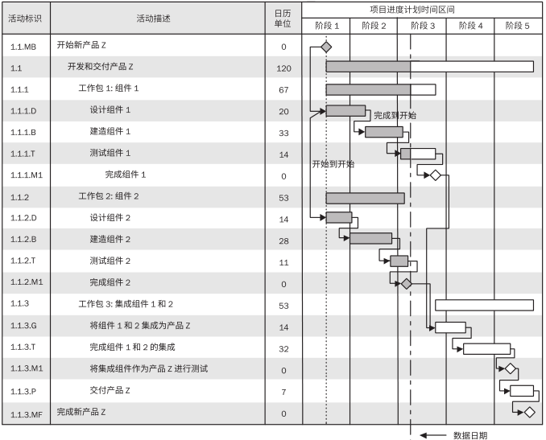

# 甘特图

甘特图，也称为横道图或条状图(Bar chart)、生产计划进度图。是在一战期间1917年由亨利·甘特开发的，以作业排序为目的，将活动与时间联系起来的最早尝试的工具之一，是当时管理思想的一次革命。

## 内在思想

- 通过代表任务的横条在时间坐标上的位置和跨度，来直观地反映任务的相关时间信息（开始时间、工期、结束时间）。

- 通过横条的不同图像特征（实心条、空心条等），来反映任务的不同状态，直观地表明任务计划在什么时候进行，及实际进展与计划要求的对比。

- 通过用带箭头的线来反映任务间的逻辑关系。

## 汇集信息

甘特图包含了活动、进度、持续时间，以及日历等几个重要信息。

- 项目的开始日期。
- 项目任务是什么。
- 谁在完成每个任务。
- 任务何时开始和完成。
- 每个任务需要多长时间。
- 任务如何组合在一起，相互重叠和链接。
- 项目的完成日期。

## 常规制作步骤

- 明确项目牵涉到的各项活动、项目。
- 创建甘特图草图，先标上开始时间，工期。
- 确定项目活动依赖关系及时序进度。
- 确定任务的工时。
- 确定任务对象的资源，并按资源情况调整工时。
- 汇总整个项目时间。

## 可能的用途

甘特图部分地反映了项目管理的三重约束（时间、成本和范围），但是主要关注进程管理（时间）。

- 计划和安排项目。
- 计划和安排任务。
- 跨多个项目计划和安排任务。
- 查看一段时间内的任务。
- 管理在冲刺中计划。
- 团队合作。
- 安排团队的工作。
- 确定项目的计划时间表与实际时间表。

