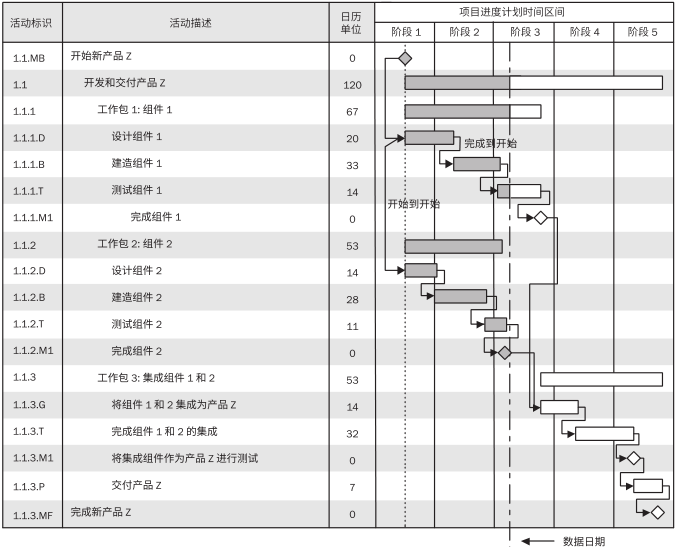

# 项目进度计划

项目进度计划是对项目所有活动的顺序和工期进行安排、协调，并确定项目的总工期。最终的进度计划通常要放在日历表上。

项目进度管理的首要任务是制定项目的进度计划，其最重要的目的在于：

- 如何以及何时交付项目范围中定义的产品、服务和成果。
- 协调资源的调配。
- 调整任务优先级。
- 严格的时间约束。
- 用于沟通和管理相关方期望的工具。
- 为绩效报告提供了依据。
- 作为进度基准。

##  关键步骤

制定可行的项目进度计划关键步骤有：

1. 定义项目里程碑、识别活动并排列活动顺序，以及估算持续时间。
2. 由分配至各个活动的项目人员审查其被分配的活动。
3. 项目人员确认计划日期的有效性，资源时间上无冲突，任务之间无冲突。
4. 分析进度计划，进行资源平衡，确认其作为基准。

## 所包含的产出

制定可行的项目进度计划主要依据是范围基准（WBS、WBS 词典）、资源相关（资源需求、资源日历、资源分解结构、派工单）。

按关键步骤依次产出的成果有：

- **活动清单**，包含了活动及活动属性。活动表示完成工作包所需的投入。活动属性中除了活动的信息描述，还包含估算持续时间。
- **里程碑清单**，包含了项目中的重要时间节点或事件。
- **项目进度网络图**，活动清单排序的结果，是表示项目进度活动之间的逻辑关系（也叫依赖关系）的图形。
- **项目进度计划**，也是进度模型的输出，之前的产出都是为此计划服务的。一般用甘特图、里程碑图、项目进度网络图等呈现。
- **项目日历**，规定可以开展进度活动的可用工作日和工作班次。

创建项目进度计划过程中，可能会对范围基准和/或项目管理计划的其他组
成部分提出变更请求，应该通过实施整体变更控制过程对变更请求进行审查和处理。

项目进度计划的时间参数有：

- 工期，完成活动所需时间。
- 最早开始时间和最早结束时间（ES、EF），EF=ES+工期估计。

- 最迟结束时间和最迟开始时间（LF、LS），LS= LF-工期估计。
- 时差（FS），活动最迟与最早开始时间之间活动的时间。
- 计划、基线和计划安排时间，最初计划日期就是基线日期。

## 进度技术

进度计划技术能够帮助我们达到以上目标，最常用的进度技术列举如下：

- 甘特图，甘特图是随时间计划的任务的可视视图。纵向列示活动，横向列示日期，用横条表示活动自开始日期至完成日期的持续时间。
- 里程碑图，表明为了达到特定的里程碑，去完成一系列活动。类似甘特图，但无持续时间，标示出主要可交付成果和关键外部接口的计划开始或完成日期。一般分为管理级和活动级。
- 网络计划技术，由关键路径法（CPM）和计划评审技术（PERT）组成，内容包括将目标形成的网络图、计算出的时间参数、确定的关键路线，以及网络优化。
- 前导图法。

进度计划的调整方法：

- 提前量和滞后量，通过调整（提前或延后）紧后活动的开始时间来编制一份切实可行的进度计划。
- 进度压缩，不缩减项目范围的前提下，缩短或加快进度工期。一般情况可以增加资源来赶工，或者部分活动并行开展以快速跟进。
- 资源优化，用于调整活动的开始和完成日期，保证项目使用的资源小于等于可用资源。一般考虑资源平衡：为活动合理分配资源；资源平滑：调整部分活动的资源浮动。

## 估算工期

工期或者叫活动持续时间，是活动时间量（人天或点数）。估算工期就是确定完成每个活动所需花费的时间量，记录在活动属性中，作为创建进度计划重要的数据之一。

估算的准确性依赖于输入数据的数量和质量，因此是渐进明细的。

估算方法：

- 类比估算，与相似的历史数据进行对比，适合项目早期使用，成本低、耗时短、偏差高，是自上而下估算。
- 参数估算，基于历史数据，将其中完成的数量按单位参数化，加上当前项目参数，建构一个算法来估算。
- 三点估算，最有可能时间+最乐观时间+最悲观时间，取加权平均。
- 自下而上估算，从下到上逐层汇总 WBS 组成部分的估算。
- 进度储备，为应对未知工作量与已识别风险，加入一段活动持续时间估算值的某一百分比或某一固定的时间段。

## 注：受敏捷思想的影响

对于敏捷类型的项目，进度计划有不同的内容与创建方式：

- 按需进度计划，在资源可用时立即从未完项和工作序列中提取出来开展。常用在项目进入运营后或持续改进时，以增量研发新功能。通常用于看板体系，基于制约理论和来自精益生产的拉动式进度计划概念。
- 敏捷方法，用在迭代型进度计划类型中，接受存在未完成项，滚动式规划管理。将需求记录在用户故事中，每个迭代前按优先级排序并优化用户故事，最后在规定的时间盒内开发产品功能。允许在整个开发生命周期期间进行变更。

