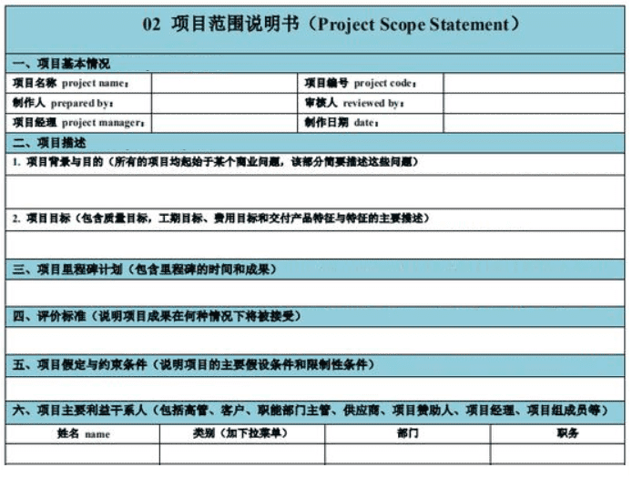

# 项目范围管理

项目范围管理，对项目包括什么与不包括什么的定义与控制过程。这个过程用于确保项目组和项目干系人对项目结果和过程有一个共同的理解。其包含的所有过程都是确保项目做且只做所需的全部工作，以成功完成项目。

项目的“三约束条件”：范围、时间、成本。其中范围的定义一定要明确、可量化、可验证，完善的项目范围管理是整个项目最终成败的关键。

## 管理的内容

主要管理内容有，规划阶段的规划范围、收集需求、定义范围、创建WBS，和监控阶段的确认范围和控制范围。

不同的项目周期管理方法有所不同：

- 适应型或敏捷型生命周期：相关方持续参与，应对大量变更，实时变更，重复执行收集需求、定义范围和创建WBS，通过多次迭代来开发可交付成果。
- 预测型生命周期：经过批准的项目范围说明书、工作分解结构（WBS）和相应的 WBS 词典构成项目范围基准，通过整体变更控制过程进行变更操作。

## 规划范围管理

**规划范围管理过程**，为了给管理范围提供指南和方向，创建范围管理计划和需求管理计划，主要是指导定义、制定、监督、控制和确认项目范围，以及规定如何分析、记录和管理项目和产品需求。

可以通过项目管理计划确认生命周期（涉及阶段）及开发类型（瀑布、敏捷、迭代等）。

- 范围管理计划包括：规定制定项目范围说明书，规定创建WBS，规定基准及其维护，规定验收成果。

- 需求管理计划包括：规定如何开展需求活动、配置活动，规定如何确定需求优先级、如何定测量指标、如何跟踪。

## 收集需求

**收集需求过程**，为定义产品范围和项目范围，而进行的确定、记录并管理相关方的需求的活动，最后产生需求文件与需求跟踪矩阵。本过程的主要作用是为定义和管理项目范围（包括产品范围）奠定基础。

- 需求文件，描述各种单一需求将如何满足与项目相关的业务需求。可简要的按提出方与优先级列出，也可详细的带上内容提要、细节及附件等信息。
- 需求跟踪矩阵，是整个生命周期中跟踪需求的一种方法，表格记录产品需求的来源信息，过程交付物，对应的最终可交付成果。

**需求**，根据特定协议或者其他强制性规范，产品、服务或成果必须具备的条件或能力，包括发起人、客户和其他干系人的已量化且书面记录的需要和期望。

需求可以由高层级需求逐步细化出来，只有明确的（可测量和可测试的）、可跟踪的、完整的、相互协调的，且主要相关方愿意认可的需求，才能作为基准。

需求分类有：

- 业务需求，整个组织的高层级需求。
- 相关方需求，干系人或干系人群体的需求。
- 解决方案需求，为满足业务及相关方需求，需要具备的特征、功能，包括功能需求与非功能需求。
- 过渡需求，为未来业务做的临时功能。
- 项目需求，项目中的行动、过程、约束等。
- 质量需求，用于确认可交付成果的任何条件或标准。

收集需求的方法：

除了专家判断需求，头脑风暴、小组会议、一对一访谈等技术外，还可用问卷调查、标杆对照等方式收集各方需求。可用亲和图、思维导图来展示讨论的需求清单。

把主要相关方召集在一起定义产品需求，可以使用引导方式有：

- 联合应用设计或开发，业务主题专家和开发团队集中在一起，以收集需求，同时还可以改进软件开发过程。
- 用户故事，简短文字描述所需的功能，包括角色、目标、动机。

直观的展示需求范围的模型有：

- 系统交互图，显示业务系统之间，或与人之间的交互。

- 产品原型，先用该产品的模型，征求对需求的早期反馈，可渐进式的明确，从模型创建、用户体验、反馈收集到原型修改的反复循环。

## 定义范围

**定义范围过程**，是制定项目和产品详细描述的过程。从前一过程收集到的需求文件中选取的项目需求，然后用**项目范围说明书**来描述产品、服务或成果的边界和验收标准。

- **项目范围说明书**，对项目范围、主要可交付成果、假设条件和制约因素的描述。记录了整个项目、产品的范围，可交付成果，验收标准，除外责任，以及各方范围共识。

定义范围需要随着认识的分析的深入而多次反复开展，迭代型项目先定高层级的愿景，再定每个迭代期详细范围。

- **产品分析**，定义产品和服务，将高层次的产品或服务描述成有意义的可交付成果。它用到的技术有：产品分解、需求分析、系统分析、系统工程、价值分析、价值工程。

组织外项目中，与项目范围说明书一样具有范围说明的还有**SOW**（工作说明书）。

- **SOW，工作说明书**，是对项目提供可交付成果的说明。一份概要，在很高层次上说明项目用途、范围和途径。是客户与供应商间的高层共识。SOW是项目的最初输入，由项目外的发起人或客户提供。
- SOW包括的内容有：范围描述、约束说明、责任说明、交付使用说明等。

## 创建WBS

**创建WBS过程**，WBS，工作分解结构，以可交付成果为目标，将要实施的全部工作范围的层级分解。创建的WBS和项目范围说明书经过批准后，形成了**范围基准**。之后的变更就需要走正式的变更流程了。

能作为范围基准的有：

- 范围说明书。
- WBS。
- WBS词典，为每个WBS组件详细描述可交付成果、活动和进度信息。

WBS归纳和定义了项目的整个工作范围，每下降一层代表对项目工作的更详细定义，最终是把项目可交付成果和项目工作分解成较小、更易于管理的组件。

WBS的结构：

一般项目分解三个层次左右，如：项目/子项目->任务/子任务->工作包->工作单元。项目和任务层级由项目经理管理并汇报给管理层或客户，其下子任务及工作包就是工作包层级，为内部控制而设计。

## 确认范围

**确认范围过程**，正式验收已完成的项目可交付成果。可在整个项目期间定期开展，确认每个可交付成果，直到最终产品、服务或成果获得验收。

主要确认人是项目主要干系人，如项目客户和项目发起人，依据的是需求文件或范围基准等各规划过程的文件。同时也要获得的工作绩效数据。

确认范围在控制质量过程之后或者同时进行，主要是验收。控制质量过程主要是可交付成果的正确性及是否满足质量要求。

正式验收的可交付成果需要记录更新需求文件的状态，并且未通过可交付成果，其未通过验收的原因，应该记录在案，并随后进行变更请求，进行补救。

## 控制范围

**控制范围过程**，监督项目和产品的范围状态，管理范围基准变更。在整个项目期间保持对范围基准的维护。

确保所有变更请求、纠正措施或预防措施都通过实施整体变更控制过程进行处理。
