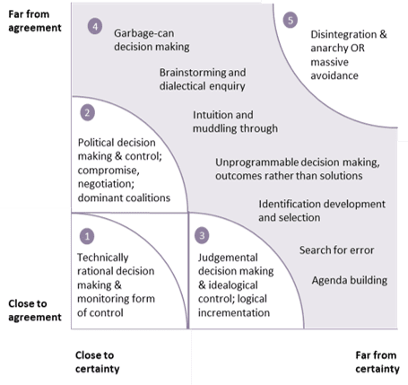

# 项目管理的Stacey模型

英国组织理论家Ralph Douglas Stacey，为了整合主流管理理论与复杂自适应系统，他提出一个图表，说明了决策和控制的适当形式取决于所面临的变化情况的性质，这张图表被称为Stacey Matrix，也就是Stacey矩阵。

Stacey矩阵有几个别名：

- 或称为“认同和确定性矩阵”。
- 或称为“拉尔夫·斯泰西的一致性与确定性矩阵（Ralph Stacey's Agreement and Certainty Matrix）”。
- 或称为“斯泰西的变革复杂性模型”。

Stacey矩阵是一个在复杂的、自适应系统中选择恰当管理行为的方法，该系统是基于所涉及问题的确定性程度和认同级别的。

## 潜在使用场景

认同和确定性矩阵主要还是关注复杂系统中的管理行为的。

- 为特定的问题或决策选择管理或领导方法。
- 制定一组决策或议程。
- 找一个合适的、特定的方法与他人沟通。
- 为创新和创造找一个合适的场景，或主动制造这个场景。

## 认同和确定性维度

纵轴，认同，是关于人的不确定性，立场、兴趣、价值观等。

横轴，确定性，是关于事的不确定性，问题、方案等。

- 接近确定性（Close to Agreement），当因果关系确定，问题与决策也确定。很容易推断和预测。
- 远离确定性（Far from Agreement），因果关系不是很明朗，常常是独特和新颖的情况。经验推断与预测并非有效。
- 认同（Certainty），表示团队或组织内关于问题、决策的认同级别。管理风格或领导职能要根据认同级别发生变化。

## 选择管理行为

该矩阵中不同的区域及对应的管理行为：

1. 接近认同，接近确定性：技术理性决策，收集分析过去数据可预测未来，规划路径并控制监控。

2. 远离认同，接近确定性：需要使用策略和政治手段，成立联盟，管理上需要充分谈判与妥协。

3. 接近认同，远离确定性：共同使命或愿景的强烈意识可以替代计划。朝着商定的未来增量的前进。

4. 混乱的边缘 ：传统的管理方法不是很有效，然而这是一个高度的创造性，创新以及打破过去创造新颖运营模式的区域。可以集思广益，辩证探究，不断的探索错误。
5. 混乱，远离认同，远离确定性：分裂，无序，应当避免。

## 应用在项目上

Stacey矩阵经常被应用到需要管理“不确定性”和“复杂性”问题、项目的场景之中，可用作把项目开发复杂性的分类。

这个Stacey矩阵有两个维度，竖轴是需求（或问题与决策）的不确定性，横轴是技术（或解决方案）不确定性。

- ①简单区：此区域属于需求明确、技术也明确，因此需要提前做计划，**预测型**开发模式成本最优，我们掌控能力最好，外包或代理机构都可以帮忙实现。
- ②技术复杂区：此区域属于需求明确，技术却不确定，也就是说怎么实现不知道，这类项目叫复杂的项目；技术不确定，怎么实现不知道，需要不断尝试，推荐用**迭代型**开发。
- ③需求复杂区：此区域属于技术很确定，需求却不明确，此时我们需要客户明确啥我们就先做啥；**增量型**开发，分成多个阶段交付，减少推倒重来的风险。
- ④混乱区：此区域属于需求不清楚，怎么实现也不清楚，这叫混乱状态的项目（Chaotic）； 这类项目尽量别碰，基本是要失败的。
- ⑤模糊区：此区域属于需求不清楚，怎么实现也不清楚，属于模糊型（Hazy）项目需求和实现方案都不明确，最好用**敏捷型**开发，适应性强，灵活机动，拥抱变化。

