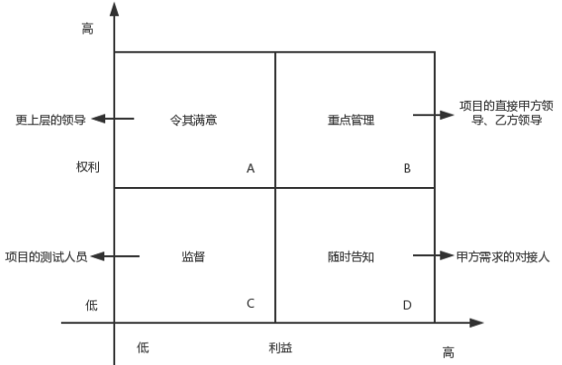
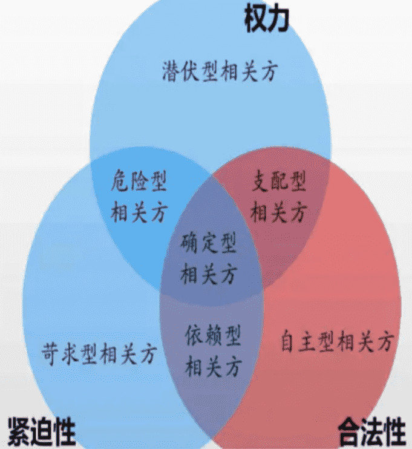
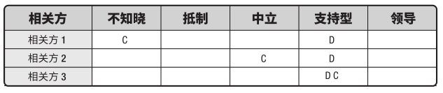

# 项目相关方管理

项目相关方管理主要工作有：识别影响项目或被影响的人员、团体或组织，分析相关方期望，评估他们对项目或受项目影响的程度，以及制定策略来有效引导相关方支持项目决策、规划和执行。

主要的项目相关方包括：

- 项目经理和团队成员。
- 客户或用户。
- 执行组织。
- 管理层。
- 出资人。
- PMO。
- 其他：权力阶层、业主、销售、分包、政府或媒体，相关公民等等。

项目经理和团队正确识别并合理引导所有相关方参与的能力，能决定着项目的成败。应当在团队组建后，尽早开始。相关方满意度也应作为项目目标加以识别和管理。

关键在于保持持续的沟通：

- 理解他们的需求和期望。
- 处理所发生的问题。
- 管理利益冲突。
- 促进相关方参与项目决策和活动。

## 识别相关方
识别相关方是定期识别项目相关方，分析和记录他们的利益、参与度、相互依赖性、影响力和对项目成功的潜在影响。使项目团队能够建立对每个相关方或相关方群体的适度关注。

收集相关方的方式包括问卷和调查、头脑风暴或者头脑写作。

对相关方进行分析得到相关方清单，和关于相关方的各种信息，如组织中的职位、项目中的角色，与项目的利害关系、期望、态度，以及对项目的兴趣。

相关方的利害关系可包括：

- 兴趣（被决策影响）。
- 权利（法律的合法权利、道德权利）。
- 所有权（法定）。
- 知识（专业知识领域）。
- 贡献（资金或人力）。

对相关方进行分类的方法有：

- 权力利益方格、权力影响方格，或作用影响方格，用于相关方简单的项目。

- 相关方立方体，通过权力、利益、影响和作用等多维数据组成分析模型。

- 凸显模型，通过评估相关方的权力、紧迫性、合法性、邻近性等，识别相关方的重要性。

- 影响方向，向上（高级管理层）、向下（团队或专家）、向外（团队外的相关方，即政府、公众等）、横向（同级别中层管理）。
- 优先级排序。

识别相关方的结果登记在相关方登记册，主要包括：

- 身份信息。
- 评估信息，主要需求、期望、影响项目成果的潜力，以及影响的项目生命周期的阶段。
- 分类，内部或外部，作用、影响、权力或利益，上级、下级、外围或横向等。

## 规划相关方参与
**规划相关方参与过程**是根据相关方的需求、期望、利益和对项目的潜在影响，制定项目相关方参与项目的方法。

相关方参与度评估矩阵，可对相关方参与水平进行分类，使用相关方当前参与水平与期望参与水平进行比较。

- 参与水平有：不了解、抵制、中立、支持、领导。
- C 代表每个相关方的当前参与水平，而 D 是项目团队评估出来的期望参与水平。应当根据差距进行必要的沟通、引导。

最终制定的相关方参与计划是项目管理计划的组成部分，确定了促进相关方有效参与的策略和行动。

## 管理相关方参与
**管理相关方参与过程**是与相关方进行沟通和协作以满足其需求与期望、处理问题，并促进相关方合理参与。

通过一些活动，让项目经理能够提高相关方的支持，减少抵制。活动包括：

- 在适当的项目阶段进行引导相关方参与，获取、确认或维持他们对项目的支持。
- 通过谈判和沟通管理相关方期望。
- 处理相关方管理过程的风险和潜在关注点，预测相关方可能引发的问题。
- 澄清和解决已识别的问题。

## 监督相关方参与
**监督相关方参与过程**是监督项目相关方关系，并通过修订参与策略和计划来引导相关方合理参与项目。维持或提升相关方参与活动的效率和效果。

