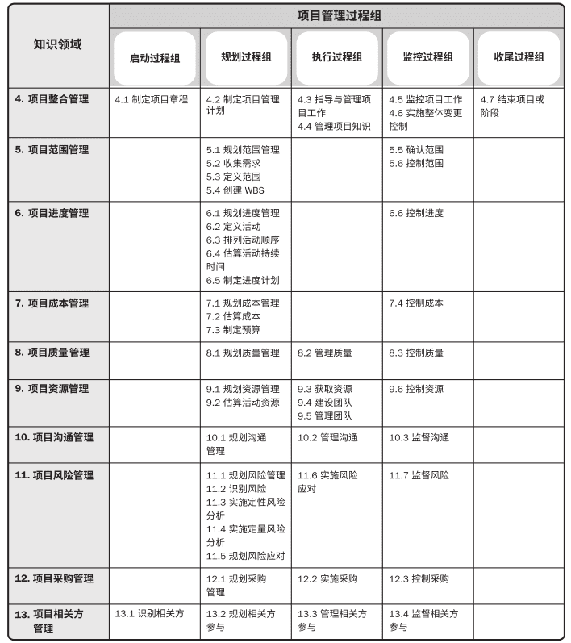
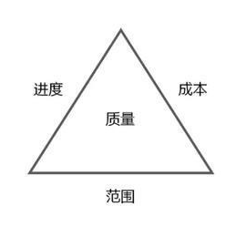

# 项目管理

项目管理最初是用于国防军事，起于第二次世界大战，由美国国防部主导发明的工具，寻求有大量不确定因素的事项的时间和费用的最佳控制。由此发展、提炼成一种具有普遍科学规律的理论模式，80年代之后扩展到了计算机，通讯，金融等众多领域。中国在50年代由华罗庚教授主导引入，叫统筹法和优选法。

项目，是为创造独特的产品、服务或成果而进行的临时性工作。

项目管理，就是将知识、技能，工具与技术应用于项目活动，以满足项目的要求。项目管理能使组织有效且高效的开展项目。

项目管理其本质是属于项目管理工程这一大类，根据不同的运用领域，有不同的侧重点。

## 项目管理的过程

项目管理整个过程是项目的管理者，在有限的资源约束下，运用系统的观点、方法和理论，对项目涉及的全部工作进行有效地管理。

管理重点事项有计划、组织、指挥、协调、控制和评价，最终目标是实现项目的目标。

**项目管理过程**是为了完成项目目标而执行的一系列相互联系的行动和活动，通过完成项目本阶段的所有项目活动，推动项目到下一阶段。

对应项目的生命周期，一个完整的项目管理过程主要分为五个逻辑分组：启动过程组、规划过程组、执行过程组、监控过程组和收尾过程组。

项目管理过程可以按知识领域进行分类，包括十个领域：整合管理、范围管理、时间管理、成本管理、质量管理、人力资源管理、沟通管理、风险管理、采购管理、相关方管理。

## 过程分组

- 启动过程组：定义一个新的项目或一个新的项目阶段，制定章程并确定项目目标。
- 规划过程组：明确项目范围，细化目标，为实现目标制定行动方案。
- 执行过程组：完成项目管理计划中确定的工作，以满足项目规范要求。
- 监控过程组：跟踪、审查和调整项目进展与绩效，识别必要的计划变更并启动相应变更。
- 收尾过程组：完结所有过程组的所有活动，正式结束项目或阶段。

## 过程领域分类

整体领域：

- **项目整合管理**，识别、定义、组合、统一和协调各项目管理过程组的各个过程和活动。核心是“协调”，需要将各方的需求进行综合性汇总，并能够权衡得失，规避风险。管理内容是：制定项目章程、制定项目管理计划、项目计划实施、监控整体项目工作与项目整体变更控制，最后结束项目。

核心领域：

- **项目范围管理**，定义和控制在项目内包括什么、不包括什么，以便多方达成共识。核心是项目范围，其中包括产品范围。管理内容是：确定项目的需求、定义和规划项目的范围（建立一个工作分解结构（WBS））、范围的变更控制管理以及范围核实等。
- **项目进度管理**，也就是时间管理，合理地安排项目起止时间和子任务开展周期，核心是进度安排。管理内容是：活动定义、活动排序、活动工期估算、安排进度表、进度控制。
- **项目成本管理**，对成本进行规划、估算、预算、融资、筹资、管理和控制，确保项目在批准的预算内完工。管理内容是：成本估算、成本预算和成本控制。
- **项目质量管理**，使整个项目的所有功能活动能够按照原有的质量及目标要求来实施，确保项目按照设计者规定的要求满意的完成。需要兼顾项目管理与项目可交付成果两个方面。管理内容是：质量方针和目标、质量管理计划、质量控制、质量保证、质量管理改进。

辅助领域：

- **项目资源管理**，识别、获取和管理所需资源，确保项目经理和项目团队在正确的时间和地点使用正确的资源。核心是人力资源管理与实物资源管理。管理内容是：估算资源、获取资源、建设团队、管理团队、控制资源。
- **项目沟通管理**，确保项目信息及时且恰当地规划、收集、生成、发布、存储、检索、管理、控制、监督和最终处理。关键是连接人、想法和信息。管理内容是：规划沟通管理、管理沟通、监督沟通。
- **项目风险管理**，对项目风险从识别到分析乃至采取应对措施等一系列管理活动。核心是了解和掌握项目风险的来源、性质和发生规律，进而施行有效的管理。管理内容是：识别风险、开展风险分析、规划风险应对、实施风险应对和监督风险。
- **项目采购管理**，管理从项目实施组织之外获得所需资源或服务。管理内容是：采购计划，实施采购，资源的选择以及合同的管理等项目工作。
- **项目干系人管理**，识别能够影响项目或会受项目影响的人员、团体或组织，分析其期望与影响，并制定对应的管理策略来有效的调动干系人参与项目的决策和执行。管理内容是：识别干系人、规划管理和监督干系人的参与到项目。

## 附：项目管理铁三角

项目管理的四个重要的领域，即：范围（需要做什么事）、时间（什么时间做完这些事）、成本（花多少钱做成这些事）、质量（这些事做到什么程度客户才满意）。这就是我们所说的项目管理四个最核心的目标，俗称项目管理铁三角。

项目管理的其他领域，即沟通、资源、风险、干系人、采购都是为这四个核心目标服务的。

