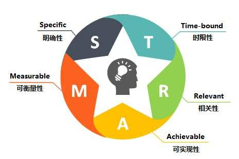

# 目标管理技术-SMART原则

SMART原则用于指导科学、合理的制定目标计划。管理大师彼得·德鲁克在《管理的实践》提出了目标管理，乔治·杜兰（George Duran）在《管理评论》发表论文提出设定管理目标的SMART原则。

#### 目标的制定

先看在《管理实践》中提到了企业的目标的5点要求：

> 1、能用简洁易懂的语言说明所有的企业现象；
>
> 2、在实践中接受检验；
>
> 3、能预测行为；
>
> 4、在决策制定过程中，就能加以评估；
>
> 5、能让实际经营者分析自己的实践，并因此改善经营绩效。

在SMART原则中，目标是以下5点特征：

- S(Specific)，明确性，目标要具体。
- M(Measurable)，可衡量性，可量化或质化。
- A(Attainable)，可实现性，努力能实现。
- R(Relevant)，相关性，对其他目标有意义。
- T(Time-based)，时限性，要在规定时间完成。

#### 明确性

明确性(Specific)，目标要清晰、具体，用简要、容易理解的语言说清楚要达成的目的，明确具体的产出物和交付标准。不能笼统和模棱两可，要具体化到数据。

可将目标拆分多个小目标，每个目标都有衡量标准、达成措施、完成期限以及资源要求，所有的信息都能有效的被相关人接收理解。

#### 可衡量性

衡量性(Measurable)，目标是明确的，不能是模糊的或模棱两可的。可以用数据指标或明确的方法进行衡量、验证目标完成的效果。

要求目标在数量、质量、成本、时间、相关方的满意程度等方面达到量化，或者质化。或者再次细分目标，再进行衡量。而且每个目的及参与人都有统一的、标准的、清晰的指标。

要杜绝在目标设置中使用形容词等概念模糊、无法衡量的描述。

#### 可实现性

可实现性(Attainable)，目标可以被执行人实现或达到。最好要在付出努力的情况下才可以实现，过高可能达不到或者推卸责任，过低则内容不饱满，行动没热情。

可以参与人一起协商，上下左右一起参与，让大家认同目标的价值和意义，形成团队整体目标。不宜单方面的利用职权影响力命令式的发布。

#### 相关性

相关性(Relevant)，和其他目标具有相关性。目标必须和公司、团队、自己有很大的联系，避免一些没有价值，或价值不大的工作。

此目标和自身、角色或岗位、其他的目标完全不相关，或者相关度很低，那么这个目标的意义也不是很大。当出现交叉职责的目标时，需要再拆分细化，或者必要的说明与澄清。

#### 时限性

时限性(Time-based)，目标是有时间限制的，这是由目标的优先级、相互关系来确定时间要求。没时间限制的限制，就没办法确定目标的轻重缓急，就没办法准确的被执行。

在这个时间范围内，要定期检查事情的进度，掌握各种影响，管理风险，或者进行变更控制。

#### 用SMART原则制定目标的要点

目标管理有利于团队和个人高效的工作，让所有人都参与进来，主动的进行目标的定义，绩效考核的制定，大家在公平公正环境中完成目标。其中几个重要的要点是：

- 目标清晰，准确的描述，量化的数据，相关方都充分的理解。
- 能量化的量化，不能量化的质化，让数据在目标中起引导作用，更利于目标的清晰。总有些不能量化的工作，也要有个具体的结果。
- 与团队、岗位、个人有相关性，一个大的目标会被分解为更多的小目标，或者再细分，就不应该存在一个独立的目标，如果存在就表示这个目标很可能没有价值，不要浪费时间和资源在没价值的事上，这本来也是目标管理的价值。
- 效率体现在时间和成就上，就是表现在明确的时间范围内完成一个有挑战的目标。没挑战没时间限制，不会有紧迫感，完成也不会有成就感，目标就没方向感或意义了。
- 过程中需要跟踪进度计划，结束需要复盘，制定奖励计划并在达到里程碑时兑现。

