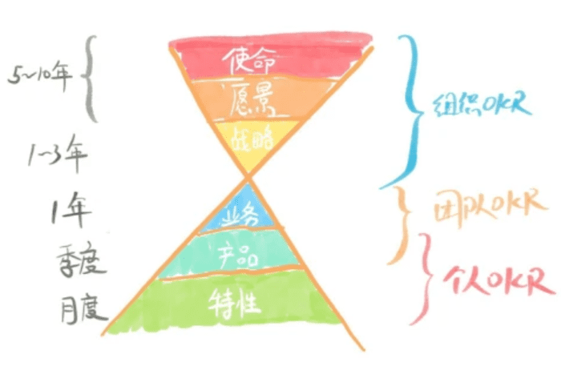

# OKR，目标和关键成果

OKR(目标和关键成果，Objectives and Key Results)，是1999年英特尔的Andy Grove发明的迭代KPI的绩效管理方法，后来被 John Doerr推广到甲骨文、谷歌、领英等并逐步流传开来，现在逐渐也被很多国内的公司采用。

OKR是企业进行目标管理的系统，提供了明确和跟踪目标及其完成情况的管理工具和方法。他起源自目标管理以及设定目标的SMART模型，能够让成员自下而上的充分参与到目标管理。

## 理解OKR

如何在一个组织中应用OKR，用Paul R. Niven和Ben Lamorte给出的定义更能说明，他们将ORK定义为：一套严密的思考框架和持续的纪律要求。确保成员紧密协作，将团队的精力聚焦在能促进组织成长的、可衡量的贡献上。

- 严密的思考框架：思考这个结果对你以及组织的价值，认同并促进完成。
- 续的纪律要求：主动的在时间和精力上的承诺。
- 确保成员紧密协作：相互就愿景进行沟通并与组织的目标对齐。
- 精力聚焦：将精力的资源集中在最关键的业务目标。
- 可衡量的贡献：KRs要可量化的（时间&数量），能追踪进度，能量化结果。
- 促进组织成长：最终目标是团队愿景得以实现，鼓励成果最大化。

从这个定义，就表明OKR比KPI更能帮助成员保持对目标的专注，尤其是一些不太好测量的愿景。只是目标管理的工具，而非强制的考核，强调自我管理。

## OKR的环境

同样就意味着OKR在变化比较快、知识密集型业务的情况下更有效，比如创业环境中、高科技企业、创新要求比较高的企业。

OKR需要的环境支持：

- 积极面对挑战的团队，不需要奋斗就能实现的舒适区的目标对个人和团队成长都不利。
- 公开、公平、透明、信任的环境，才能使得成员主动参与和相互协作，是OKR的关键支撑环境。

## OKR的层级

OKR 一般分为组织OKR，团队OKR，个人OKR 三个层级。

- 组织 OKR，主要体现使命、愿景等公司战略层级，也可能会到业务层级。一般按年度来制定，季度跟踪，年末复盘，也有按季度制定。可有一定弹性，可修改。
- 团队 OKR，聚焦在业务和产品层级。一般按季度制定，周或月跟踪，季度末复盘。时间短所以不变更，还可能更细化出周计划和任务。
- 个人 OKR，聚焦在产品和功能特性层级。同样按季度制定。可能会变化。

OKR 的目标分为“承诺型（任务型、指标）目标”和“愿景型（挑战型、愿景）目标”，前者多是自上而下，后者多是自下而上。

## 方法

OKR要体现在组织和团队一个周期内的战略和目标，在每个周期结束时能够评估团队目标的执行和完成情况。

制定OKR的基本方法是：

- 第一步，设定O，要设定一个“目标”（Objective）。

- 第二步，分解KRs，设定若干可以量化的“关键结果”（Key Results），用来帮助自己实现目标。
- 第三步，精炼，让整个团队一起评审，进一步完善与精炼。
- 第四步，对齐，将所有参与人面对面一起讨论相互有依赖的KRs，并达成一致。
- 第五步，定稿，确定最终的OKR。
- 第六步，发布，正式公示OKR给组织全员，透明公开，大家就本周期内的聚集的目标达成一致认识。
- 第七步，跟踪，周期性的跟踪进展情况，每周、每月、每季，并及时找到风险与解决方案。
- 第八步，评估，一个周期末举行评估会议，回顾完成情况，并做最终的评分。

“目标”（Objective）的设定要求：

- 首先要明确组织的使命与愿景，然后到团队。
- 要有从下而上进行双向确认对齐过程。
- 目标要少而精，要聚集，方向明确，范围清晰，可定量也可定性。
- 周期时限，组织到年度，团队与个人的到季度。
- 目标得可实现并有挑战性，才有激励作用。

“关键结果”（Key Results）的设定要求：

- 遵守SMART原则，具体、可实现，可衡量，有时限。
- 同样要少而精。
- 同样要有挑战性。
- 中期可跟踪其进展。
- 70%完成即合格。
- 所有KR完成，O一定完成。

组织层级的OKR的制定通常由公司高层管理者提出，团队OKR 和员工OKR 的制定通常有主管由上而下制定OKR并对齐组织的OKR、成员由下而上理解并确认出OKR，或者一起讨论制定OKR。

跟踪与评估，实际上就是PDCA模型，形成计划-执行-检查-复盘的工作循环：

- 周例会跟踪本周目标的进度，关键结果的风险。
- 季度中审视是否能完成，或者风险的解决方案。
- 季度评估目标完成情况，并自我打分，负责人打分。再集体讨论回顾本周期的执行情况，激励优秀成员，汇总问题，供新周期的执行提供参考。

OKR主要价值是，指引前进的方向，增强协作，达成共识，期望突破。对于有明确的目标，标准化的、重复性的，KPI更适合。

