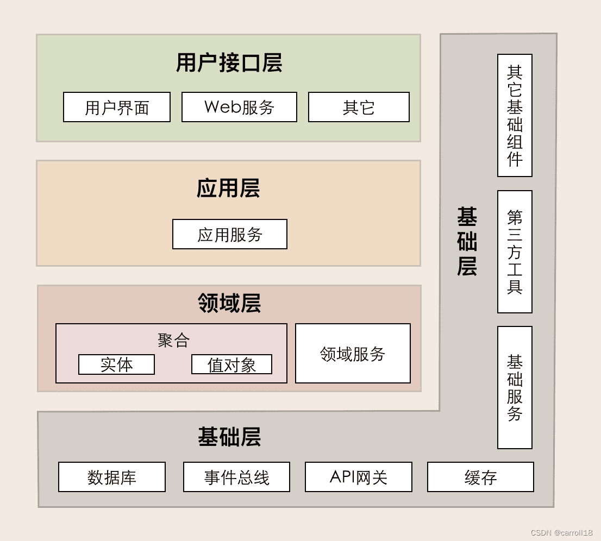

# 领域模型分层设计

分层其实也是一种事物分类方法，是把一系列相同或相似的事物进行分类放在同一层，然后根据他们之间的依赖关系再确定上下层次关系。

在系统设计时，分层是为了解决逻辑不清晰、各模块相互依赖、代码扩展性差、改动一处就牵一发而动全身等问题。

最常见的就是经典的三层架构：展示层、业务逻辑层、数据访问层（MVC）。

### 领域模型的分层设计

Martin Fowler给出的类似三层：表现层，领域层，数据源层，后来细化为四层架构，该架构包括表示层（Presentation Layer）、应用层（Application Layer）、领域层（Domain Layer）和基础设施层（Infrastructure Layer）。

- **表示层**

负责处理用户界面和用户交互，主要负责展示数据和接受用户输入。其职责包括处理用户请求、验证用户输入、向用户展示信息等。

表示层应该尽可能简单，专注在用户体验方面，避免包含业务逻辑。

实现上主要是，Web应用中的HTML、CSS和JavaScript，还有桌面应用的窗口组件等等。

微服务负责接口定义的API，也可以归类到此，在这做参数的校验，VO/DTO的转换。

- **应用层**

负责协调领域层的父域和子域之间的交互。应用层的服务会调用不同子域的服务，以完成复杂的业务操作。

应用层不应有业务逻辑与规则，主要是面向用例和流程相关的操作。

具体来说，负责了业务请求的组合、编排、转发、转换和传递；处理业务用例的执行顺序以及结果的拼装；事务控制、订阅和处理领域事件；还可进行更细粒度的安全认证和权限校验等。

- **领域层**

包含业务逻辑和业务规则，是整个系统的核心层，几乎全部的业务逻辑会在该层实现。这层的核心是领域模型，包括了实体、值对象、领域服务、聚合/聚合根、工厂、仓储、领域事件等等。

领域事件更多也是在领域层发布，通常由领域对象在其状态发生变化时发布。

将那些不容易归类为任何特定领域对象的方法或逻辑，表示为领域服务，通常是跨多个领域对象的业务操作。

如果充血模型的领域对象，则本对象提供所有行为和状态；如果贫血模型的领域对象，则只有属性，业务逻辑由服务类实现。

领域层不依赖于应用层和基础设施层。

- **基础设施层**

主要包含了各种通用能力以及工具类，它的作用就是为上层提供基础服务的，如数据库服务、MQ 服务、缓存服务、RPC服务等，还有其他的一些配置以及资源。

### 分层示例

以Java项目为例的代码结构：

    ├─com.xx.ddd
    │    │ 
    │    ├─apis   API接口层 
    │    │    └─controller    控制器，对外提供（Restful）接口
    │    ├─application        应用层
    │    │    ├─model         数据传输对象模型及其装配器（含校验）
    │    │    │    ├─assembler   装配器，实现模型转换
    │    │    │    └─dto         模型定义（含校验规则）
    │    │    ├─service       应用服务，非核心服务，跨领域的协作、复杂分页查询等
    │    │    ├─task          任务定义，协调领域模型
    │    │    ├─listener      事件监听定义
    │    │ 
    │    ├─domain   领域层
    │    │    ├─common       模块0-公共代码抽取，限于领域层有效
    │    │    ├─module-xxx   模块1-xxx，领域划分的模块，可理解为子域划分
    │    │    │    ├─action      行为定义
    │    │    │    │    ├─XXXDomainService.java   领域服务
    │    │    │    │    ├─XXXEventPublisher.java  领域事件
    │    │    │    ├─model       领域聚合内模型 
    │    │    │    │    ├─XXXEntity.java          领域实体，有唯一标识的充血模型
    │    │    │    │    ├─XXXVObj.java            领域值对象
    │    │    │    ├─repostiory  领域仓储接口
    │    │    │    │    ├─XXXRepository.java
    │    │    │    ├─reference   领域适配接口
    │    │    │    │    ├─XXXSenderFacade.java
    │    │    │    └─factory     领域工厂  
    │    │ 
    │    ├─infrastructure  基础设施层
    │    │    ├─persistence      持久化
    │    │    │    ├─converter   持久化模型转换器
    │    │    │    ├─po          持久化对象定义 
    │    │    │    └─repository.impl  仓储类，持久化接口&实现，可与ORM映射框架结合
    │    │    ├─general          通用技术支持，向其他层输出通用服务，工具
    │    │    ├─reference        引用层，包装外部接口用，防止穿插到Domain层腐化领域模型等
    │    │    │    ├─dto         传输模型定义
    │    │    │    ├─converter   传输模型转换器       
    │    │    │    └─facade.impl 适配器具体实现，此处的RPC、Http等调用

### 五层架构

除了最常见的四层架构，还有在上述的四层架构中加入了上下文环境层(Context)，介于应用层与模型层之间，形成五层架构，应用层做调度，环境层做协调领域对象的行为与领域层交互。

五层架构由DCI架构（Data、Context和Interactive三层架构）发展而来。主要加入了对象的角色role的显式建模。

### 六边形架构

还有一种很有趣的架构，六边形架构（Hexagonal Architecture），又称为端口和适配器风格，最早由 Alistair Cockburn 提出。这是个扁平的架构，每个边界的权重是相等的。

他的分层特点是：

- 领域层，在最里面，纯业务逻辑。
- 端口层，与领域层交互，负责接收与用例相关的所有请求。
- 适配器层，与端口层交互，负责以某种格式接收输入、及产生输出。

数据库、消息、缓存等等对接都是通过适配器层进行，彻底将领域层做到也技术无关。在适配层，UI展现、RPC调用、数据库访问都是平等的。

外部业务请求，由应用服务协调领域层完成，应用服务也处于内圈。

领域层中那些只有纯粹的业务行为的，或者跨多个子域的逻辑，由领域服务协调提供。

