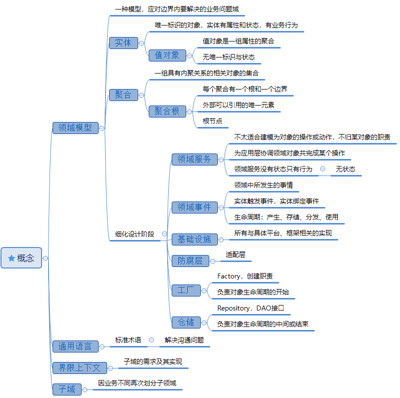

# 领域模型与领域驱动设计

关于领域模型，一般说两种概念，一种是来源于最初的传统软件开发过程，一种来源于领域驱动设计（DDD），下面都是来源于DDD的概念。

领域驱动设计（DDD）是Eric Evans在2003年出版的《领域驱动设计：软件核心复杂性应对之道》（*Domain-Driven Design: Tackling Complexity in the Heart of Software*）一书中提出的具有划时代意义的重要概念，是指通过统一语言、业务抽象、领域划分和领域建模等一系列手段来控制软件复杂度的方法论。

## 领域模型

领域，具体指一种特定的范围或区域，尤其是指具体的业务范围或具体的某个行业。

领域模型，是对领域内的概念类或现实世界中对象的可视化表示。又称概念模型、领域对象模型、分析对象模型。它比业务模型更加抽象，专注于分析问题领域本身，发掘重要的业务领域概念，并建立业务领域概念之间的关系。

回到软件行业，软件开发的本质，是从“问题空间”到“解决方案空间”的转化，那么领域模型，就是“解决方案空间”的架构，通过抽象的模型，为系统带来统一的认知。

对领域的建模，可以帮助分析理解复杂业务领域问题，是面向对象分析的主要产物，它表达了对现实问题的描述和抽象，是需求分析人员与用户交流的有力工具，并能指导系统设计。

领域模型提供了一种对整个系统的结构化的视图。领域模型的一个好处是描述并限制了系统边界。

## 领域驱动设计（DDD）

它是面向对象分析的方法论，将视角切换到业务模型之上的领域模型，化解业务复杂性。

领域驱动设计关心的是业务中的领域划分（战略设计）和领域建模（战术设计），其开发过程以领域模型为出发点。领域模型对应的是业务实体，在程序中主要表现为类、聚合根和值对象，它更加关注业务语义的显性化表达，而不是数据的存储和数据之间的关系。

战略设计主要从业务视角出发，建立业务领域模型，划分领域边界，建立通用语言的限界上下文。

战术设计则从技术视角出发，侧重于领域模型的技术实现，完成软件开发和落地，包括：聚合根、实体、值对象、领域服务、应用服务和资源库等代码逻辑的设计和实现。

## 领域驱动设计的优点

- 统一语言

业务语言中的术语由公司的的业务侧和技术侧通过协商来定义，创造可以被业务、技术和代码自身无歧义使用的共同术语。可以极大的提高沟通效率，减少误解，减少系统故障。

- 面向对象

此方法论是先找到业务中的领域模型，以领域模型为中心，驱动项目开发。接触到需求后第一步就是考虑领域模型，然后用数据库实现数据，用服务实现行为。重点是业务语言，再考虑数据与行为，可以对业务的理解与分析更深入。

- 业务语义显性化

统一语言会让核心领域概念可以始终贯穿在业务方案，PRD文档、设计文档、代码、测试用例以及团队日常交流中。让业务语义得到显性化的表达，方案就会更深入业务，代码的可读性就会提升很多。面向对象也是让代码尽量体现领域实体和实体之间的关系原貌，代码更容易被理解和维护。业务能够以模型的方式沉淀下来，增强知识积累。

在软件开发方法论中，核心焦点都应落在“减少代码复杂度”。

- 分离业务逻辑与技术细节

代码复杂度是由业务复杂度和技术复杂度共同组成的。在领域驱动设计中，将这两个维度分开来对待，核心业务逻辑对技术细节没有任何依赖，并只能外层对内层依赖。

分离开两个维度后，可以降低整体的复杂度，并且各维度上的视角也会更专注，处理各自的复杂性。

## 领域模型的组成

对复杂的业务来说，应对手段概括来说有抽象、分治和知识。领域模型就是知识这个维度的思想工具。领域模型设计在战略层面来说，关注领域模型、语言、限界上下文。

- **领域、领域模型、子域**，领域：问题域，问题空间，边界内要解决的业务问题域。领域模型是一种模型，表达了领域中哪些业务需求以及业务规则必须被满足。领域因业务不同也会划分出子域，根据重要性也分核心子域和支撑子域。
- **通用语言**，团队交流达成共识，并能够明确简单清晰的描述业务规则和业务含义的标准术语。贯穿于整个设计与开发过程，解决各岗位的沟通障碍问题，确保业务需求的正确表达。
- **限界上下文**，确定领域模型的边界及上下文环境，用来对领域模型进行划分。领域模型便存在于这个边界之内，这个边界定义了模型的适用范围。提供上下文环境，保证在领域之内的一些术语、业务相关对象等（通用语言）无二义性。

领域模型是核心概念，包括实体、值对象、聚合根。聚合根是一个实体，它的标识是全局唯一，实体的标识在聚合内唯一。聚合是在限界上下文范围内的领域对象集合，它的根就是聚合根。

- **实体、值对象**，都是领域概念，是现实世界的事物的映射。实体有唯一标识，有连续性的生命周期，有状态，拥有一定的属性或行为。值对象是一组属性的聚合，只起描述作用，无生命周期也不需要唯一标识。
- **聚合、聚合根**，聚合由根实体，值对象和实体组成，核心领域往往都需要用聚合来表达，将一组模型聚合在一起，与外部模型划分开来。聚合根是一个实体，是这个聚合的根节点。

在具体的模型设计层面，需要加入设计层面的概念，领域服务、领域事件、防腐层、基础设施、仓储、工厂，来解决如分层，复用，解耦合等方面的问题。

- **领域服务**，领域服务是领域模型的一部分，来串联各对象、资源、其他上下文接口等作用。一些重要的领域行为或操作，又归类不到对象的，可以归类为领域服务，它没有状态和属性只有行为。
- **领域事件**，领域事件是领域内发生的活动的抽象。事件由领域模型发出，最终被某限界上下文中的组件所接收。这也是一种设计理念，通过事件的发布-订阅来解对象之间的耦合。
- 防腐层，也叫适配层，对外部上下文的访问进行一次转义，来解决。系统实现时会采用应用程序中的组件或作为独立服务。
- 基础设施，抽象出来处理所有与具体平台、框架相关的实现，主要功能是对领域模块进行持久化或用户界面的组件库。
- 仓储，就是对领域对象的持久化（存储和访问）进行统一管理的对象。存储如数据库，分布式缓存，本地缓存等。
- 工厂，用来创建复杂对象的实例和聚合的对象。

