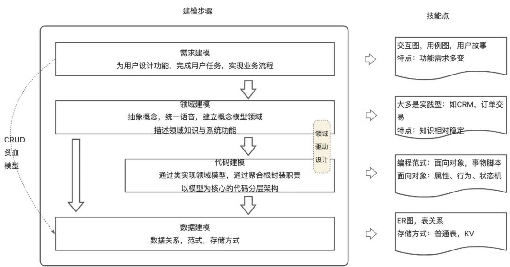
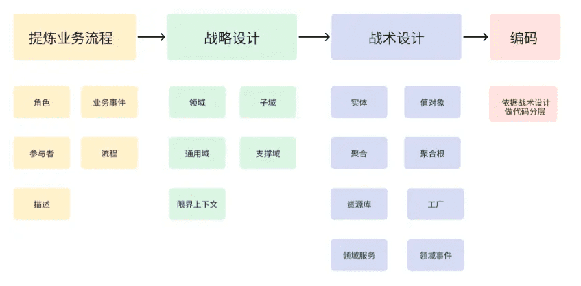

# 领域模型建模的思想

领域，某个特定问题空间或业务领域的知识和概念。

模型，对实际对象、系统或问题的简化抽象和结构化表达。

领域模型，对业务领域中的核心概念、规则和行为的抽象描述。

如果是单一问题域和简单系统，演进式设计并敏捷重构，就可以让系统适应业务增长。

如果是大规模和复杂系统，那么领域模型建模就是解决复杂问题的较为理想的一条路径或方法论了。

领域模型目标就是降低复杂度，解决统一认识、减少沟通成本，让业务语言和技术语言能统一，贯穿在软件实现的整个过程。

###  领域模型，贯穿始终

软件系统就是从“问题空间”到“解决方案空间”的过程，软件的设计就从问题域出发，用问题域分析出的模型指导软件设计。

从需求到架构设计，通常从三个维度描述系统：业务架构、系统架构、技术架构。他们各自描述了系统的不同关注点，业务架构分析设计业务模块及其关系，系统架构设计子系统及关系，技术架构确定技术框架。

分析设计过程依次产生的四种模型：

- 需求模型：真实需求，用例、角色、流程等等。
- 领域模型：基于需求模型，把业务规则、定义、范围、知识等抽象成领域，将业务概念可视化描述。
- 代码模型：以领域模型为基础，转换为子系统、模块、包、类，以及技术框架。
- 数据模型：根据代码模型，确定数据库的ER结构及存储。

基于领域模型进行代码、数据建模，业务、产品、开发、测试等人员比较容易就需求达成共识，保障沟通的一致性。

### 分而治之

软件系统复杂的三要素是规模、结构与变化。

如何降低复杂度，核心思想就是“分而治之”。 

将复杂的问题拆解抽象成领域，领域代表了特定的一块密集而内聚的信息，再将领域分为下层的子域。每个领域和子域规定好边界和核心实体，就形成了一个有机的整体。

设计方面关于解复杂，广泛应用的两个原则：

- 设计理念的KISS（Keep it Simple Stupid）原则，即“小而美”。
- 设计原则的“单一职责原则”。

领域划分要依据实际业务的组织结构。

- 康威定律，设计系统的架构受制于产生这些设计的组织的沟通结构。

### 建模方法

建模过程从通用语言、领域、限界上下文展开。

- 通用语言，定义术语。
- 领域是用于确定范围和边界。
- 限界上下文明确各领域之间的边界及它们如何交互。

能很好总结此过程的一句话：“提炼业务知识，形成统一语言，沉淀领域模型”。其中，领域专家对业务的理解思考尤为重要，相当半个业务专家，将业务知识提炼后用在整个过程。

- **领域驱动设计（DDD）**

  最主要的建模方法是领域驱动设计（DDD），强调将业务逻辑和规则直接映射到代码中，提倡紧密与领域专家合作，构建出反映实际业务规则的领域模型，确保模型能够很好地适应业务需求的变化。

  这方法过程复杂，适合复杂的大型系统，多个团队协作的情况。

  核心过程分为：战略设计，战术设计。

  战略设计：从全局和顶层结构化分层，划分领域和子域，分解问题复杂度，即“分而治之”。

  战术设计：从各个域中再次拆解更细粒度的模块，去指导最终的编码实现。

还有常见的分析方法有用例分析法、四色建模法和事件风暴法，可以在不同阶段为领域建模提供帮助。或者与DDD互补，或者在简单的系统中使用。

- **用例分析法（Use Case Analysis）**

  通过描述系统用户与系统交互的方式来确定系统需求。主要聚焦在需求分析，帮助识别界限上下文，以及领域事件。

  大致可以分为获取用例、收集实体、添加关联、添加属性、模型精化几个步骤。

  使用流程图，包图，用例图，类图，序列图或活动图等工具。

- **四色建模法（Four-Color Modeling）**

  通过不同的颜色标示出人，事，物，角色，通过四色建模得到四色原型图，每个原型图有属性和连接（关联与依赖等关系）两个部分组成。

  可以快速识别领域对象、实体和它们之间的关系。

  简单说，某个人（`Party`）的角色（`PartyRole`）在某个地点（`Place`）的角色（`PlaceRole`）用某个东西（`Thing`）的角色（`ThingRole`）做了某件事情（`Moment-Interval`）。

- **事件风暴（Event Storming）**

  让领域专家和开发团队一起，以用户的视角来讨论，围绕着事件去编排整个业务流程。可以快速探索、理解和设计领域模型。
  
  简单理解就是谁在何时基于什么（`输入`）做了什么（`命令`），产生了什么（`输出`），影响了什么（`事件`），最后聚合成了什么（`领域`）。
  
  可以帮助标识领域中的事件、命令、聚合、角色等。根据事件可以推动界限上下文划分。聚合已经非常接近代码实现。

