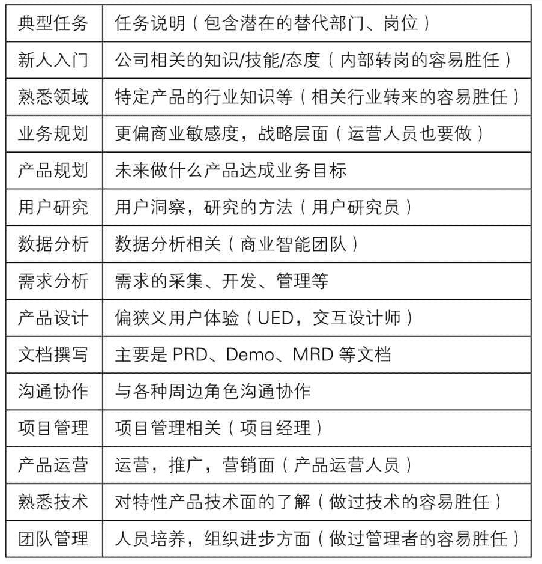

# 产品经理

产品经理（Product manager，PM），还没有标准的定义，一般是指在公司中针对某一项或是某一类的产品进行规划和管理的人员，主要负责产品的研发、制造、营销、渠道等工作。

相比另外一个也叫PM的项目经理概念，产品经理更注重在产品的创造，任务的提出。同时也得具有一定的项目管理能力。

## 职责

产品经理依据公司产品战略，对某个产品担负根本责任，在产品的规划、设计、开发、运营等各个环节全程参与和监控。他们必须有效的利用企业的运营、市场、技术、销售、客服等资源，领会意图、分解目标、制定策略、协调资源，把想法变成结果。

最开始是产品的定义与架构，然后是产品设计，接着做出来，最后推出去，有以下几个方面的职责：

- 产品架构，宏观把控产品，定义、规划、定位产品，并且确定大方向的里程碑。
- 产品设计，产品细节设计，业务逻辑，业务流程，业务规则，用户体验等等。
- 产品管理，偏日常具体事务，资源协调，跟进实施，也有团队管理，也是部分项目经理的职责。
- 产品运营，挖掘用户，负责营销推广，以及产品迭代。

# 阶段工作

纵观各企业的产品经理需求上，在各个企业通常都需要产品经理开展的工作有：

1. 市场调研。
2. 产品定义及设计。
3. 项目管理。
4. 产品宣传介绍。
5. 产品市场推广。
6. 产品生命周期管理。

针对不同阶段，具体的工作有：

1. 提案，跟进业务方提出口头上的或者邮件的产品战略或者规划，或者需求。
2. 调研，通过和用户交流、市场咨询、市场分析报告、竞品分析等手段，确定是否确认为需求。可能会产生“商业需求文档”或“调研分析报告”。
3. 立项，如果重大项目，需要制定要达到的结果的各项量化指标，并可能通过演示PPT，让业务、领导评审。
4. 设计，确定愿景、目标、计划等；描述详细的功能需求，及优先级等，产生“PRD（产品需求文档）”；并确定界面外观（“UI稿”）、交互等细节，需要UI设计师的配合；跟进评审前端的页面制作（“HTML/CSS/JS”）；
5. 开发，跟进评审开发的设计（“ERD”）；跟进开发人员的问题（“代码”）。
6. 测试，跟进评审测试人员的测试用例；跟进测试情况；做验收测试。
7. 发布，发布前需要编写“用户手册”；培训用户；正式发布后跟进使用情况，可能还需要确定下一个迭代。
8. 结项，复盘。

## 分类

根据产品经理的职责，可细分不同的产品经理：

- 设计型产品经理，在大的规划下，进行产品设计与落地执行。工作内容包括：设计产品功能、设计流程、原型、交互，体验、数据分析等。主要是分析与设计等技能。
- 规划型产品经理，对产品进行全面的规划，根据市场或业务方向或目标，规划需求、确定价值、规划可行的实施方案。体现在策划能力以及全盘控制能力，组织与协调为主。
- 总负责型产品经理，运作整体产品，负责目标分解、策略制定、资源的配置、关键点把握。着重在战略思维与决策能力，系统性思维、结构化知识体系比较重要。

从具体的能力来分层的话，可分为：

- 第一层，需求细化与研发跟进。
  写PRD、画原型、做Demo。
- 第二层，主动挖掘与项目管理。
  见用户、挖需求、探究人性，并把需求转化为产品功能。
  知识：用户研究、数据分析、竞品分析、心理学、社会学。
- 第三层，完整产品与大局观。
  规划与迭代、组团队。
  要开始做取舍、砍需求，大到产品概念的筛选，小到具体功能的权衡。
- 第四层，产品线与带团队。
  主要区别就是负责的产品要足够复杂，要拥有洞察行业走势、提前布局的能力。
- 第五层，成功案例与影响力。
  操盘过一个众所周知的产品。
  能输出方法论、做好知识传承、建立团队的人才梯度，并形成影响力
- 第六层，商业闭环与全职能管理。
  践行甚至开创某种商业模式
- 第七层，自己成功到助人成功。
  能开创一个时代，也能开创一个全新的行业。

## 核心能力

产品经理应当具备的核心素质：

- 逻辑性：产品经理需要具备良好的逻辑思维能力，对接收的信息做归纳总结和推导。

- 同理心：换位思考，以用户为中心看待问题。

- 产品心：有打造优秀产品的追求，并为此全力付出的匠心。

在专业、个人、管理等三个方面的应当具备的能力：

- 专业能力：行业知识、业务知识、产品基本功、设计、规划。
- 个人能力：学习、沟通、洞察、决策。
- 管理能力：团队管理、业务管理、成本管理、风险管理。

