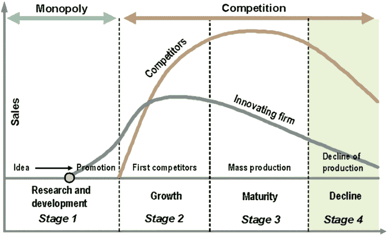

# 产品的生命周期

一个典型的产品生命周期一般可以分成四个阶段，即引入期/开发期、成长期、成熟期和衰退期。此理论由美国哈佛大学教授雷蒙德·弗农(Raymond Vernon)1966年提出的。

- 引入期，产品从设计投产直到投入市场进入测试阶段，就进入引入期，开始寻找初期用户。
- 成长期，当市场反响良好，用户逐渐接受该产品，意味着引入成功，进入成长期。
- 成熟期，经历成长期后，产品广泛被市场认可，稳定且趋于饱和，就到了成熟期。
- 衰退期，淘汰阶段，产品老化，不适应市场新需求，或者有更好的替代。生命周期结束，最后完全撤出市场。

产品的生命周期最大的意义就在于确定当前的目标，让产品和运营工作有的放矢。

## 阶段性运营内容

- 引入期，也是启动时期，主要是探索和定位，拉种子用户。

- 成长期，也是爆发时期，产品有了认可，要开拓新的市场得到新用户，获得大量反馈并快速调整运营策略。

- 成熟期，进入大规模的市场应用阶段，用户活跃，需要更多的考虑变现策略。
- 衰退期，当产品已经出现不适应市场新变化时，竞争力下降，需要重新审视市场，重新定位产品，考虑探索适应新的需求，市场投入适应缩减。

## 阶段性产品内容

- 引入期，用户需求的挖掘、功能的探索、产品的定位、商业模式的确定。

- 成长期，产品快速迭代，修正商业模式。

- 成熟期，围绕活跃和变现功能需求，寻找新的爆发点。
- 衰退期，重新定位，探索新的商业模式，获得新的用户。

## 产品当前位置的判断

产品的生命周期出现的顺序不太固定，一般是冷启动期开始，到衰退期结束。也可能在衰退期之后，重新定位和修正，重新进入爆发期。

生命周期的衡量可能参考活跃用户数量：

- 活跃用户指标，通过埋点，收集到用户行为数据，分析出实际使用用户。
- 活跃用户数量曲线，根据活跃用户，可以得到趋势曲线。

